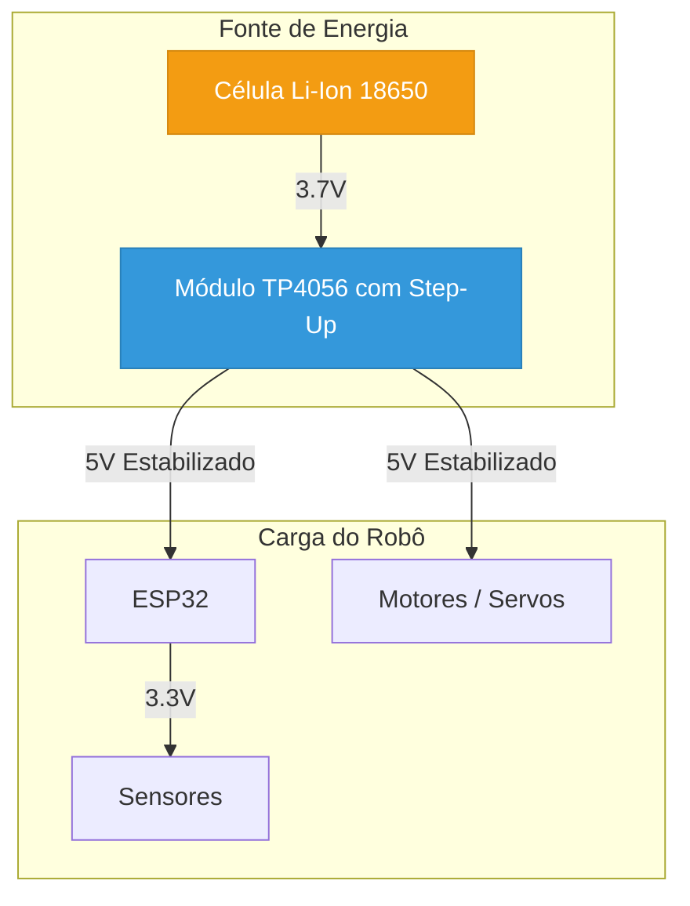
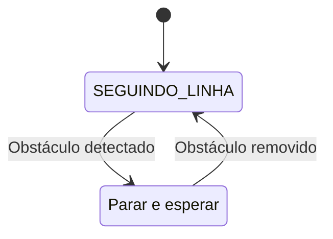

# Curso Completo de Robótica: Do Zero ao Expert

---

## Introdução

Bem-vindo ao Curso Completo de Robótica! Esta jornada foi projetada para levar você do zero absoluto ao desenvolvimento de robôs complexos com inteligência artificial. O curso é dividido em três níveis progressivos:

-   **Nível 1: Iniciante**: Focado nos fundamentos de eletrônica, programação e na construção do seu primeiro robô.
-   **Nível 2: Intermediário**: Aprofunda em sensores avançados, algoritmos de controle e na criação de robôs autônomos.
-   **Nível 3: Expert**: Explora o fascinante mundo da visão computacional, machine learning e interação por voz.

---


---
# Nível 1: Fundamentos da Robótica
---

# Módulo 1.1: Introdução à Robótica e Eletrônica Básica

## O Que é um Robô?

Bem-vindo ao início da sua jornada no fascinante mundo da robótica! Um **robô** é, em sua essência, uma máquina programável capaz de realizar uma série de ações de forma autônoma ou semi-autônoma. A palavra "robô" foi popularizada pelo escritor tcheco Karel Čapek em sua peça de 1920, "R.U.R." (Rossum's Universal Robots), derivando da palavra tcheca *robota*, que significa "trabalho forçado".

Os robôs modernos são compostos por três pilares fundamentais:

1.  **Mecânica**: O corpo físico do robô, incluindo seu chassi, rodas, braços e garras.
2.  **Eletrônica**: O sistema nervoso do robô, composto por sensores, atuadores e a unidade de controle (o "cérebro").
3.  **Programação**: A inteligência do robô, o conjunto de instruções que define seu comportamento.

Neste curso, exploraremos todos os três pilares, começando com os blocos de construção da eletrônica.


*Figura 1: Diversos componentes eletrônicos que formam a base da robótica.*

---

## Conceitos Fundamentais de Eletrônica

Para construir robôs, é crucial entender três conceitos básicos da eletricidade: Tensão, Corrente e Resistência.

| Conceito | Unidade | Analogia com Água |
| :--- | :--- | :--- |
| **Tensão (V)** | Volt (V) | A **pressão** da água em uma mangueira. É a "força" que impulsiona os elétrons. |
| **Corrente (I)** | Ampere (A) | O **fluxo** de água que passa pela mangueira. É a quantidade de elétrons em movimento. |
| **Resistência (R)** | Ohm (Ω) | Um **estreitamento** na mangueira que limita o fluxo de água. Controla a quantidade de corrente. |

A **Lei de Ohm** relaciona esses três conceitos: **V = I * R**. Esta é a lei mais fundamental da eletrônica e nos ajuda a calcular como os componentes se comportarão em um circuito.

---

## Componentes Eletrônicos Essenciais

Vamos conhecer alguns dos componentes mais comuns que você usará.

### Protoboard (Matriz de Contatos)

A protoboard é uma ferramenta que permite montar e testar circuitos eletrônicos sem a necessidade de solda. Suas conexões internas facilitam a prototipagem rápida.


*Figura 2: Diagrama de uma protoboard mostrando as conexões internas das fileiras e colunas.*

-   **Linhas de Alimentação**: As colunas nas laterais (geralmente marcadas com `+` e `-`) são conectadas verticalmente. São usadas para distribuir a tensão (VCC) e o terra (GND) por todo o circuito.
-   **Área de Componentes**: As fileiras na área central são conectadas horizontalmente. Cada fileira é um nó elétrico, permitindo conectar os terminais dos componentes.

### LED (Diodo Emissor de Luz)

O LED é um componente que emite luz quando a corrente elétrica passa por ele. Ele é um **diodo**, o que significa que a corrente só pode fluir em uma direção. O terminal mais longo é o **anodo (+)** e o mais curto é o **catodo (-)**.

### Resistor

O resistor é um componente que limita a passagem de corrente. Ele é crucial para proteger componentes sensíveis, como os LEDs, de receberem corrente excessiva e queimarem. O valor de um resistor é medido em Ohms (Ω).


*Figura 3: Esquema de um circuito simples para acender um LED, mostrando a necessidade de um resistor para limitar a corrente.*

---

## Projeto Prático: Acendendo seu Primeiro LED

Vamos aplicar o que aprendemos montando um circuito físico simples. Este projeto não requer programação, apenas uma fonte de energia.

**Materiais Necessários:**
- 1x Protoboard
- 1x LED (qualquer cor)
- 1x Resistor de 220Ω a 330Ω
- Fios Jumper
- 1x Fonte de alimentação de 5V (pode ser um power bank ou a saída 5V de uma placa Arduino/ESP32)

**Passos da Montagem:**

1.  **Conecte a Alimentação**: Use fios jumper para conectar a saída de 5V da sua fonte à linha de alimentação positiva (`+`) da protoboard e o GND à linha negativa (`-`).
2.  **Posicione o LED**: Espete o LED na área central da protoboard, com cada terminal em uma fileira diferente.
3.  **Conecte o Resistor**: Conecte uma perna do resistor na mesma fileira do terminal **anodo (+)** do LED.
4.  **Feche o Circuito**:
    -   Use um fio para conectar a outra perna do resistor à linha de alimentação positiva (`+`).
    -   Use outro fio para conectar a fileira do terminal **catodo (-)** do LED à linha de alimentação negativa (`-`).

**Resultado Esperado:**

Ao ligar a fonte de alimentação, o LED deve acender! Se não acender, verifique as conexões, a polaridade do LED (anodo/catodo) e se a fonte está funcionando.

Parabéns! Você montou seu primeiro circuito eletrônico. No próximo módulo, aprenderemos a controlar componentes como este usando programação.
_# Módulo 1.2: Introdução ao Arduino e Programação

## O Que é Arduino?

No módulo anterior, montamos um circuito estático. Agora, vamos dar vida aos nossos projetos com o **Arduino**. O Arduino não é um único componente, mas uma **plataforma de prototipagem eletrônica de código aberto** que combina hardware e software para criar projetos interativos.

-   **Hardware**: Uma placa de microcontrolador que pode ser programada para ler entradas (como a luz em um sensor) e transformá-las em saídas (como acender um LED ou mover um motor).
-   **Software**: O Arduino IDE (Ambiente de Desenvolvimento Integrado), um programa de computador onde você escreve e envia o código para a placa.

Existem muitas placas na família Arduino, mas a mais icônica é o **Arduino UNO**. Para este curso, focaremos no **ESP32**, uma placa mais poderosa com Wi-Fi e Bluetooth integrados, mas que pode ser programada da mesma forma que um Arduino.


*Figura 1: Um ESP32 DevKit, uma placa poderosa e versátil que usaremos em nossos projetos.*

---

## Instalação do Arduino IDE e ESP32

Para programar o ESP32, usaremos o Arduino IDE. Siga estes passos para configurar seu ambiente:

1.  **Baixe e Instale o Arduino IDE**: Acesse o site oficial do [Arduino](https://www.arduino.cc/en/software) e baixe a versão mais recente para o seu sistema operacional.

2.  **Adicione o Suporte ao ESP32**:
    -   Abra o Arduino IDE, vá em `Arquivo > Preferências`.
    -   No campo "URLs de Gerenciadores de Placas Adicionais", cole o seguinte link:
        ```
        https://raw.githubusercontent.com/espressif/arduino-esp32/gh-pages/package_esp32_index.json
        ```

3.  **Instale as Placas ESP32**:
    -   Vá em `Ferramentas > Placa > Gerenciador de Placas`.
    -   Pesquise por "esp32" e instale o pacote "esp32 by Espressif Systems".

4.  **Selecione a Placa e a Porta**:
    -   Conecte seu ESP32 ao computador via cabo USB.
    -   Em `Ferramentas > Placa`, navegue até "ESP32 Arduino" e selecione "ESP32 Dev Module".
    -   Em `Ferramentas > Porta`, selecione a porta serial correspondente ao seu ESP32 (ex: `COM3` no Windows ou `/dev/ttyUSB0` no Linux).

---

## Estrutura Básica de um Programa Arduino

Todo programa (chamado de *sketch*) para Arduino possui duas funções principais:

```cpp
void setup() {
  // Código de configuração, executado uma vez quando a placa liga ou é resetada.
}

void loop() {
  // Código principal, executado repetidamente em um loop infinito.
}
```

-   `setup()`: Usada para inicializar configurações, como definir se um pino será de entrada ou saída.
-   `loop()`: Onde a lógica principal do robô acontece. Ele lê sensores, toma decisões e controla atuadores, repetidamente.

### Variáveis e Tipos de Dados

Variáveis são "caixas" na memória onde guardamos informações. Cada variável tem um tipo:

-   `int`: para números inteiros (ex: `int idade = 30;`)
-   `float`: para números com casas decimais (ex: `float pi = 3.14;`)
-   `bool`: para valores verdadeiro ou falso (ex: `bool ledAceso = true;`)
-   `String`: para texto (ex: `String nome = "Robô";`)

### Entrada e Saída Digital

Os pinos de um microcontrolador podem ser configurados como **entrada** (para ler dados, como um botão) ou **saída** (para enviar sinais, como acender um LED).

-   `pinMode(pino, MODO)`: Configura um pino como `INPUT` ou `OUTPUT`.
-   `digitalWrite(pino, VALOR)`: Escreve um valor `HIGH` (ligado, 5V/3.3V) ou `LOW` (desligado, 0V) em um pino de saída.
-   `digitalRead(pino)`: Lê o valor de um pino de entrada, que será `HIGH` ou `LOW`.

---

## Projeto Prático: Semáforo com LEDs

Vamos criar um semáforo simples com três LEDs (vermelho, amarelo e verde) que acendem em sequência.

**Materiais Necessários:**
- 1x ESP32 DevKit
- 1x Protoboard
- 3x LEDs (1 vermelho, 1 amarelo, 1 verde)
- 3x Resistores de 220Ω
- Fios Jumper

**Montagem do Circuito:**

1.  Conecte o pino `GND` do ESP32 à linha de alimentação negativa (`-`) da protoboard.
2.  Conecte os LEDs na protoboard, cada um com seu resistor em série no terminal anodo (+).
3.  Conecte o catodo (-) de todos os LEDs à linha negativa (`-`) da protoboard.
4.  Conecte os resistores dos LEDs aos pinos do ESP32:
    -   LED Verde: **GPIO 25**
    -   LED Amarelo: **GPIO 26**
    -   LED Vermelho: **GPIO 27**

**Código do Projeto:**

Copie e cole este código no seu Arduino IDE, e clique no botão "Carregar" (seta para a direita).

```cpp
// Define os pinos para cada LED
const int pinoLedVerde = 25;
const int pinoLedAmarelo = 26;
const int pinoLedVermelho = 27;

void setup() {
  // Configura todos os pinos dos LEDs como saída
  pinMode(pinoLedVerde, OUTPUT);
  pinMode(pinoLedAmarelo, OUTPUT);
  pinMode(pinoLedVermelho, OUTPUT);
}

void loop() {
  // Sequência do semáforo

  // 1. Verde aceso por 5 segundos
  digitalWrite(pinoLedVerde, HIGH);
  delay(5000); // Espera 5000 milissegundos (5 segundos)
  digitalWrite(pinoLedVerde, LOW);

  // 2. Amarelo aceso por 2 segundos
  digitalWrite(pinoLedAmarelo, HIGH);
  delay(2000);
  digitalWrite(pinoLedAmarelo, LOW);

  // 3. Vermelho aceso por 5 segundos
  digitalWrite(pinoLedVermelho, HIGH);
  delay(5000);
  digitalWrite(pinoLedVermelho, LOW);
}
```

**Resultado Esperado:**

Após carregar o código, seu circuito se comportará como um semáforo, alternando entre os LEDs verde, amarelo e vermelho. A função `delay()` pausa o programa, permitindo que cada luz fique acesa por um tempo.

Você acaba de dar o primeiro passo na programação de hardware! No próximo módulo, aprenderemos a interagir com o mundo exterior usando sensores.
_# Módulo 1.3: Sensores Básicos

## O Que São Sensores?

Se os atuadores são as "mãos" de um robô, os **sensores** são seus "sentidos". Sensores são componentes eletrônicos que permitem a um robô perceber o ambiente ao seu redor. Eles convertem uma propriedade física (como luz, distância ou temperatura) em um sinal elétrico que o microcontrolador pode ler e interpretar.

Neste módulo, vamos explorar um dos sensores mais populares e úteis para robôs iniciantes: o sensor de distância ultrassônico.

---

## Sensor de Distância Ultrassônico (HC-SR04)

O HC-SR04 é um sensor que mede distâncias usando ondas sonoras de alta frequência (ultrassom), de forma semelhante a como um morcego ou um sonar de submarino funciona.


*Figura 1: O sensor ultrassônico HC-SR04, com seus dois transdutores (emissor e receptor).*

**Como Funciona:**
1.  O pino **Trig** (Trigger/Gatilho) recebe um pulso do microcontrolador.
2.  Em resposta, o sensor emite um breve pulso de som ultrassônico.
3.  O som viaja, bate em um objeto e retorna como um eco.
4.  O pino **Echo** (Eco) detecta o eco e envia um sinal de volta ao microcontrolador. A duração desse sinal é proporcional ao tempo que o som levou para ir e voltar.

Conhecendo a velocidade do som no ar (aproximadamente 343 metros por segundo), podemos calcular a distância até o objeto.

### Pinos do HC-SR04


*Figura 2: Diagrama de pinagem do sensor HC-SR04.*

-   **VCC**: Alimentação de 5V.
-   **Trig**: Pino de entrada do gatilho.
-   **Echo**: Pino de saída do eco.
-   **GND**: Terra (0V).

**Atenção com o ESP32:** O ESP32 opera com 3.3V em seus pinos de GPIO. O pino Echo do HC-SR04 envia um sinal de 5V. Para conectar o Echo a um pino do ESP32 de forma segura, precisamos de um **divisor de tensão** para reduzir o sinal de 5V para aproximadamente 3.3V. Um divisor de tensão simples pode ser feito com dois resistores (ex: 1kΩ e 2kΩ).

---

## Projeto Prático: Sistema de Alarme de Distância

Vamos construir um "alarme de ré" que acende um LED e emite um som (usando o LED da própria placa) quando um objeto se aproxima demais do sensor.

**Materiais Necessários:**
- 1x ESP32 DevKit
- 1x Sensor Ultrassônico HC-SR04
- 1x Protoboard
- 1x Resistor de 1kΩ
- 1x Resistor de 2kΩ
- Fios Jumper

**Montagem do Circuito:**


*Figura 3: Exemplo de como conectar o sensor HC-SR04 a uma placa Arduino. A lógica para o ESP32 é similar, mas requer o divisor de tensão.*

1.  Conecte os pinos `VCC` e `GND` do sensor às saídas `5V` e `GND` do ESP32, respectivamente.
2.  Conecte o pino `Trig` do sensor ao **GPIO 12** do ESP32.
3.  **Crie o Divisor de Tensão:**
    -   Conecte o pino `Echo` do sensor a um ponto na protoboard.
    -   Nesse mesmo ponto, conecte o resistor de 1kΩ.
    -   Conecte a outra ponta do resistor de 1kΩ ao **GPIO 13** do ESP32.
    -   No pino GPIO 13, conecte também o resistor de 2kΩ. A outra ponta do resistor de 2kΩ deve ser conectada ao `GND`.

**Código do Projeto:**

```cpp
// Define os pinos para o sensor ultrassônico
const int pinoTrig = 12;
const int pinoEcho = 13;

// Define o pino do LED embutido na placa (geralmente é o 2)
const int ledEmbutido = 2;

// Variáveis para armazenar a duração do pulso e a distância
long duracao;
int distanciaCm;

void setup() {
  Serial.begin(115200); // Inicia a comunicação serial para vermos os resultados
  pinMode(pinoTrig, OUTPUT);
  pinMode(pinoEcho, INPUT);
  pinMode(ledEmbutido, OUTPUT);
}

void loop() {
  // Limpa o pino Trig
  digitalWrite(pinoTrig, LOW);
  delayMicroseconds(2);

  // Envia um pulso de 10 microssegundos no pino Trig
  digitalWrite(pinoTrig, HIGH);
  delayMicroseconds(10);
  digitalWrite(pinoTrig, LOW);

  // Lê o tempo de retorno do pulso no pino Echo
  duracao = pulseIn(pinoEcho, HIGH);

  // Calcula a distância em centímetros
  // Velocidade do som (343 m/s) = 0.0343 cm/µs
  // A distância é o tempo / 2 (ida e volta) * velocidade
  distanciaCm = duracao * 0.0343 / 2;

  // Imprime a distância no Monitor Serial
  Serial.print("Distância: ");
  Serial.print(distanciaCm);
  Serial.println(" cm");

  // Lógica do alarme
  if (distanciaCm < 10) {
    // Se o objeto estiver a menos de 10 cm, acende o LED
    digitalWrite(ledEmbutido, HIGH);
  } else {
    // Caso contrário, apaga o LED
    digitalWrite(ledEmbutido, LOW);
  }

  delay(100); // Pequena pausa antes da próxima leitura
}
```

**Resultado Esperado:**

Abra o **Monitor Serial** (`Ferramentas > Monitor Serial`) com a velocidade de `115200`. Você verá as leituras de distância sendo impressas. Aproxime sua mão do sensor. Quando a distância for menor que 10 cm, o LED azul embutido na sua placa ESP32 deverá acender.

Você acabou de dar "olhos" ao seu projeto! No próximo módulo, vamos aprender a fazer nosso robô se mover usando servomotores.
_# Módulo 1.4: Atuadores - Servomotores

## O Que São Atuadores?

**Atuadores** são os componentes que permitem a um robô interagir fisicamente com o mundo. Eles convertem energia (geralmente elétrica) em movimento. Enquanto os sensores coletam informações, os atuadores executam as ações. Os motores são o tipo mais comum de atuador em robótica móvel.

Neste módulo, focaremos nos **servomotores**, que são essenciais para a robótica de precisão.

---

## Tipos de Servomotores

Um servomotor (ou simplesmente "servo") é um motor especial que permite o controle preciso de sua posição angular ou velocidade. Existem dois tipos principais que usaremos:

### 1. Servo Padrão (ex: SG90)

Este servo é projetado para girar para uma posição específica dentro de um alcance limitado, geralmente de 0 a 180 graus. Ele é ideal para aplicações que exigem controle de ângulo, como:

-   Braços robóticos
-   Timões de direção
-   Pernas de robôs
-   Controle de câmeras (pan/tilt)

### 2. Servo de Rotação Contínua (ex: FS90R)

Visualmente idêntico ao servo padrão, este tipo é modificado para girar continuamente em 360 graus, sem um limite de posição. Em vez de controlar o ângulo, controlamos a **velocidade e a direção** da rotação. É a escolha perfeita para as rodas de um robô móvel.


*Figura 1: O servo de rotação contínua FS90R, ideal para as rodas do nosso robô.*

---

## Como Controlar um Servo: PWM

Servos são controlados por um sinal de **PWM (Pulse Width Modulation)**, ou Modulação por Largura de Pulso. Em vez de um sinal digital simples (ligado/desligado), o PWM é um pulso que se repete em uma frequência constante (geralmente 50 Hz para servos), mas cuja **largura** (duração) pode ser variada.


*Figura 2: Um sinal PWM com diferentes larguras de pulso (duty cycles). É essa largura que o servo interpreta.*

-   **Para Servos Padrão (SG90)**:
    -   Um pulso de ~1000 µs (microssegundos) corresponde a 0 graus.
    -   Um pulso de ~1500 µs corresponde a 90 graus (centro).
    -   Um pulso de ~2000 µs corresponde a 180 graus.

-   **Para Servos de Rotação Contínua (FS90R)**:
    -   Um pulso de ~1300 µs corresponde à velocidade máxima em um sentido (ex: anti-horário).
    -   Um pulso de ~1500 µs corresponde a **parado**.
    -   Um pulso de ~1700 µs corresponde à velocidade máxima no outro sentido (ex: horário).

O ESP32 possui hardware dedicado (LEDC) para gerar sinais PWM precisos, o que o torna excelente para controlar múltiplos servos.


*Figura 3: A pinagem típica de um servo, com fios para alimentação (VCC), terra (GND) e sinal (PWM).*

---

## Projeto Prático: Controlando um Servo de Rotação Contínua

Vamos testar um servo FS90R, fazendo-o girar para frente, para trás e parar, usando a biblioteca `ESP32Servo`.

**Materiais Necessários:**
- 1x ESP32 DevKit
- 1x Servo de Rotação Contínua FS90R
- 1x Protoboard
- Fios Jumper
- Fonte de alimentação externa de 5V (um power bank é ideal, pois o USB do computador pode não fornecer corrente suficiente)

**Montagem do Circuito:**

**Importante:** Nunca alimente servos diretamente dos pinos 5V/3.3V do microcontrolador enquanto ele estiver conectado ao USB do seu computador. Servos podem consumir muita corrente e danificar a porta USB ou o próprio computador. Use sempre uma fonte externa para os servos.

1.  **GND Comum**: Conecte o `GND` da sua fonte de 5V, o `GND` do ESP32 e o fio **marrom/preto** do servo todos juntos na linha negativa (`-`) da protoboard. Este é o passo mais importante.
2.  **Alimentação do Servo**: Conecte o fio **vermelho** do servo à saída de `5V` da sua fonte externa.
3.  **Alimentação do ESP32**: Conecte o pino `5V` do ESP32 à saída de `5V` da fonte externa.
4.  **Sinal de Controle**: Conecte o fio de sinal **amarelo/laranja** do servo ao **GPIO 18** do ESP32.

**Código do Projeto:**

Primeiro, instale a biblioteca `ESP32Servo`: vá em `Ferramentas > Gerenciar Bibliotecas`, procure por "ESP32Servo" e instale-a.

```cpp
#include <ESP32Servo.h>

// Cria um objeto Servo
Servo meuServo;

// Define o pino onde o servo está conectado
const int pinoServo = 18;

void setup() {
  // Associa o objeto Servo ao pino e define os parâmetros de PWM
  // (500 µs = pulso mínimo, 2500 µs = pulso máximo)
  meuServo.attach(pinoServo, 500, 2500);
}

void loop() {
  Serial.println("Girando para frente (velocidade máxima)");
  meuServo.writeMicroseconds(1300); // Valor para girar em um sentido
  delay(3000); // Gira por 3 segundos

  Serial.println("Parando");
  meuServo.writeMicroseconds(1500); // Valor para parar
  delay(3000); // Fica parado por 3 segundos

  Serial.println("Girando para trás (velocidade máxima)");
  meuServo.writeMicroseconds(1700); // Valor para girar no outro sentido
  delay(3000); // Gira por 3 segundos

  Serial.println("Parando");
  meuServo.writeMicroseconds(1500); // Valor para parar
  delay(3000); // Fica parado por 3 segundos
}
```

**Calibração:**

O valor exato para parar um servo de rotação contínua pode variar ligeiramente (ex: 1480, 1510). Se o seu servo não parar completamente com `1500`, ajuste este valor no código até encontrar o ponto de repouso perfeito.

**Resultado Esperado:**

O servo irá girar em um sentido por 3 segundos, parar por 3 segundos, girar no sentido oposto por 3 segundos e parar novamente, repetindo o ciclo. Você agora tem o conhecimento para dar movimento ao seu robô!

No próximo módulo, vamos juntar tudo o que aprendemos para construir nosso primeiro robô completo: o Rover de Papel!
# Módulo 1.5: Projeto Final Nível 1 - Robô Rover de Papel

## Chegou a Hora de Construir!

Parabéns por chegar ao projeto final do Nível 1! Neste módulo, vamos integrar tudo o que aprendemos sobre eletrônica, programação e atuadores para construir nosso primeiro robô funcional: um **Rover de Papel controlado por Wi-Fi**.

Este projeto é fantástico para iniciantes porque utiliza materiais simples e acessíveis (como papelão) para o chassi, combinado com a potência do ESP32 para criar uma interface de controle web que funciona em qualquer smartphone. Vamos colocar a mão na massa!


*Figura 1: Exemplo de um robô rover similar ao que vamos construir, controlado por um aplicativo web.*

---

## 1. Materiais Necessários

| Quantidade | Componente | Descrição | Módulo Relacionado |
| :--- | :--- | :--- | :--- |
| 1x | **ESP32 DevKit** | O cérebro do nosso robô. | 1.2 |
| 2x | **Servo de Rotação Contínua FS90R** | Os motores que moverão as rodas. | 1.4 |
| 2x | **Rodas para Servo** | Podem ser compradas ou feitas de papelão. | 1.4 |
| 1x | **Rodízio ou Roda Boba** | Para dar um terceiro ponto de apoio. | 1.1 |
| 1x | **Power Bank 5V (≥ 2A)** | Fonte de alimentação para o robô. | 1.1 |
| 1x | **Protoboard Mini** | Para organizar as conexões. | 1.1 |
| - | **Fios Jumper Macho-Fêmea** | Para conectar os componentes. | 1.1 |
| - | **Papelão ou Cartolina Rígida** | Para construir o chassi. | - |
| - | **Ferramentas** | Fita dupla-face, cola quente, tesoura, régua. | - |

---

## 2. Montagem Mecânica: O Chassi

Vamos criar o corpo do nosso robô. A simplicidade é a chave aqui.


*Figura 2: Um gabarito técnico para o design do chassi, mostrando a posição dos servos e rodas.*

1.  **Corte o Chassi**: Desenhe e corte um retângulo de papelão com aproximadamente **15 cm de comprimento por 9 cm de largura**.
2.  **Fixe os Servos**: Prenda os dois servos FS90R nas laterais do chassi, um de cada lado. Os eixos dos servos devem ficar para fora. Você pode usar fita dupla-face forte ou cola quente.
3.  **Prepare as Rodas**: Se você não tiver rodas prontas, corte dois discos de papelão com cerca de 6-7 cm de diâmetro. Cole duas camadas de papelão para maior rigidez. Em seguida, parafuse o *horn* (acessório plástico) do servo no centro da roda.
4.  **Encaixe as Rodas**: Encaixe as rodas nos eixos dos servos.
5.  **Adicione o Rodízio**: Cole o rodízio na parte traseira e central do chassi. Isso servirá como o terceiro ponto de apoio, permitindo que o robô gire facilmente.

---

## 3. Ligações Elétricas: O Sistema Nervoso

Agora, vamos conectar os componentes eletrônicos. Preste muita atenção ao **GND comum**, que é essencial para o funcionamento do circuito.


*Figura 3: A arquitetura do nosso robô, mostrando como a energia e os sinais fluem entre os componentes.*

1.  **Distribua a Alimentação**: Conecte a saída do Power Bank a uma protoboard mini. Isso facilitará a distribuição de 5V e GND.
2.  **Alimente o ESP32**: Conecte o pino **5V** do ESP32 na linha positiva da protoboard e o pino **GND** na linha negativa.
3.  **Alimente os Servos**: Conecte os fios **vermelhos** de AMBOS os servos na linha positiva (5V) e os fios **marrons/pretos** na linha negativa (GND).
4.  **Conecte os Sinais dos Servos**:
    -   Conecte o fio de sinal (amarelo/laranja) do **servo esquerdo** ao **GPIO 18** do ESP32.
    -   Conecte o fio de sinal do **servo direito** ao **GPIO 19** do ESP32.


*Figura 4: Exemplo de ligação de um servo. Lembre-se de que o GND deve ser comum a todos os componentes.*

---

## 4. Programação: A Inteligência do Robô

Este código transformará seu ESP32 em um ponto de acesso Wi-Fi (Access Point). Ao se conectar a ele com seu celular, você poderá acessar uma página web com botões para controlar o robô.

Copie o código abaixo, cole no seu Arduino IDE e carregue-o para o ESP32.

```cpp
#include <WiFi.h>
#include <ESP32Servo.h>

// ===== Configuração do Wi-Fi AP =====
const char* ssid = "ROBO_PAPEL";
const char* password = "12345678";
WiFiServer server(80);

// ===== Configuração dos Servos =====
Servo servoEsquerdo;
Servo servoDireito;

const int pinoServoEsquerdo = 18;
const int pinoServoDireito = 19;

// ===== Calibração e Velocidade =====
// Ajuste estes valores se os servos não pararem completamente
int paradoEsquerdo = 1500;
int paradoDireito = 1500;
int velocidade = 200; // Quão rápido o robô se move (100-400)

// ===== Funções de Movimento =====
void parar() {
  servoEsquerdo.writeMicroseconds(paradoEsquerdo);
  servoDireito.writeMicroseconds(paradoDireito);
}

void frente() {
  servoEsquerdo.writeMicroseconds(paradoEsquerdo + velocidade);
  servoDireito.writeMicroseconds(paradoDireito - velocidade);
}

void tras() {
  servoEsquerdo.writeMicroseconds(paradoEsquerdo - velocidade);
  servoDireito.writeMicroseconds(paradoDireito + velocidade);
}

void esquerda() {
  servoEsquerdo.writeMicroseconds(paradoEsquerdo - velocidade);
  servoDireito.writeMicroseconds(paradoDireito - velocidade);
}

void direita() {
  servoEsquerdo.writeMicroseconds(paradoEsquerdo + velocidade);
  servoDireito.writeMicroseconds(paradoDireito + velocidade);
}

// ===== Página HTML de Controle =====
String html = "<!DOCTYPE html><html><head><meta name=\"viewport\" content=\"width=device-width, initial-scale=1\"><style>" \
             "body{text-align:center; font-family:sans-serif;} button{font-size:24px; padding:20px; margin:10px;}" \
             ".dir{display:flex; justify-content:center;} #stop{background-color:red; color:white;}" \
             "</style></head><body><h1>Controle do Robô</h1>" \
             "<div class=\"dir\"><button onmousedown=\"fetch(\"/frente\")\" ontouchstart=\"fetch(\"/frente\")\">▲</button></div>" \
             "<div class=\"dir\"><button onmousedown=\"fetch(\"/esquerda\")\" ontouchstart=\"fetch(\"/esquerda\")\">◄</button>" \
             "<button id=\"stop\" onmousedown=\"fetch(\"/parar\")\" ontouchstart=\"fetch(\"/parar\")\">■</button>" \
             "<button onmousedown=\"fetch(\"/direita\")\" ontouchstart=\"fetch(\"/direita\")\">►</button></div>" \
             "<div class=\"dir\"><button onmousedown=\"fetch(\"/tras\")\" ontouchstart=\"fetch(\"/tras\")\">▼</button></div>" \
             "</body></html>";

void setup() {
  servoEsquerdo.attach(pinoServoEsquerdo);
  servoDireito.attach(pinoServoDireito);
  parar();

  WiFi.softAP(ssid, password);
  server.begin();
}

void loop() {
  WiFiClient client = server.available();
  if (client) {
    String req = client.readStringUntil(\'\r\');
    if (req.indexOf("/frente") != -1) frente();
    else if (req.indexOf("/tras") != -1) tras();
    else if (req.indexOf("/esquerda") != -1) esquerda();
    else if (req.indexOf("/direita") != -1) direita();
    else if (req.indexOf("/parar") != -1) parar();
    
    client.print(html);
    delay(1);
  }
}
```

---

## 5. Teste e Calibração

1.  **Ligue o Robô**: Conecte o Power Bank.
2.  **Conecte-se ao Wi-Fi**: No seu celular, procure a rede Wi-Fi chamada `ROBO_PAPEL` e conecte-se a ela usando a senha `12345678`.
3.  **Acesse a Página de Controle**: Abra o navegador do seu celular e digite o endereço `192.168.4.1`.
4.  **Controle o Robô**: A página com os botões de controle deve aparecer. Teste cada um dos botões.

**Calibração Fina**: Se o robô se mover lentamente quando deveria estar parado, ajuste os valores das variáveis `paradoEsquerdo` e `paradoDireito` no código. Aumente ou diminua os valores em pequenos incrementos (ex: de 1500 para 1505, ou 1495) até que as rodas fiquem perfeitamente imóveis ao pressionar o botão de parar.

---

## Próximos Passos e Upgrades

Você construiu seu primeiro robô! Agora, as possibilidades são infinitas. Aqui estão algumas ideias para evoluir seu projeto, que serão a base para o Nível 2 do nosso curso:

-   **Adicione Sensores**: Integre o sensor ultrassônico (HC-SR04) do Módulo 1.3 para criar um modo autônomo que evita obstáculos.
-   **Melhore o Chassi**: Projete e imprima em 3D um chassi mais robusto e personalizado.
-   **Gestão de Energia**: Troque o power bank por uma bateria de Li-Ion com um circuito de gerenciamento para um robô mais compacto.
-   **Sensores de Linha**: Adicione sensores de infravermelho para que o robô possa seguir uma linha preta no chão.

**Parabéns por concluir o Nível 1! Você agora tem uma base sólida em robótica e está pronto para explorar os desafios mais avançados do Nível 2.**
_# Módulo 2.1: Aprofundando no ESP32

## Bem-vindo ao Nível Intermediário!

No Nível 1, você construiu um robô funcional e aprendeu os fundamentos da programação e eletrônica. Agora, no Nível 2, vamos mergulhar em conceitos mais avançados para tornar nossos robôs mais inteligentes e autônomos. Começaremos explorando todo o potencial do **ESP32**, o cérebro poderoso que já estamos usando.

Enquanto o Arduino UNO é fantástico para começar, o ESP32 é uma plataforma muito mais robusta, projetada para a era da **Internet das Coisas (IoT)**. Suas principais vantagens são o processamento dual-core e, mais importante, a conectividade sem fio integrada.


*Figura 1: Diagrama de pinagem detalhado de um ESP32 DevKit, mostrando a vasta quantidade de periféricos disponíveis.*

---

## Arquitetura e Vantagens do ESP32

| Característica | Arduino UNO (ATmega328P) | ESP32 (Xtensa LX6) |
| :--- | :--- | :--- |
| **Processador** | Single-Core 8-bit @ 16 MHz | **Dual-Core 32-bit @ 240 MHz** |
| **Memória RAM** | 2 KB | **520 KB** |
| **Memória Flash** | 32 KB | **4 MB** (ou mais) |
| **Conectividade** | Nenhuma (requer shields) | **Wi-Fi 802.11 b/g/n e Bluetooth 4.2/BLE** |
| **Pinos GPIO** | 14 Digitais, 6 Analógicos | **Até 34**, com múltiplas funções (ADC, DAC, Touch, etc.) |
| **Tensão de Operação** | 5V | **3.3V** |

Essa superioridade em hardware permite que o ESP32 execute tarefas muito mais complexas, como:

-   Hospedar servidores web completos.
-   Processar dados de múltiplos sensores em tempo real.
-   Comunicar-se com outros dispositivos e serviços na nuvem.
-   Executar algoritmos de machine learning (no Nível 3).

### O Sistema Dual-Core

O ESP32 possui dois núcleos de processamento que podem executar tarefas de forma independente. Isso é extremamente útil em robótica. Podemos, por exemplo, dedicar um núcleo para tarefas críticas de tempo real (como o controle dos motores e a leitura de sensores), enquanto o outro núcleo cuida da comunicação Wi-Fi e da interface do usuário. Essa divisão evita que a conexão de rede interfira na estabilidade do robô.

---

## Pinos e Periféricos Especiais

Além dos pinos digitais e analógicos, o ESP32 oferece uma gama de periféricos avançados:

-   **ADC (Conversor Analógico-Digital)**: Múltiplos pinos para ler sensores analógicos com maior precisão.
-   **DAC (Conversor Digital-Analógico)**: Dois pinos que podem gerar um sinal de tensão analógico real, útil para áudio.
-   **Sensores de Toque**: Pinos que podem detectar o toque capacitivo, permitindo criar interfaces sem botões físicos.
-   **LEDC (PWM Avançado)**: O sistema de PWM do ESP32 é muito mais flexível que o do Arduino, permitindo configurar frequência e resolução para até 16 canais, ideal para controlar muitos servos ou LEDs com precisão.
-   **Comunicação**: Além do Serial (`UART`), o ESP32 suporta `I2C` e `SPI`, protocolos para se comunicar com centenas de sensores e outros chips usando poucos fios.

---

## Projeto Prático: Monitor de Status com Web Server

Vamos criar um projeto que demonstra o poder do ESP32. Construiremos um servidor web que não apenas controla um LED, mas também exibe o status de um pino (como um botão) e o tempo que o ESP32 está ligado (`uptime`).

**Materiais Necessários:**
- 1x ESP32 DevKit
- 1x LED
- 1x Resistor de 220Ω
- 1x Botão (Push-button)
- 1x Resistor de 10kΩ (pull-down)
- Protoboard e Fios Jumper

**Montagem do Circuito:**

1.  **LED**: Conecte o anodo (+) do LED ao **GPIO 26** através do resistor de 220Ω. Conecte o catodo (-) ao `GND`.
2.  **Botão**: Conecte um terminal do botão ao **GPIO 25**. No mesmo terminal, conecte o resistor de 10kΩ, e a outra ponta do resistor ao `GND`. Conecte o outro terminal do botão ao `3.3V` do ESP32.

**Código do Projeto:**

```cpp
#include <WiFi.h>

// Configurações de Rede
const char* ssid = "SEU_WIFI"; // <<< COLOQUE O NOME DA SUA REDE
const char* password = "SUA_SENHA"; // <<< COLOQUE A SENHA DA SUA REDE

WiFiServer server(80);

// Pinos dos componentes
const int pinoLed = 26;
const int pinoBotao = 25;

void setup() {
  Serial.begin(115200);
  pinMode(pinoLed, OUTPUT);
  pinMode(pinoBotao, INPUT);

  // Conecta ao Wi-Fi
  Serial.print("Conectando a ");
  Serial.println(ssid);
  WiFi.begin(ssid, password);
  while (WiFi.status() != WL_CONNECTED) {
    delay(500);
    Serial.print(".");
  }
  Serial.println("\nWiFi conectado!");
  Serial.print("Endereço IP: ");
  Serial.println(WiFi.localIP());

  server.begin();
}

void loop() {
  WiFiClient client = server.available();
  if (client) {
    String req = client.readStringUntil('\r');

    // Controle do LED
    if (req.indexOf("/led/on") != -1) {
      digitalWrite(pinoLed, HIGH);
    } else if (req.indexOf("/led/off") != -1) {
      digitalWrite(pinoLed, LOW);
    }

    // Monta a página HTML
    client.println("HTTP/1.1 200 OK");
    client.println("Content-Type: text/html");
    client.println("Connection: close");
    client.println();
    client.println("<!DOCTYPE html><html><head><title>ESP32 Web Server</title>");
    client.println("<meta http-equiv=\"refresh\" content=\"5\">"); // Atualiza a página a cada 5s
    client.println("</head><body><h1>Status do ESP32</h1>");
    client.print("<p>Uptime: ");
    client.print(millis() / 1000);
    client.println(" segundos</p>");
    client.print("<p>Status do Botão: ");
    client.print(digitalRead(pinoBotao) == HIGH ? "Pressionado" : "Solto");
    client.println("</p>");
    client.println("<p>Controle do LED:</p>");
    client.println("<a href=\"/led/on\"><button>Ligar</button></a>");
    client.println("<a href=\"/led/off\"><button>Desligar</button></a>");
    client.println("</body></html>");
  }
}
```

**Resultado Esperado:**

1.  **Atualize o SSID e a Senha**: Mude `"SEU_WIFI"` e `"SUA_SENHA"` para os dados da sua rede Wi-Fi.
2.  **Carregue o Código**: Envie o código para o ESP32.
3.  **Encontre o IP**: Abra o Monitor Serial. Ele mostrará o endereço de IP que o ESP32 recebeu do seu roteador.
4.  **Acesse o Servidor**: Digite esse endereço de IP no navegador de qualquer dispositivo (computador, celular) conectado à mesma rede Wi-Fi.

Você verá uma página que mostra há quanto tempo o ESP32 está ligado e o estado do botão. A página se atualizará automaticamente a cada 5 segundos. Os botões na página permitirão que você ligue e desligue o LED remotamente.

Este projeto demonstra como o ESP32 pode atuar como um dispositivo de IoT completo, servindo uma interface de usuário e interagindo com o hardware simultaneamente. No próximo módulo, vamos aprofundar na criação de interfaces web mais ricas e na comunicação sem fio.
_# Módulo 2.2: Comunicação Sem Fio e Interfaces Web

## Wi-Fi: O Coração da Conectividade

No projeto anterior, usamos o ESP32 no modo **Station (STA)**, onde ele se conecta a uma rede Wi-Fi existente, como um celular ou computador. No projeto do Nível 1 (Rover de Papel), usamos o modo **Access Point (AP)**, onde o ESP32 cria sua própria rede Wi-Fi.

Compreender a diferença é fundamental para a robótica conectada:

| Modo | Descrição | Vantagens | Desvantagens |
| :--- | :--- | :--- | :--- |
| **Station (STA)** | O ESP32 é um **cliente** em uma rede maior (seu roteador de casa). | Acesso à internet, comunicação com outros dispositivos na rede. | Depende de uma rede Wi-Fi existente. |
| **Access Point (AP)** | O ESP32 é o **roteador**, criando sua própria rede. | Autocontido, funciona em qualquer lugar sem infraestrutura externa. | Sem acesso à internet, apenas dispositivos conectados diretamente a ele podem se comunicar. |
| **AP + STA** | Modo híbrido onde o ESP32 cria sua rede e simultaneamente se conecta a outra. | O melhor dos dois mundos: oferece um ponto de acesso para configuração e ainda se conecta à internet. | Mais complexo de gerenciar. |

Para robôs móveis, o modo AP é excelente para controle direto em campo, enquanto o modo STA é ideal para robôs que precisam buscar informações da internet ou serem controlados de qualquer lugar do mundo.

---

## HTTP e a Web: Como Funciona a Comunicação

Quando você acessa uma página no seu navegador, seu dispositivo está fazendo uma **requisição HTTP** para um servidor. O servidor então envia de volta uma **resposta HTTP**, que contém o conteúdo da página (geralmente HTML, CSS e JavaScript).

-   **Requisição (Request)**: O cliente (navegador) pede um recurso. Ex: `GET /led/on`.
-   **Resposta (Response)**: O servidor (ESP32) envia o recurso ou uma confirmação. Ex: `HTTP/1.1 200 OK` seguido do código HTML.

Nosso ESP32 atua como um mini servidor web. Ele escuta por requisições e responde de acordo com a lógica que programamos.

### Criando Interfaces Web Melhores

No código anterior, o HTML e o CSS estavam misturados em uma única `String` no código C++, o que é difícil de manter. Uma abordagem muito mais limpa é armazenar o HTML em uma variável separada usando a notação `R"rawliteral(...)rawliteral"` do C++. Isso permite escrever HTML de forma muito mais natural.


*Figura 1: Um robô com ESP32-CAM sendo controlado por uma interface web sofisticada em um smartphone.*

---

## Projeto Prático: Dashboard de Controle Avançado

Vamos evoluir nosso web server para um dashboard mais completo. Ele terá botões que mudam de cor para refletir o estado do LED e usará um pouco de JavaScript para enviar comandos sem recarregar a página (uma técnica conhecida como **AJAX**), tornando a experiência muito mais fluida.

**Materiais:**
- Os mesmos do projeto anterior (Módulo 2.1).

**Montagem:**
- A mesma do projeto anterior.

**Código do Projeto:**

Este código é mais longo, mas a maior parte é a página HTML e o JavaScript. A lógica no ESP32 continua simples.

```cpp
#include <WiFi.h>

// ===== Configurações de Rede =====
const char* ssid = "SEU_WIFI";
const char* password = "SUA_SENHA";
WiFiServer server(80);

// ===== Pinos e Estado =====
const int pinoLed = 26;
bool estadoLed = false;

// ===== Página HTML com CSS e JavaScript =====
const char* HTML_PAGE = R"rawliteral(
<!DOCTYPE html>
<html lang="pt-BR">
<head>
<meta charset="utf-8" />
<meta name="viewport" content="width=device-width,initial-scale=1" />
<title>ESP32 Dashboard</title>
<style>
  body { font-family: system-ui, sans-serif; text-align:center; margin: 24px; background-color: #f0f0f0; }
  h1 { color: #333; }
  .card { background-color: white; padding: 20px; border-radius: 12px; box-shadow: 0 4px 8px rgba(0,0,0,0.1); max-width: 400px; margin: 20px auto; }
  button { font-size: 18px; padding: 12px 24px; border: none; border-radius: 8px; cursor: pointer; transition: background-color 0.3s; }
  .on { background-color: #2ecc71; color: white; }
  .off { background-color: #e74c3c; color: white; }
</style>
</head>
<body>
  <h1>Dashboard do Robô</h1>
  <div class="card">
    <h2>Controle do LED</h2>
    <p>O LED está atualmente: <b id="status">DESLIGADO</b></p>
    <button id="btnLigar" class="on" onclick="sendCommand('on')">LIGAR</button>
    <button id="btnDesligar" class="off" onclick="sendCommand('off')">DESLIGAR</button>
  </div>
<script>
function sendCommand(cmd) {
  fetch('/led/' + cmd)
    .then(response => response.text())
    .then(data => {
      document.getElementById('status').innerText = data;
    });
}
</script>
</body>
</html>
)rawliteral";

void setup() {
  pinMode(pinoLed, OUTPUT);
  digitalWrite(pinoLed, LOW);
  
  WiFi.begin(ssid, password);
  while (WiFi.status() != WL_CONNECTED) { delay(500); }
  server.begin();
}

void handleRequest(WiFiClient& client, String req) {
  String response_content_type = "text/html";
  String response_body = "";

  if (req.startsWith("GET /led/on")) {
    estadoLed = true;
    digitalWrite(pinoLed, HIGH);
    response_content_type = "text/plain";
    response_body = "LIGADO";
  } else if (req.startsWith("GET /led/off")) {
    estadoLed = false;
    digitalWrite(pinoLed, LOW);
    response_content_type = "text/plain";
    response_body = "DESLIGADO";
  } else {
    response_body = HTML_PAGE;
  }

  client.println("HTTP/1.1 200 OK");
  client.println("Content-Type: " + response_content_type + "; charset=utf-8");
  client.println("Connection: close\r\n");
  client.print(response_body);
}

void loop() {
  WiFiClient client = server.available();
  if (!client) return;
  String req = client.readStringUntil('\r');
  while (client.available()) client.read();
  handleRequest(client, req);
  delay(1);
}
```

**Como o Código Funciona:**

1.  **HTML/CSS**: A página agora tem um estilo mais agradável, com um "card" para organizar o conteúdo.
2.  **JavaScript (AJAX)**: A função `sendCommand(cmd)` usa a API `fetch()` do navegador. Quando um botão é clicado, o JavaScript envia a requisição (ex: `/led/on`) para o ESP32 em segundo plano. Ele não recarrega a página inteira.
3.  **Lógica do ESP32**: O servidor agora é mais inteligente. Se ele recebe um comando `/led/on` ou `/led/off`, ele muda o estado do LED e responde apenas com o novo status em texto puro (ex: "LIGADO"). Se ele recebe qualquer outra requisição, ele responde com a página HTML completa.
4.  **Atualização da Interface**: O JavaScript recebe a resposta de texto puro e atualiza apenas o `<span>` com o ID "status", mudando o texto na tela sem piscar.

**Resultado Esperado:**

Ao acessar o IP do seu ESP32, você verá um dashboard mais profissional. Clicar nos botões "LIGAR" e "DESLIGAR" mudará o estado do LED instantaneamente, e o texto de status na página será atualizado sem que a página inteira precise ser recarregada. Esta é a base para criar interfaces de controle de robôs muito mais responsivas e agradáveis de usar.

No próximo módulo, vamos adicionar mais "sentidos" ao nosso robô com sensores avançados.
_# Módulo 2.3: Sensores Avançados

## Dando Mais Sentidos ao Robô

No Nível 1, usamos o sensor ultrassônico para dar ao nosso robô uma percepção básica de distância. Agora, vamos equipá-lo com sentidos mais aguçados que permitem tarefas de navegação complexas, como seguir uma linha ou saber sua própria orientação no espaço.

### Sensor de Linha Infravermelho (TCRT5000)

O TCRT5000 é um sensor de refletância. Ele consiste em um LED infravermelho (emissor) e um fototransistor (receptor). O LED emite luz IR, que é refletida pela superfície abaixo do sensor e captada pelo fototransistor.

-   **Superfícies Claras (Branco)**: Refletem muita luz IR. O fototransistor recebe um sinal forte.
-   **Superfícies Escuras (Preto)**: Absorvem a maior parte da luz IR. O fototransistor recebe um sinal fraco.

Ao ler a intensidade do sinal refletido, o robô pode distinguir entre uma linha preta e um fundo branco, tornando-se a base para um **robô seguidor de linha**.


*Figura 1: Um módulo com o sensor TCRT5000. Ele já inclui o circuito necessário e um pino de saída digital e/ou analógico.*

### Unidade de Medição Inercial (IMU) - MPU-6050

A IMU é um dos sensores mais poderosos para robótica. O MPU-6050 é um chip que combina dois sensores em um:

1.  **Acelerômetro**: Mede a aceleração linear em três eixos (X, Y, Z). Pode ser usado para detectar inclinação e movimento.
2.  **Giroscópio**: Mede a velocidade angular (rotação) em três eixos (X, Y, Z). É essencial para saber o quão rápido o robô está virando.

Combinando os dados desses dois sensores (um processo chamado de **fusão de sensores**), podemos obter uma estimativa muito precisa da orientação do robô no espaço (seu *roll*, *pitch* e *yaw*). Isso é crucial para realizar curvas precisas (ex: virar exatamente 90 graus) ou para manter o robô equilibrado.


*Figura 2: Um módulo MPU-6050 conectado a um Arduino via protocolo I2C, que usa apenas dois fios de dados (SDA e SCL).*

---

## Projeto Prático: Navegador com IMU

Vamos construir um programa que lê os dados do MPU-6050 e os exibe no Monitor Serial. Este é o primeiro passo para usar a IMU em um sistema de navegação.

**Materiais Necessários:**
- 1x ESP32 DevKit
- 1x Módulo MPU-6050
- Protoboard e Fios Jumper

**Montagem do Circuito (Protocolo I2C):**

O MPU-6050 se comunica usando o protocolo I2C, que é muito conveniente pois usa apenas dois pinos de dados.

1.  **Alimentação**: Conecte o pino `VCC` do MPU-6050 ao pino `3.3V` do ESP32. Conecte o `GND` do MPU-6050 ao `GND` do ESP32.
2.  **Dados I2C**:
    -   Conecte o pino `SCL` (Serial Clock) do MPU-6050 ao pino **GPIO 22** do ESP32 (pino SCL padrão).
    -   Conecte o pino `SDA` (Serial Data) do MPU-6050 ao pino **GPIO 21** do ESP32 (pino SDA padrão).

**Código do Projeto:**

Primeiro, instale a biblioteca para o MPU-6050. Vá em `Ferramentas > Gerenciar Bibliotecas` e instale a biblioteca **"Adafruit MPU6050"** e suas dependências (como a **"Adafruit BusIO"** e a **"Adafruit Unified Sensor"**).

```cpp
#include <Adafruit_MPU6050.h>
#include <Adafruit_Sensor.h>
#include <Wire.h>

// Cria um objeto para o sensor MPU6050
Adafruit_MPU6050 mpu;

void setup() {
  Serial.begin(115200);

  // Tenta inicializar o sensor
  if (!mpu.begin()) {
    Serial.println(\"Falha ao encontrar o chip MPU6050. Verifique as conexões!\");
    while (1) {
      delay(10);
    }
  }
  Serial.println(\"MPU6050 Encontrado!\");

  // Configura as faixas de medição (opcional)
  mpu.setAccelerometerRange(MPU6050_RANGE_8_G);
  mpu.setGyroRange(MPU6050_RANGE_500_DPS);
  mpu.setFilterBandwidth(MPU6050_BAND_21_HZ);
}

void loop() {
  // Cria variáveis para armazenar os eventos (leituras) dos sensores
  sensors_event_t a, g, temp;
  mpu.getEvent(&a, &g, &temp);

  // Imprime os dados do Acelerômetro (em m/s^2)
  Serial.print(\"Aceleração X: \");
  Serial.print(a.acceleration.x);
  Serial.print(\", Y: \");
  Serial.print(a.acceleration.y);
  Serial.print(\", Z: \");
  Serial.print(a.acceleration.z);
  Serial.println(\" m/s^2\");

  // Imprime os dados do Giroscópio (em rad/s)
  Serial.print(\"Rotação X: \");
  Serial.print(g.gyro.x);
  Serial.print(\", Y: \");
  Serial.print(g.gyro.y);
  Serial.print(\", Z: \");
  Serial.print(g.gyro.z);
  Serial.println(\" rad/s\");

  Serial.println(\"---\" );

  delay(500); // Pausa de meio segundo entre as leituras
}
```

**Resultado Esperado:**

Abra o Monitor Serial. Você verá um fluxo contínuo de dados do acelerômetro e do giroscópio. Tente mover e girar o sensor MPU-6050. Observe como os valores nos eixos X, Y e Z mudam de acordo com o movimento.

-   **Acelerômetro**: Com o sensor parado e nivelado, o eixo Z deve mostrar um valor próximo a 9.8 m/s², que é a aceleração da gravidade. Ao inclinar o sensor, a gravidade será distribuída entre os eixos X e Y.
-   **Giroscópio**: Com o sensor parado, os valores devem ser próximos de zero. Ao girá-lo, você verá picos de velocidade angular no eixo correspondente.

Entender e interpretar esses dados é o primeiro passo para criar algoritmos de controle sofisticados, que é exatamente o que faremos no próximo módulo.
_# Módulo 2.4: Algoritmos de Controle

## Dando Inteligência ao Movimento

Até agora, nossos robôs ou eram controlados diretamente por nós (teleoperados) ou tinham uma lógica de decisão muito simples (se a distância for menor que X, faça Y). Para criar robôs verdadeiramente autônomos, precisamos de **algoritmos de controle**: um conjunto de regras e cálculos que permitem ao robô tomar decisões inteligentes com base nos dados dos sensores para atingir um objetivo.

Neste módulo, vamos explorar dois algoritmos fundamentais: a lógica para seguir uma linha e o famoso controle PID.

---

## Lógica de um Robô Seguidor de Linha

Um dos desafios clássicos da robótica é construir um robô que possa seguir uma linha preta em um fundo branco. A lógica por trás disso é um excelente exercício de controle.

Imagine que nosso robô tem **três sensores de linha** (TCRT5000) na frente: um à esquerda, um no centro e um à direita.


*Figura 1: Um robô autônomo precisa de algoritmos para interpretar os dados dos seus sensores e decidir como se mover.*

A lógica de decisão pode ser descrita como uma série de regras "SE-ENTÃO":

| Leitura dos Sensores (Esquerda, Centro, Direita) | Situação | Ação do Robô |
| :--- | :--- | :--- |
| Branco, **Preto**, Branco | O robô está perfeitamente sobre a linha. | **Mover para frente** em velocidade normal. |
| Branco, Branco, **Preto** | O robô está desviando para a esquerda. | **Virar para a direita** para corrigir. |
| **Preto**, Branco, Branco | O robô está desviando para a direita. | **Virar para a esquerda** para corrigir. |
| Branco, Branco, Branco | O robô perdeu a linha (ou chegou a uma interrupção). | **Parar** ou iniciar uma rotina de busca. |
| **Preto**, **Preto**, **Preto** | O robô encontrou uma intersecção ou a linha de chegada. | **Parar** ou tomar uma decisão mais complexa. |

Este é um exemplo de uma **máquina de estados finitos**, onde o robô está sempre em um de vários estados possíveis e transita entre eles com base nas leituras dos sensores.

---

## Controle PID: O Segredo da Precisão

A lógica "SE-ENTÃO" funciona, mas muitas vezes resulta em um movimento oscilante, onde o robô ziguezagueia sobre a linha. Para um movimento suave e preciso, usamos um **Controlador Proporcional-Integral-Derivativo (PID)**.

O PID é um algoritmo de controle de malha fechada amplamente utilizado na indústria e na robótica. Seu objetivo é minimizar o **erro** entre o estado atual de um sistema e o estado desejado (o *setpoint*).

No nosso robô seguidor de linha, o **erro** pode ser definido como a distância do sensor central até o centro da linha. O PID calcula uma **saída de correção** para os motores com base em três termos:


*Figura 2: Um fluxograma de programa de robô. O controle PID se encaixa no passo de "Processar Dados" e "Tomar Decisão".*

### 1. Termo Proporcional (P)

O termo **Proporcional** é a parte mais intuitiva. A correção é **proporcional ao erro atual**. 

-   Se o robô está muito longe da linha (erro grande), a correção é forte (vira bruscamente).
-   Se o robô está perto da linha (erro pequeno), a correção é suave.

**Correção_P = Kp * erro**

O `Kp` é uma constante de ganho que ajustamos. Um `Kp` muito alto causa oscilações; um `Kp` muito baixo torna o robô lento para reagir.

### 2. Termo Integral (I)

O termo **Integral** lida com o **erro acumulado ao longo do tempo**. Ele serve para corrigir pequenos erros persistentes que o termo P sozinho não consegue eliminar (erro de estado estacionário).

-   Se o robô fica consistentemente um pouco à direita da linha, o erro se acumula, e o termo I aumenta gradualmente a correção para a esquerda até que o erro seja zerado.

**Correção_I = Ki * (soma_dos_erros)**

O `Ki` é a constante integral. Um `Ki` muito alto pode levar a uma correção exagerada e instabilidade.

### 3. Termo Derivativo (D)

O termo **Derivativo** olha para a **taxa de variação do erro** (a "velocidade" com que o erro está mudando). Ele tem um efeito de amortecimento, prevendo o erro futuro e agindo para evitar que a correção seja excessiva (*overshoot*).

-   Se o robô está se aproximando da linha muito rápido, o termo D reduz a força da correção para que ele não passe direto pelo centro.

**Correção_D = Kd * (erro_atual - erro_anterior)**

O `Kd` é a constante derivativa. Ele ajuda a estabilizar o sistema e reduzir as oscilações.

### A Equação Final do PID

A correção total aplicada aos motores é a soma dos três termos:

**Correção_Final = (Kp * erro) + (Ki * soma_dos_erros) + (Kd * (erro_atual - erro_anterior))**

Esta `Correção_Final` é então usada para ajustar a velocidade dos motores esquerdo e direito, fazendo o robô seguir a linha de forma suave e eficiente.

---

## Projeto Prático: Simulação de Controle PID

Implementar um PID completo em hardware requer um ajuste cuidadoso (chamado de *tuning*) das constantes Kp, Ki e Kd. Antes de colocar no robô, vamos fazer um programa simples que simula a lógica do PID no Monitor Serial.

**Materiais:**
- Apenas um ESP32 DevKit.

**Código do Projeto:**

Este código simula um sistema (como nosso robô) que tenta alcançar um `setpoint` (ponto desejado) de `100`.

```cpp
// Variáveis do sistema simulado
double setpoint = 100.0; // O valor que queremos alcançar
double valorAtual = 0.0;   // O valor atual do sistema
double saidaMotor = 0.0;  // A "força" aplicada ao sistema

// Constantes do PID (Tuning)
double Kp = 0.5;
double Ki = 0.2;
double Kd = 0.1;

// Variáveis do PID
double erro;
double erroAnterior = 0;
double integral = 0;
double derivativo;

unsigned long tempoAnterior;

void setup() {
  Serial.begin(115200);
  tempoAnterior = millis();
}

void loop() {
  unsigned long tempoAtual = millis();
  double dt = (double)(tempoAtual - tempoAnterior) / 1000.0; // Delta T em segundos
  tempoAnterior = tempoAtual;

  // ===== Lógica do PID =====
  erro = setpoint - valorAtual;
  integral += erro * dt;
  derivativo = (erro - erroAnterior) / dt;
  erroAnterior = erro;

  // Calcula a saída do PID
  double saidaPID = (Kp * erro) + (Ki * integral) + (Kd * derivativo);

  // ===== Simulação do Sistema =====
  // A saída do PID afeta o valor atual do sistema (simulando o motor empurrando o robô)
  valorAtual += saidaPID * dt;

  // Imprime os resultados
  Serial.print("Setpoint: "); Serial.print(setpoint);
  Serial.print(" | Valor Atual: "); Serial.print(valorAtual);
  Serial.print(" | Erro: "); Serial.print(erro);
  Serial.print(" | Saída PID: "); Serial.println(saidaPID);

  // Para a simulação quando chegar perto do setpoint
  if (abs(erro) < 0.1) {
    Serial.println("\nSetpoint alcançado! Fim da simulação.");
    while(true) delay(1000);
  }

  delay(100);
}
```

**Resultado Esperado:**

Abra o Monitor Serial. Você verá o `Valor Atual` começar em 0 e gradualmente se aproximar do `Setpoint` de 100. Observe como a `Saída PID` é alta no início (quando o erro é grande) e diminui à medida que o `Valor Atual` se aproxima do `Setpoint`.

Experimente mudar os valores de `Kp`, `Ki` e `Kd`:
-   Aumente `Kp`: o sistema responderá mais rápido, mas pode passar do setpoint e oscilar.
-   Aumente `Ki`: o sistema eliminará erros pequenos mais rápido, mas pode se tornar instável.
-   Aumente `Kd`: o sistema ficará mais estável e com menos oscilações.

Entender essa dinâmica é a chave para aplicar o PID em projetos reais. No projeto final deste nível, usaremos essa lógica para criar um robô autônomo que navega com precisão.
_# Módulo 2.5: Alimentação e Gestão de Energia

## A Força Vital do Robô

Um robô autônomo só é verdadeiramente autônomo se puder carregar sua própria fonte de energia. No Nível 1, usamos um power bank, que é uma solução simples e eficaz. No entanto, para robôs mais compactos e integrados, precisamos de um sistema de alimentação dedicado. Este módulo aborda os fundamentos da gestão de energia para robôs móveis.

## Tipos de Baterias

A escolha da bateria é uma das decisões mais críticas no design de um robô. Ela afeta o peso, a autonomia e a segurança do projeto.

| Tipo de Bateria | Vantagens | Desvantagens |
| :--- | :--- | :--- |
| **Alcalinas (AA, AAA)** | Baratas, fáceis de encontrar. | Não recarregáveis, baixa capacidade de corrente. |
| **NiMH (Níquel-Hidreto Metálico)** | Recarregáveis, mais seguras que Li-Ion. | Menor densidade de energia, efeito memória (em modelos antigos). |
| **Li-Ion (Íon de Lítio) / Li-Po (Polímero de Lítio)** | **Alta densidade de energia** (muita capacidade em pouco peso), alta capacidade de corrente. | **Requerem circuitos de proteção** (contra sobrecarga, descarga excessiva e curto-circuito), mais caras, sensíveis a danos físicos. |

Para robótica, as baterias de **Li-Ion** (como as células 18650) e **Li-Po** são as mais populares devido à sua excelente relação energia/peso. No entanto, elas exigem um cuidado extremo no manuseio e carregamento.

**AVISO DE SEGURANÇA:** Nunca use baterias de Lítio sem um **BMS (Battery Management System)** ou um circuito de proteção adequado. Uma sobrecarga ou um curto-circuito pode causar incêndios ou explosões.

## Reguladores de Tensão

Os componentes de um robô geralmente operam em tensões diferentes. Por exemplo:

-   **Motores**: Podem precisar de 6V, 7.4V ou até 12V.
-   **ESP32**: Opera com 3.3V, mas pode ser alimentado com 5V em seu pino VIN.
-   **Sensores**: Alguns operam em 5V, outros em 3.3V.

Uma bateria de Li-Ion fornece uma tensão que varia (ex: de 4.2V quando cheia a 3.0V quando vazia). Para fornecer as tensões estáveis que nossos componentes precisam, usamos **reguladores de tensão**.

### Reguladores Step-Down (Buck Converter)

Um conversor *step-down* **reduz** a tensão. Por exemplo, ele pode pegar os 7.4V de duas células de Li-Ion em série e convertê-los em 5V estáveis para alimentar o ESP32 e os servos.

### Reguladores Step-Up (Boost Converter)

Um conversor *step-up* **aumenta** a tensão. Por exemplo, ele pode pegar os 3.7V de uma única célula de Li-Ion e elevá-los para 5V.

O uso de conversores DC-DC (como os Buck e Boost) é muito mais eficiente do que usar reguladores lineares (como o LM7805), pois eles desperdiçam muito menos energia na forma de calor, o que é crucial para maximizar a autonomia da bateria.

## Projeto Prático: Sistema de Alimentação com Bateria 18650

Vamos projetar um sistema de alimentação básico para nosso robô usando uma célula de Li-Ion 18650 e um módulo que já inclui o carregador e o conversor step-up.

**Materiais Necessários:**
- 1x Célula de Li-Ion 18650
- 1x Suporte para bateria 18650
- 1x Módulo Carregador TP4056 com Proteção e Step-Up
    - *Este tipo de módulo é muito popular. Ele possui uma entrada micro-USB para carregar a bateria, um circuito de proteção e uma saída de 5V estabilizada.*
- Fios e conectores

**Montagem do Circuito:**

1.  **Encaixe a Bateria**: Coloque a célula 18650 no suporte, observando a polaridade correta.
2.  **Conecte a Bateria ao Módulo**: Solde os fios do suporte de bateria aos pads `B+` e `B-` do módulo TP4056.
3.  **Saída de 5V**: O módulo terá saídas marcadas como `OUT+` e `OUT-`. Esta será a sua fonte de 5V estabilizada para alimentar o robô (ESP32 e motores).
4.  **Carregamento**: Para carregar a bateria, basta conectar um cabo micro-USB à porta do módulo. Um LED no módulo indicará o status do carregamento (geralmente vermelho para carregando, azul/verde para completo).

**Diagrama do Sistema:**



**Resultado:**

Você agora tem um sistema de alimentação compacto e recarregável. A saída de 5V do módulo pode ser conectada diretamente à protoboard do seu robô, substituindo o power bank. Isso torna o robô totalmente independente e muito mais profissional.

No próximo módulo, vamos juntar todos os conceitos do Nível 2 para construir um robô autônomo completo, capaz de navegar em um ambiente usando sensores avançados e algoritmos de controle.
# Módulo 2.6: Projeto Final Nível 2 - Robô Autônomo Multi-Sensor

## O Desafio da Autonomia

Bem-vindo ao projeto final do Nível Intermediário! É hora de combinar o poder do ESP32, a precisão dos sensores avançados, a inteligência dos algoritmos de controle e um sistema de energia dedicado para construir um **robô autônomo multi-sensor**.

Nosso objetivo é construir um robô que possa navegar em um ambiente simples, realizando duas tarefas principais:

1.  **Seguir uma linha preta** no chão.
2.  **Parar automaticamente** se um obstáculo aparecer em seu caminho.

Este projeto representa um salto significativo em complexidade e capacidade em relação ao robô do Nível 1, transformando-o de um veículo teleoperado para um agente autônomo.


*Figura 1: Nosso objetivo é um robô que integra múltiplos sensores para navegar de forma inteligente.*

---

## 1. Upgrade do Hardware

Vamos partir do nosso Rover de Papel e adicionar os novos componentes.

**Materiais Adicionais:**
- 1x Módulo com 3 ou mais sensores de linha (TCRT5000)
- 1x Sensor Ultrassônico HC-SR04 (com divisor de tensão)
- 1x Sistema de alimentação com bateria (como o projetado no Módulo 2.5)
- Um chassi mais robusto (acrílico ou MDF é uma boa opção, mas o de papelão ainda funciona para prototipagem)

**Montagem:**

1.  **Chassi**: Monte o novo chassi, garantindo espaço para todos os componentes.
2.  **Motores e Rodas**: Fixe os servos de rotação contínua e as rodas, como no projeto anterior.
3.  **Sistema de Alimentação**: Instale a bateria e o módulo de gerenciamento de energia, garantindo que a saída de 5V esteja acessível.
4.  **Montagem dos Sensores**:
    -   **Sensores de Linha**: Monte o módulo de sensores de linha na frente do robô, o mais próximo possível do chão (cerca de 3-5 mm de altura é o ideal).
    -   **Sensor Ultrassônico**: Monte o HC-SR04 na frente do robô, apontado para frente, a uma altura que possa detectar obstáculos comuns.
5.  **Eletrônica**: Posicione o ESP32 e a protoboard no chassi e faça todas as conexões.

**Esquema de Conexões Sugerido:**

-   **Motores**: Esquerdo no **GPIO 18**, Direito no **GPIO 19**.
-   **Sensor Ultrassônico**: `Trig` no **GPIO 12**, `Echo` no **GPIO 13** (com divisor de tensão).
-   **Sensores de Linha** (exemplo para 3 sensores):
    -   Sensor Esquerdo: **GPIO 32**
    -   Sensor Central: **GPIO 33**
    -   Sensor Direito: **GPIO 34**

---

## 2. A Lógica do Programa: Uma Máquina de Estados

Nosso programa será estruturado como uma **máquina de estados**. O robô estará sempre em um de dois estados principais: `SEGUINDO_LINHA` ou `EVITANDO_OBSTACULO`.



-   O estado padrão é `SEGUINDO_LINHA`.
-   A cada ciclo do `loop()`, o robô primeiro verifica a distância com o sensor ultrassônico.
-   Se a distância for menor que um limiar (ex: 15 cm), ele transita para o estado `EVITANDO_OBSTACULO`, onde a ação principal é **parar**.
-   Se não houver obstáculo, ele executa a lógica do estado `SEGUINDO_LINHA`, usando os sensores de linha para ajustar a direção.

---

## 3. Código do Projeto

Este código integra a leitura de todos os sensores e implementa a máquina de estados descrita.

```cpp
#include <ESP32Servo.h>

// --- Configuração dos Pinos ---
const int pinoServoEsquerdo = 18;
const int pinoServoDireito = 19;

const int pinoTrig = 12;
const int pinoEcho = 13;

const int pinoSensorLinhaEsq = 32;
const int pinoSensorLinhaCen = 33;
const int pinoSensorLinhaDir = 34;

// --- Servos e Movimento ---
Servo servoEsquerdo;
Servo servoDireito;
int velocidadeBase = 150; // Velocidade de cruzeiro

// --- Sensores e Lógica ---
#define DISTANCIA_OBSTACULO 15 // cm

enum EstadoRobo { SEGUINDO_LINHA, EVITANDO_OBSTACULO };
EstadoRobo estadoAtual = SEGUINDO_LINHA;

void setup() {
  Serial.begin(115200);

  // Inicializa os motores
  servoEsquerdo.attach(pinoServoEsquerdo);
  servoDireito.attach(pinoServoDireito);

  // Inicializa os pinos dos sensores
  pinMode(pinoTrig, OUTPUT);
  pinMode(pinoEcho, INPUT);
  pinMode(pinoSensorLinhaEsq, INPUT);
  pinMode(pinoSensorLinhaCen, INPUT);
  pinMode(pinoSensorLinhaDir, INPUT);
}

// --- Funções de Movimento ---
void parar() { servoEsquerdo.writeMicroseconds(1500); servoDireito.writeMicroseconds(1500); }
void frente() { servoEsquerdo.writeMicroseconds(1500 + velocidadeBase); servoDireito.writeMicroseconds(1500 - velocidadeBase); }
void esquerda() { servoEsquerdo.writeMicroseconds(1500 - velocidadeBase); servoDireito.writeMicroseconds(1500 - velocidadeBase); }
void direita() { servoEsquerdo.writeMicroseconds(1500 + velocidadeBase); servoDireito.writeMicroseconds(1500 + velocidadeBase); }

// --- Funções de Leitura de Sensores ---
int lerDistancia() {
  digitalWrite(pinoTrig, LOW);
  delayMicroseconds(2);
  digitalWrite(pinoTrig, HIGH);
  delayMicroseconds(10);
  digitalWrite(pinoTrig, LOW);
  long duracao = pulseIn(pinoEcho, HIGH);
  return duracao * 0.0343 / 2;
}

void loop() {
  // 1. Verificação de Obstáculos (maior prioridade)
  int distancia = lerDistancia();
  if (distancia < DISTANCIA_OBSTACulo && distancia > 0) {
    estadoAtual = EVITANDO_OBSTACULO;
  } else {
    estadoAtual = SEGUINDO_LINHA;
  }

  // 2. Executa a lógica baseada no estado atual
  switch (estadoAtual) {
    case SEGUINDO_LINHA:
      // Lê os sensores de linha (LOW = viu linha preta)
      bool esq = digitalRead(pinoSensorLinhaEsq) == LOW;
      bool cen = digitalRead(pinoSensorLinhaCen) == LOW;
      bool dir = digitalRead(pinoSensorLinhaDir) == LOW;

      if (cen) {
        frente(); // Em cima da linha, vai para frente
      } else if (esq) {
        esquerda(); // Desviou para a direita, corrige para a esquerda
      } else if (dir) {
        direita(); // Desviou para a esquerda, corrige para a direita
      } else {
        // Perdeu a linha, para (ou pode girar para procurar)
        parar();
      }
      break;

    case EVITANDO_OBSTACULO:
      Serial.println("Obstáculo detectado! Parando.");
      parar();
      break;
  }
  
  delay(20); // Pequeno delay para estabilidade
}
```

---

## 4. Teste e Desafios

1.  **Crie uma Pista**: Desenhe uma pista simples em uma cartolina branca grande usando fita isolante preta. Comece com retas e curvas suaves.
2.  **Calibre os Motores**: Certifique-se de que os valores de `1500` em `parar()` realmente param seus motores. Ajuste se necessário.
3.  **Teste os Sensores**: Antes de colocar o robô na pista, verifique se os sensores de linha e o sensor ultrassônico estão fornecendo leituras corretas via Monitor Serial.
4.  **Execute o Robô**: Coloque o robô na pista e ligue-o. Ele deve começar a seguir a linha. Teste a função de evitar obstáculos colocando sua mão na frente dele.

**Desafios para Evoluir:**

-   **Controle PID**: Substitua a lógica simples de seguir linha por um controle PID (como discutido no Módulo 2.4) para um movimento muito mais suave e rápido.
-   **Intersecções**: Melhore o código para que o robô possa lidar com intersecções em "T" ou em cruz.
-   **Interface de Status**: Use o que aprendeu no Módulo 2.2 para criar um web server que mostre o estado atual do robô (seguindo linha, parado, etc.) e as leituras dos sensores em tempo real.

**Parabéns por concluir o Nível 2!** Você agora tem um robô autônomo e inteligente, e possui as habilidades necessárias para enfrentar os desafios do Nível 3, onde exploraremos o excitante mundo da Inteligência Artificial, Visão Computacional e Reconhecimento de Voz.


---
# Nível 2: Robótica Autônoma
---

_# Módulo 2.1: Aprofundando no ESP32

## Bem-vindo ao Nível Intermediário!

No Nível 1, você construiu um robô funcional e aprendeu os fundamentos da programação e eletrônica. Agora, no Nível 2, vamos mergulhar em conceitos mais avançados para tornar nossos robôs mais inteligentes e autônomos. Começaremos explorando todo o potencial do **ESP32**, o cérebro poderoso que já estamos usando.

Enquanto o Arduino UNO é fantástico para começar, o ESP32 é uma plataforma muito mais robusta, projetada para a era da **Internet das Coisas (IoT)**. Suas principais vantagens são o processamento dual-core e, mais importante, a conectividade sem fio integrada.


*Figura 1: Diagrama de pinagem detalhado de um ESP32 DevKit, mostrando a vasta quantidade de periféricos disponíveis.*

---

## Arquitetura e Vantagens do ESP32

| Característica | Arduino UNO (ATmega328P) | ESP32 (Xtensa LX6) |
| :--- | :--- | :--- |
| **Processador** | Single-Core 8-bit @ 16 MHz | **Dual-Core 32-bit @ 240 MHz** |
| **Memória RAM** | 2 KB | **520 KB** |
| **Memória Flash** | 32 KB | **4 MB** (ou mais) |
| **Conectividade** | Nenhuma (requer shields) | **Wi-Fi 802.11 b/g/n e Bluetooth 4.2/BLE** |
| **Pinos GPIO** | 14 Digitais, 6 Analógicos | **Até 34**, com múltiplas funções (ADC, DAC, Touch, etc.) |
| **Tensão de Operação** | 5V | **3.3V** |

Essa superioridade em hardware permite que o ESP32 execute tarefas muito mais complexas, como:

-   Hospedar servidores web completos.
-   Processar dados de múltiplos sensores em tempo real.
-   Comunicar-se com outros dispositivos e serviços na nuvem.
-   Executar algoritmos de machine learning (no Nível 3).

### O Sistema Dual-Core

O ESP32 possui dois núcleos de processamento que podem executar tarefas de forma independente. Isso é extremamente útil em robótica. Podemos, por exemplo, dedicar um núcleo para tarefas críticas de tempo real (como o controle dos motores e a leitura de sensores), enquanto o outro núcleo cuida da comunicação Wi-Fi e da interface do usuário. Essa divisão evita que a conexão de rede interfira na estabilidade do robô.

---

## Pinos e Periféricos Especiais

Além dos pinos digitais e analógicos, o ESP32 oferece uma gama de periféricos avançados:

-   **ADC (Conversor Analógico-Digital)**: Múltiplos pinos para ler sensores analógicos com maior precisão.
-   **DAC (Conversor Digital-Analógico)**: Dois pinos que podem gerar um sinal de tensão analógico real, útil para áudio.
-   **Sensores de Toque**: Pinos que podem detectar o toque capacitivo, permitindo criar interfaces sem botões físicos.
-   **LEDC (PWM Avançado)**: O sistema de PWM do ESP32 é muito mais flexível que o do Arduino, permitindo configurar frequência e resolução para até 16 canais, ideal para controlar muitos servos ou LEDs com precisão.
-   **Comunicação**: Além do Serial (`UART`), o ESP32 suporta `I2C` e `SPI`, protocolos para se comunicar com centenas de sensores e outros chips usando poucos fios.

---

## Projeto Prático: Monitor de Status com Web Server

Vamos criar um projeto que demonstra o poder do ESP32. Construiremos um servidor web que não apenas controla um LED, mas também exibe o status de um pino (como um botão) e o tempo que o ESP32 está ligado (`uptime`).

**Materiais Necessários:**
- 1x ESP32 DevKit
- 1x LED
- 1x Resistor de 220Ω
- 1x Botão (Push-button)
- 1x Resistor de 10kΩ (pull-down)
- Protoboard e Fios Jumper

**Montagem do Circuito:**

1.  **LED**: Conecte o anodo (+) do LED ao **GPIO 26** através do resistor de 220Ω. Conecte o catodo (-) ao `GND`.
2.  **Botão**: Conecte um terminal do botão ao **GPIO 25**. No mesmo terminal, conecte o resistor de 10kΩ, e a outra ponta do resistor ao `GND`. Conecte o outro terminal do botão ao `3.3V` do ESP32.

**Código do Projeto:**

```cpp
#include <WiFi.h>

// Configurações de Rede
const char* ssid = "SEU_WIFI"; // <<< COLOQUE O NOME DA SUA REDE
const char* password = "SUA_SENHA"; // <<< COLOQUE A SENHA DA SUA REDE

WiFiServer server(80);

// Pinos dos componentes
const int pinoLed = 26;
const int pinoBotao = 25;

void setup() {
  Serial.begin(115200);
  pinMode(pinoLed, OUTPUT);
  pinMode(pinoBotao, INPUT);

  // Conecta ao Wi-Fi
  Serial.print("Conectando a ");
  Serial.println(ssid);
  WiFi.begin(ssid, password);
  while (WiFi.status() != WL_CONNECTED) {
    delay(500);
    Serial.print(".");
  }
  Serial.println("\nWiFi conectado!");
  Serial.print("Endereço IP: ");
  Serial.println(WiFi.localIP());

  server.begin();
}

void loop() {
  WiFiClient client = server.available();
  if (client) {
    String req = client.readStringUntil('\r');

    // Controle do LED
    if (req.indexOf("/led/on") != -1) {
      digitalWrite(pinoLed, HIGH);
    } else if (req.indexOf("/led/off") != -1) {
      digitalWrite(pinoLed, LOW);
    }

    // Monta a página HTML
    client.println("HTTP/1.1 200 OK");
    client.println("Content-Type: text/html");
    client.println("Connection: close");
    client.println();
    client.println("<!DOCTYPE html><html><head><title>ESP32 Web Server</title>");
    client.println("<meta http-equiv=\"refresh\" content=\"5\">"); // Atualiza a página a cada 5s
    client.println("</head><body><h1>Status do ESP32</h1>");
    client.print("<p>Uptime: ");
    client.print(millis() / 1000);
    client.println(" segundos</p>");
    client.print("<p>Status do Botão: ");
    client.print(digitalRead(pinoBotao) == HIGH ? "Pressionado" : "Solto");
    client.println("</p>");
    client.println("<p>Controle do LED:</p>");
    client.println("<a href=\"/led/on\"><button>Ligar</button></a>");
    client.println("<a href=\"/led/off\"><button>Desligar</button></a>");
    client.println("</body></html>");
  }
}
```

**Resultado Esperado:**

1.  **Atualize o SSID e a Senha**: Mude `"SEU_WIFI"` e `"SUA_SENHA"` para os dados da sua rede Wi-Fi.
2.  **Carregue o Código**: Envie o código para o ESP32.
3.  **Encontre o IP**: Abra o Monitor Serial. Ele mostrará o endereço de IP que o ESP32 recebeu do seu roteador.
4.  **Acesse o Servidor**: Digite esse endereço de IP no navegador de qualquer dispositivo (computador, celular) conectado à mesma rede Wi-Fi.

Você verá uma página que mostra há quanto tempo o ESP32 está ligado e o estado do botão. A página se atualizará automaticamente a cada 5 segundos. Os botões na página permitirão que você ligue e desligue o LED remotamente.

Este projeto demonstra como o ESP32 pode atuar como um dispositivo de IoT completo, servindo uma interface de usuário e interagindo com o hardware simultaneamente. No próximo módulo, vamos aprofundar na criação de interfaces web mais ricas e na comunicação sem fio.
_# Módulo 2.2: Comunicação Sem Fio e Interfaces Web

## Wi-Fi: O Coração da Conectividade

No projeto anterior, usamos o ESP32 no modo **Station (STA)**, onde ele se conecta a uma rede Wi-Fi existente, como um celular ou computador. No projeto do Nível 1 (Rover de Papel), usamos o modo **Access Point (AP)**, onde o ESP32 cria sua própria rede Wi-Fi.

Compreender a diferença é fundamental para a robótica conectada:

| Modo | Descrição | Vantagens | Desvantagens |
| :--- | :--- | :--- | :--- |
| **Station (STA)** | O ESP32 é um **cliente** em uma rede maior (seu roteador de casa). | Acesso à internet, comunicação com outros dispositivos na rede. | Depende de uma rede Wi-Fi existente. |
| **Access Point (AP)** | O ESP32 é o **roteador**, criando sua própria rede. | Autocontido, funciona em qualquer lugar sem infraestrutura externa. | Sem acesso à internet, apenas dispositivos conectados diretamente a ele podem se comunicar. |
| **AP + STA** | Modo híbrido onde o ESP32 cria sua rede e simultaneamente se conecta a outra. | O melhor dos dois mundos: oferece um ponto de acesso para configuração e ainda se conecta à internet. | Mais complexo de gerenciar. |

Para robôs móveis, o modo AP é excelente para controle direto em campo, enquanto o modo STA é ideal para robôs que precisam buscar informações da internet ou serem controlados de qualquer lugar do mundo.

---

## HTTP e a Web: Como Funciona a Comunicação

Quando você acessa uma página no seu navegador, seu dispositivo está fazendo uma **requisição HTTP** para um servidor. O servidor então envia de volta uma **resposta HTTP**, que contém o conteúdo da página (geralmente HTML, CSS e JavaScript).

-   **Requisição (Request)**: O cliente (navegador) pede um recurso. Ex: `GET /led/on`.
-   **Resposta (Response)**: O servidor (ESP32) envia o recurso ou uma confirmação. Ex: `HTTP/1.1 200 OK` seguido do código HTML.

Nosso ESP32 atua como um mini servidor web. Ele escuta por requisições e responde de acordo com a lógica que programamos.

### Criando Interfaces Web Melhores

No código anterior, o HTML e o CSS estavam misturados em uma única `String` no código C++, o que é difícil de manter. Uma abordagem muito mais limpa é armazenar o HTML em uma variável separada usando a notação `R"rawliteral(...)rawliteral"` do C++. Isso permite escrever HTML de forma muito mais natural.


*Figura 1: Um robô com ESP32-CAM sendo controlado por uma interface web sofisticada em um smartphone.*

---

## Projeto Prático: Dashboard de Controle Avançado

Vamos evoluir nosso web server para um dashboard mais completo. Ele terá botões que mudam de cor para refletir o estado do LED e usará um pouco de JavaScript para enviar comandos sem recarregar a página (uma técnica conhecida como **AJAX**), tornando a experiência muito mais fluida.

**Materiais:**
- Os mesmos do projeto anterior (Módulo 2.1).

**Montagem:**
- A mesma do projeto anterior.

**Código do Projeto:**

Este código é mais longo, mas a maior parte é a página HTML e o JavaScript. A lógica no ESP32 continua simples.

```cpp
#include <WiFi.h>

// ===== Configurações de Rede =====
const char* ssid = "SEU_WIFI";
const char* password = "SUA_SENHA";
WiFiServer server(80);

// ===== Pinos e Estado =====
const int pinoLed = 26;
bool estadoLed = false;

// ===== Página HTML com CSS e JavaScript =====
const char* HTML_PAGE = R"rawliteral(
<!DOCTYPE html>
<html lang="pt-BR">
<head>
<meta charset="utf-8" />
<meta name="viewport" content="width=device-width,initial-scale=1" />
<title>ESP32 Dashboard</title>
<style>
  body { font-family: system-ui, sans-serif; text-align:center; margin: 24px; background-color: #f0f0f0; }
  h1 { color: #333; }
  .card { background-color: white; padding: 20px; border-radius: 12px; box-shadow: 0 4px 8px rgba(0,0,0,0.1); max-width: 400px; margin: 20px auto; }
  button { font-size: 18px; padding: 12px 24px; border: none; border-radius: 8px; cursor: pointer; transition: background-color 0.3s; }
  .on { background-color: #2ecc71; color: white; }
  .off { background-color: #e74c3c; color: white; }
</style>
</head>
<body>
  <h1>Dashboard do Robô</h1>
  <div class="card">
    <h2>Controle do LED</h2>
    <p>O LED está atualmente: <b id="status">DESLIGADO</b></p>
    <button id="btnLigar" class="on" onclick="sendCommand('on')">LIGAR</button>
    <button id="btnDesligar" class="off" onclick="sendCommand('off')">DESLIGAR</button>
  </div>
<script>
function sendCommand(cmd) {
  fetch('/led/' + cmd)
    .then(response => response.text())
    .then(data => {
      document.getElementById('status').innerText = data;
    });
}
</script>
</body>
</html>
)rawliteral";

void setup() {
  pinMode(pinoLed, OUTPUT);
  digitalWrite(pinoLed, LOW);
  
  WiFi.begin(ssid, password);
  while (WiFi.status() != WL_CONNECTED) { delay(500); }
  server.begin();
}

void handleRequest(WiFiClient& client, String req) {
  String response_content_type = "text/html";
  String response_body = "";

  if (req.startsWith("GET /led/on")) {
    estadoLed = true;
    digitalWrite(pinoLed, HIGH);
    response_content_type = "text/plain";
    response_body = "LIGADO";
  } else if (req.startsWith("GET /led/off")) {
    estadoLed = false;
    digitalWrite(pinoLed, LOW);
    response_content_type = "text/plain";
    response_body = "DESLIGADO";
  } else {
    response_body = HTML_PAGE;
  }

  client.println("HTTP/1.1 200 OK");
  client.println("Content-Type: " + response_content_type + "; charset=utf-8");
  client.println("Connection: close\r\n");
  client.print(response_body);
}

void loop() {
  WiFiClient client = server.available();
  if (!client) return;
  String req = client.readStringUntil('\r');
  while (client.available()) client.read();
  handleRequest(client, req);
  delay(1);
}
```

**Como o Código Funciona:**

1.  **HTML/CSS**: A página agora tem um estilo mais agradável, com um "card" para organizar o conteúdo.
2.  **JavaScript (AJAX)**: A função `sendCommand(cmd)` usa a API `fetch()` do navegador. Quando um botão é clicado, o JavaScript envia a requisição (ex: `/led/on`) para o ESP32 em segundo plano. Ele não recarrega a página inteira.
3.  **Lógica do ESP32**: O servidor agora é mais inteligente. Se ele recebe um comando `/led/on` ou `/led/off`, ele muda o estado do LED e responde apenas com o novo status em texto puro (ex: "LIGADO"). Se ele recebe qualquer outra requisição, ele responde com a página HTML completa.
4.  **Atualização da Interface**: O JavaScript recebe a resposta de texto puro e atualiza apenas o `<span>` com o ID "status", mudando o texto na tela sem piscar.

**Resultado Esperado:**

Ao acessar o IP do seu ESP32, você verá um dashboard mais profissional. Clicar nos botões "LIGAR" e "DESLIGAR" mudará o estado do LED instantaneamente, e o texto de status na página será atualizado sem que a página inteira precise ser recarregada. Esta é a base para criar interfaces de controle de robôs muito mais responsivas e agradáveis de usar.

No próximo módulo, vamos adicionar mais "sentidos" ao nosso robô com sensores avançados.
_# Módulo 2.3: Sensores Avançados

## Dando Mais Sentidos ao Robô

No Nível 1, usamos o sensor ultrassônico para dar ao nosso robô uma percepção básica de distância. Agora, vamos equipá-lo com sentidos mais aguçados que permitem tarefas de navegação complexas, como seguir uma linha ou saber sua própria orientação no espaço.

### Sensor de Linha Infravermelho (TCRT5000)

O TCRT5000 é um sensor de refletância. Ele consiste em um LED infravermelho (emissor) e um fototransistor (receptor). O LED emite luz IR, que é refletida pela superfície abaixo do sensor e captada pelo fototransistor.

-   **Superfícies Claras (Branco)**: Refletem muita luz IR. O fototransistor recebe um sinal forte.
-   **Superfícies Escuras (Preto)**: Absorvem a maior parte da luz IR. O fototransistor recebe um sinal fraco.

Ao ler a intensidade do sinal refletido, o robô pode distinguir entre uma linha preta e um fundo branco, tornando-se a base para um **robô seguidor de linha**.


*Figura 1: Um módulo com o sensor TCRT5000. Ele já inclui o circuito necessário e um pino de saída digital e/ou analógico.*

### Unidade de Medição Inercial (IMU) - MPU-6050

A IMU é um dos sensores mais poderosos para robótica. O MPU-6050 é um chip que combina dois sensores em um:

1.  **Acelerômetro**: Mede a aceleração linear em três eixos (X, Y, Z). Pode ser usado para detectar inclinação e movimento.
2.  **Giroscópio**: Mede a velocidade angular (rotação) em três eixos (X, Y, Z). É essencial para saber o quão rápido o robô está virando.

Combinando os dados desses dois sensores (um processo chamado de **fusão de sensores**), podemos obter uma estimativa muito precisa da orientação do robô no espaço (seu *roll*, *pitch* e *yaw*). Isso é crucial para realizar curvas precisas (ex: virar exatamente 90 graus) ou para manter o robô equilibrado.


*Figura 2: Um módulo MPU-6050 conectado a um Arduino via protocolo I2C, que usa apenas dois fios de dados (SDA e SCL).*

---

## Projeto Prático: Navegador com IMU

Vamos construir um programa que lê os dados do MPU-6050 e os exibe no Monitor Serial. Este é o primeiro passo para usar a IMU em um sistema de navegação.

**Materiais Necessários:**
- 1x ESP32 DevKit
- 1x Módulo MPU-6050
- Protoboard e Fios Jumper

**Montagem do Circuito (Protocolo I2C):**

O MPU-6050 se comunica usando o protocolo I2C, que é muito conveniente pois usa apenas dois pinos de dados.

1.  **Alimentação**: Conecte o pino `VCC` do MPU-6050 ao pino `3.3V` do ESP32. Conecte o `GND` do MPU-6050 ao `GND` do ESP32.
2.  **Dados I2C**:
    -   Conecte o pino `SCL` (Serial Clock) do MPU-6050 ao pino **GPIO 22** do ESP32 (pino SCL padrão).
    -   Conecte o pino `SDA` (Serial Data) do MPU-6050 ao pino **GPIO 21** do ESP32 (pino SDA padrão).

**Código do Projeto:**

Primeiro, instale a biblioteca para o MPU-6050. Vá em `Ferramentas > Gerenciar Bibliotecas` e instale a biblioteca **"Adafruit MPU6050"** e suas dependências (como a **"Adafruit BusIO"** e a **"Adafruit Unified Sensor"**).

```cpp
#include <Adafruit_MPU6050.h>
#include <Adafruit_Sensor.h>
#include <Wire.h>

// Cria um objeto para o sensor MPU6050
Adafruit_MPU6050 mpu;

void setup() {
  Serial.begin(115200);

  // Tenta inicializar o sensor
  if (!mpu.begin()) {
    Serial.println(\"Falha ao encontrar o chip MPU6050. Verifique as conexões!\");
    while (1) {
      delay(10);
    }
  }
  Serial.println(\"MPU6050 Encontrado!\");

  // Configura as faixas de medição (opcional)
  mpu.setAccelerometerRange(MPU6050_RANGE_8_G);
  mpu.setGyroRange(MPU6050_RANGE_500_DPS);
  mpu.setFilterBandwidth(MPU6050_BAND_21_HZ);
}

void loop() {
  // Cria variáveis para armazenar os eventos (leituras) dos sensores
  sensors_event_t a, g, temp;
  mpu.getEvent(&a, &g, &temp);

  // Imprime os dados do Acelerômetro (em m/s^2)
  Serial.print(\"Aceleração X: \");
  Serial.print(a.acceleration.x);
  Serial.print(\", Y: \");
  Serial.print(a.acceleration.y);
  Serial.print(\", Z: \");
  Serial.print(a.acceleration.z);
  Serial.println(\" m/s^2\");

  // Imprime os dados do Giroscópio (em rad/s)
  Serial.print(\"Rotação X: \");
  Serial.print(g.gyro.x);
  Serial.print(\", Y: \");
  Serial.print(g.gyro.y);
  Serial.print(\", Z: \");
  Serial.print(g.gyro.z);
  Serial.println(\" rad/s\");

  Serial.println(\"---\" );

  delay(500); // Pausa de meio segundo entre as leituras
}
```

**Resultado Esperado:**

Abra o Monitor Serial. Você verá um fluxo contínuo de dados do acelerômetro e do giroscópio. Tente mover e girar o sensor MPU-6050. Observe como os valores nos eixos X, Y e Z mudam de acordo com o movimento.

-   **Acelerômetro**: Com o sensor parado e nivelado, o eixo Z deve mostrar um valor próximo a 9.8 m/s², que é a aceleração da gravidade. Ao inclinar o sensor, a gravidade será distribuída entre os eixos X e Y.
-   **Giroscópio**: Com o sensor parado, os valores devem ser próximos de zero. Ao girá-lo, você verá picos de velocidade angular no eixo correspondente.

Entender e interpretar esses dados é o primeiro passo para criar algoritmos de controle sofisticados, que é exatamente o que faremos no próximo módulo.
_# Módulo 2.4: Algoritmos de Controle

## Dando Inteligência ao Movimento

Até agora, nossos robôs ou eram controlados diretamente por nós (teleoperados) ou tinham uma lógica de decisão muito simples (se a distância for menor que X, faça Y). Para criar robôs verdadeiramente autônomos, precisamos de **algoritmos de controle**: um conjunto de regras e cálculos que permitem ao robô tomar decisões inteligentes com base nos dados dos sensores para atingir um objetivo.

Neste módulo, vamos explorar dois algoritmos fundamentais: a lógica para seguir uma linha e o famoso controle PID.

---

## Lógica de um Robô Seguidor de Linha

Um dos desafios clássicos da robótica é construir um robô que possa seguir uma linha preta em um fundo branco. A lógica por trás disso é um excelente exercício de controle.

Imagine que nosso robô tem **três sensores de linha** (TCRT5000) na frente: um à esquerda, um no centro e um à direita.


*Figura 1: Um robô autônomo precisa de algoritmos para interpretar os dados dos seus sensores e decidir como se mover.*

A lógica de decisão pode ser descrita como uma série de regras "SE-ENTÃO":

| Leitura dos Sensores (Esquerda, Centro, Direita) | Situação | Ação do Robô |
| :--- | :--- | :--- |
| Branco, **Preto**, Branco | O robô está perfeitamente sobre a linha. | **Mover para frente** em velocidade normal. |
| Branco, Branco, **Preto** | O robô está desviando para a esquerda. | **Virar para a direita** para corrigir. |
| **Preto**, Branco, Branco | O robô está desviando para a direita. | **Virar para a esquerda** para corrigir. |
| Branco, Branco, Branco | O robô perdeu a linha (ou chegou a uma interrupção). | **Parar** ou iniciar uma rotina de busca. |
| **Preto**, **Preto**, **Preto** | O robô encontrou uma intersecção ou a linha de chegada. | **Parar** ou tomar uma decisão mais complexa. |

Este é um exemplo de uma **máquina de estados finitos**, onde o robô está sempre em um de vários estados possíveis e transita entre eles com base nas leituras dos sensores.

---

## Controle PID: O Segredo da Precisão

A lógica "SE-ENTÃO" funciona, mas muitas vezes resulta em um movimento oscilante, onde o robô ziguezagueia sobre a linha. Para um movimento suave e preciso, usamos um **Controlador Proporcional-Integral-Derivativo (PID)**.

O PID é um algoritmo de controle de malha fechada amplamente utilizado na indústria e na robótica. Seu objetivo é minimizar o **erro** entre o estado atual de um sistema e o estado desejado (o *setpoint*).

No nosso robô seguidor de linha, o **erro** pode ser definido como a distância do sensor central até o centro da linha. O PID calcula uma **saída de correção** para os motores com base em três termos:


*Figura 2: Um fluxograma de programa de robô. O controle PID se encaixa no passo de "Processar Dados" e "Tomar Decisão".*

### 1. Termo Proporcional (P)

O termo **Proporcional** é a parte mais intuitiva. A correção é **proporcional ao erro atual**. 

-   Se o robô está muito longe da linha (erro grande), a correção é forte (vira bruscamente).
-   Se o robô está perto da linha (erro pequeno), a correção é suave.

**Correção_P = Kp * erro**

O `Kp` é uma constante de ganho que ajustamos. Um `Kp` muito alto causa oscilações; um `Kp` muito baixo torna o robô lento para reagir.

### 2. Termo Integral (I)

O termo **Integral** lida com o **erro acumulado ao longo do tempo**. Ele serve para corrigir pequenos erros persistentes que o termo P sozinho não consegue eliminar (erro de estado estacionário).

-   Se o robô fica consistentemente um pouco à direita da linha, o erro se acumula, e o termo I aumenta gradualmente a correção para a esquerda até que o erro seja zerado.

**Correção_I = Ki * (soma_dos_erros)**

O `Ki` é a constante integral. Um `Ki` muito alto pode levar a uma correção exagerada e instabilidade.

### 3. Termo Derivativo (D)

O termo **Derivativo** olha para a **taxa de variação do erro** (a "velocidade" com que o erro está mudando). Ele tem um efeito de amortecimento, prevendo o erro futuro e agindo para evitar que a correção seja excessiva (*overshoot*).

-   Se o robô está se aproximando da linha muito rápido, o termo D reduz a força da correção para que ele não passe direto pelo centro.

**Correção_D = Kd * (erro_atual - erro_anterior)**

O `Kd` é a constante derivativa. Ele ajuda a estabilizar o sistema e reduzir as oscilações.

### A Equação Final do PID

A correção total aplicada aos motores é a soma dos três termos:

**Correção_Final = (Kp * erro) + (Ki * soma_dos_erros) + (Kd * (erro_atual - erro_anterior))**

Esta `Correção_Final` é então usada para ajustar a velocidade dos motores esquerdo e direito, fazendo o robô seguir a linha de forma suave e eficiente.

---

## Projeto Prático: Simulação de Controle PID

Implementar um PID completo em hardware requer um ajuste cuidadoso (chamado de *tuning*) das constantes Kp, Ki e Kd. Antes de colocar no robô, vamos fazer um programa simples que simula a lógica do PID no Monitor Serial.

**Materiais:**
- Apenas um ESP32 DevKit.

**Código do Projeto:**

Este código simula um sistema (como nosso robô) que tenta alcançar um `setpoint` (ponto desejado) de `100`.

```cpp
// Variáveis do sistema simulado
double setpoint = 100.0; // O valor que queremos alcançar
double valorAtual = 0.0;   // O valor atual do sistema
double saidaMotor = 0.0;  // A "força" aplicada ao sistema

// Constantes do PID (Tuning)
double Kp = 0.5;
double Ki = 0.2;
double Kd = 0.1;

// Variáveis do PID
double erro;
double erroAnterior = 0;
double integral = 0;
double derivativo;

unsigned long tempoAnterior;

void setup() {
  Serial.begin(115200);
  tempoAnterior = millis();
}

void loop() {
  unsigned long tempoAtual = millis();
  double dt = (double)(tempoAtual - tempoAnterior) / 1000.0; // Delta T em segundos
  tempoAnterior = tempoAtual;

  // ===== Lógica do PID =====
  erro = setpoint - valorAtual;
  integral += erro * dt;
  derivativo = (erro - erroAnterior) / dt;
  erroAnterior = erro;

  // Calcula a saída do PID
  double saidaPID = (Kp * erro) + (Ki * integral) + (Kd * derivativo);

  // ===== Simulação do Sistema =====
  // A saída do PID afeta o valor atual do sistema (simulando o motor empurrando o robô)
  valorAtual += saidaPID * dt;

  // Imprime os resultados
  Serial.print("Setpoint: "); Serial.print(setpoint);
  Serial.print(" | Valor Atual: "); Serial.print(valorAtual);
  Serial.print(" | Erro: "); Serial.print(erro);
  Serial.print(" | Saída PID: "); Serial.println(saidaPID);

  // Para a simulação quando chegar perto do setpoint
  if (abs(erro) < 0.1) {
    Serial.println("\nSetpoint alcançado! Fim da simulação.");
    while(true) delay(1000);
  }

  delay(100);
}
```

**Resultado Esperado:**

Abra o Monitor Serial. Você verá o `Valor Atual` começar em 0 e gradualmente se aproximar do `Setpoint` de 100. Observe como a `Saída PID` é alta no início (quando o erro é grande) e diminui à medida que o `Valor Atual` se aproxima do `Setpoint`.

Experimente mudar os valores de `Kp`, `Ki` e `Kd`:
-   Aumente `Kp`: o sistema responderá mais rápido, mas pode passar do setpoint e oscilar.
-   Aumente `Ki`: o sistema eliminará erros pequenos mais rápido, mas pode se tornar instável.
-   Aumente `Kd`: o sistema ficará mais estável e com menos oscilações.

Entender essa dinâmica é a chave para aplicar o PID em projetos reais. No projeto final deste nível, usaremos essa lógica para criar um robô autônomo que navega com precisão.
_# Módulo 2.5: Alimentação e Gestão de Energia

## A Força Vital do Robô

Um robô autônomo só é verdadeiramente autônomo se puder carregar sua própria fonte de energia. No Nível 1, usamos um power bank, que é uma solução simples e eficaz. No entanto, para robôs mais compactos e integrados, precisamos de um sistema de alimentação dedicado. Este módulo aborda os fundamentos da gestão de energia para robôs móveis.

## Tipos de Baterias

A escolha da bateria é uma das decisões mais críticas no design de um robô. Ela afeta o peso, a autonomia e a segurança do projeto.

| Tipo de Bateria | Vantagens | Desvantagens |
| :--- | :--- | :--- |
| **Alcalinas (AA, AAA)** | Baratas, fáceis de encontrar. | Não recarregáveis, baixa capacidade de corrente. |
| **NiMH (Níquel-Hidreto Metálico)** | Recarregáveis, mais seguras que Li-Ion. | Menor densidade de energia, efeito memória (em modelos antigos). |
| **Li-Ion (Íon de Lítio) / Li-Po (Polímero de Lítio)** | **Alta densidade de energia** (muita capacidade em pouco peso), alta capacidade de corrente. | **Requerem circuitos de proteção** (contra sobrecarga, descarga excessiva e curto-circuito), mais caras, sensíveis a danos físicos. |

Para robótica, as baterias de **Li-Ion** (como as células 18650) e **Li-Po** são as mais populares devido à sua excelente relação energia/peso. No entanto, elas exigem um cuidado extremo no manuseio e carregamento.

**AVISO DE SEGURANÇA:** Nunca use baterias de Lítio sem um **BMS (Battery Management System)** ou um circuito de proteção adequado. Uma sobrecarga ou um curto-circuito pode causar incêndios ou explosões.

## Reguladores de Tensão

Os componentes de um robô geralmente operam em tensões diferentes. Por exemplo:

-   **Motores**: Podem precisar de 6V, 7.4V ou até 12V.
-   **ESP32**: Opera com 3.3V, mas pode ser alimentado com 5V em seu pino VIN.
-   **Sensores**: Alguns operam em 5V, outros em 3.3V.

Uma bateria de Li-Ion fornece uma tensão que varia (ex: de 4.2V quando cheia a 3.0V quando vazia). Para fornecer as tensões estáveis que nossos componentes precisam, usamos **reguladores de tensão**.

### Reguladores Step-Down (Buck Converter)

Um conversor *step-down* **reduz** a tensão. Por exemplo, ele pode pegar os 7.4V de duas células de Li-Ion em série e convertê-los em 5V estáveis para alimentar o ESP32 e os servos.

### Reguladores Step-Up (Boost Converter)

Um conversor *step-up* **aumenta** a tensão. Por exemplo, ele pode pegar os 3.7V de uma única célula de Li-Ion e elevá-los para 5V.

O uso de conversores DC-DC (como os Buck e Boost) é muito mais eficiente do que usar reguladores lineares (como o LM7805), pois eles desperdiçam muito menos energia na forma de calor, o que é crucial para maximizar a autonomia da bateria.

## Projeto Prático: Sistema de Alimentação com Bateria 18650

Vamos projetar um sistema de alimentação básico para nosso robô usando uma célula de Li-Ion 18650 e um módulo que já inclui o carregador e o conversor step-up.

**Materiais Necessários:**
- 1x Célula de Li-Ion 18650
- 1x Suporte para bateria 18650
- 1x Módulo Carregador TP4056 com Proteção e Step-Up
    - *Este tipo de módulo é muito popular. Ele possui uma entrada micro-USB para carregar a bateria, um circuito de proteção e uma saída de 5V estabilizada.*
- Fios e conectores

**Montagem do Circuito:**

1.  **Encaixe a Bateria**: Coloque a célula 18650 no suporte, observando a polaridade correta.
2.  **Conecte a Bateria ao Módulo**: Solde os fios do suporte de bateria aos pads `B+` e `B-` do módulo TP4056.
3.  **Saída de 5V**: O módulo terá saídas marcadas como `OUT+` e `OUT-`. Esta será a sua fonte de 5V estabilizada para alimentar o robô (ESP32 e motores).
4.  **Carregamento**: Para carregar a bateria, basta conectar um cabo micro-USB à porta do módulo. Um LED no módulo indicará o status do carregamento (geralmente vermelho para carregando, azul/verde para completo).

**Diagrama do Sistema:**


**Resultado:**

Você agora tem um sistema de alimentação compacto e recarregável. A saída de 5V do módulo pode ser conectada diretamente à protoboard do seu robô, substituindo o power bank. Isso torna o robô totalmente independente e muito mais profissional.

No próximo módulo, vamos juntar todos os conceitos do Nível 2 para construir um robô autônomo completo, capaz de navegar em um ambiente usando sensores avançados e algoritmos de controle.
# Módulo 2.6: Projeto Final Nível 2 - Robô Autônomo Multi-Sensor

## O Desafio da Autonomia

Bem-vindo ao projeto final do Nível Intermediário! É hora de combinar o poder do ESP32, a precisão dos sensores avançados, a inteligência dos algoritmos de controle e um sistema de energia dedicado para construir um **robô autônomo multi-sensor**.

Nosso objetivo é construir um robô que possa navegar em um ambiente simples, realizando duas tarefas principais:

1.  **Seguir uma linha preta** no chão.
2.  **Parar automaticamente** se um obstáculo aparecer em seu caminho.

Este projeto representa um salto significativo em complexidade e capacidade em relação ao robô do Nível 1, transformando-o de um veículo teleoperado para um agente autônomo.


*Figura 1: Nosso objetivo é um robô que integra múltiplos sensores para navegar de forma inteligente.*

---

## 1. Upgrade do Hardware

Vamos partir do nosso Rover de Papel e adicionar os novos componentes.

**Materiais Adicionais:**
- 1x Módulo com 3 ou mais sensores de linha (TCRT5000)
- 1x Sensor Ultrassônico HC-SR04 (com divisor de tensão)
- 1x Sistema de alimentação com bateria (como o projetado no Módulo 2.5)
- Um chassi mais robusto (acrílico ou MDF é uma boa opção, mas o de papelão ainda funciona para prototipagem)

**Montagem:**

1.  **Chassi**: Monte o novo chassi, garantindo espaço para todos os componentes.
2.  **Motores e Rodas**: Fixe os servos de rotação contínua e as rodas, como no projeto anterior.
3.  **Sistema de Alimentação**: Instale a bateria e o módulo de gerenciamento de energia, garantindo que a saída de 5V esteja acessível.
4.  **Montagem dos Sensores**:
    -   **Sensores de Linha**: Monte o módulo de sensores de linha na frente do robô, o mais próximo possível do chão (cerca de 3-5 mm de altura é o ideal).
    -   **Sensor Ultrassônico**: Monte o HC-SR04 na frente do robô, apontado para frente, a uma altura que possa detectar obstáculos comuns.
5.  **Eletrônica**: Posicione o ESP32 e a protoboard no chassi e faça todas as conexões.

**Esquema de Conexões Sugerido:**

-   **Motores**: Esquerdo no **GPIO 18**, Direito no **GPIO 19**.
-   **Sensor Ultrassônico**: `Trig` no **GPIO 12**, `Echo` no **GPIO 13** (com divisor de tensão).
-   **Sensores de Linha** (exemplo para 3 sensores):
    -   Sensor Esquerdo: **GPIO 32**
    -   Sensor Central: **GPIO 33**
    -   Sensor Direito: **GPIO 34**

---

## 2. A Lógica do Programa: Uma Máquina de Estados

Nosso programa será estruturado como uma **máquina de estados**. O robô estará sempre em um de dois estados principais: `SEGUINDO_LINHA` ou `EVITANDO_OBSTACULO`.


-   O estado padrão é `SEGUINDO_LINHA`.
-   A cada ciclo do `loop()`, o robô primeiro verifica a distância com o sensor ultrassônico.
-   Se a distância for menor que um limiar (ex: 15 cm), ele transita para o estado `EVITANDO_OBSTACULO`, onde a ação principal é **parar**.
-   Se não houver obstáculo, ele executa a lógica do estado `SEGUINDO_LINHA`, usando os sensores de linha para ajustar a direção.

---

## 3. Código do Projeto

Este código integra a leitura de todos os sensores e implementa a máquina de estados descrita.

```cpp
#include <ESP32Servo.h>

// --- Configuração dos Pinos ---
const int pinoServoEsquerdo = 18;
const int pinoServoDireito = 19;

const int pinoTrig = 12;
const int pinoEcho = 13;

const int pinoSensorLinhaEsq = 32;
const int pinoSensorLinhaCen = 33;
const int pinoSensorLinhaDir = 34;

// --- Servos e Movimento ---
Servo servoEsquerdo;
Servo servoDireito;
int velocidadeBase = 150; // Velocidade de cruzeiro

// --- Sensores e Lógica ---
#define DISTANCIA_OBSTACULO 15 // cm

enum EstadoRobo { SEGUINDO_LINHA, EVITANDO_OBSTACULO };
EstadoRobo estadoAtual = SEGUINDO_LINHA;

void setup() {
  Serial.begin(115200);

  // Inicializa os motores
  servoEsquerdo.attach(pinoServoEsquerdo);
  servoDireito.attach(pinoServoDireito);

  // Inicializa os pinos dos sensores
  pinMode(pinoTrig, OUTPUT);
  pinMode(pinoEcho, INPUT);
  pinMode(pinoSensorLinhaEsq, INPUT);
  pinMode(pinoSensorLinhaCen, INPUT);
  pinMode(pinoSensorLinhaDir, INPUT);
}

// --- Funções de Movimento ---
void parar() { servoEsquerdo.writeMicroseconds(1500); servoDireito.writeMicroseconds(1500); }
void frente() { servoEsquerdo.writeMicroseconds(1500 + velocidadeBase); servoDireito.writeMicroseconds(1500 - velocidadeBase); }
void esquerda() { servoEsquerdo.writeMicroseconds(1500 - velocidadeBase); servoDireito.writeMicroseconds(1500 - velocidadeBase); }
void direita() { servoEsquerdo.writeMicroseconds(1500 + velocidadeBase); servoDireito.writeMicroseconds(1500 + velocidadeBase); }

// --- Funções de Leitura de Sensores ---
int lerDistancia() {
  digitalWrite(pinoTrig, LOW);
  delayMicroseconds(2);
  digitalWrite(pinoTrig, HIGH);
  delayMicroseconds(10);
  digitalWrite(pinoTrig, LOW);
  long duracao = pulseIn(pinoEcho, HIGH);
  return duracao * 0.0343 / 2;
}

void loop() {
  // 1. Verificação de Obstáculos (maior prioridade)
  int distancia = lerDistancia();
  if (distancia < DISTANCIA_OBSTACulo && distancia > 0) {
    estadoAtual = EVITANDO_OBSTACULO;
  } else {
    estadoAtual = SEGUINDO_LINHA;
  }

  // 2. Executa a lógica baseada no estado atual
  switch (estadoAtual) {
    case SEGUINDO_LINHA:
      // Lê os sensores de linha (LOW = viu linha preta)
      bool esq = digitalRead(pinoSensorLinhaEsq) == LOW;
      bool cen = digitalRead(pinoSensorLinhaCen) == LOW;
      bool dir = digitalRead(pinoSensorLinhaDir) == LOW;

      if (cen) {
        frente(); // Em cima da linha, vai para frente
      } else if (esq) {
        esquerda(); // Desviou para a direita, corrige para a esquerda
      } else if (dir) {
        direita(); // Desviou para a esquerda, corrige para a direita
      } else {
        // Perdeu a linha, para (ou pode girar para procurar)
        parar();
      }
      break;

    case EVITANDO_OBSTACULO:
      Serial.println("Obstáculo detectado! Parando.");
      parar();
      break;
  }
  
  delay(20); // Pequeno delay para estabilidade
}
```

---

## 4. Teste e Desafios

1.  **Crie uma Pista**: Desenhe uma pista simples em uma cartolina branca grande usando fita isolante preta. Comece com retas e curvas suaves.
2.  **Calibre os Motores**: Certifique-se de que os valores de `1500` em `parar()` realmente param seus motores. Ajuste se necessário.
3.  **Teste os Sensores**: Antes de colocar o robô na pista, verifique se os sensores de linha e o sensor ultrassônico estão fornecendo leituras corretas via Monitor Serial.
4.  **Execute o Robô**: Coloque o robô na pista e ligue-o. Ele deve começar a seguir a linha. Teste a função de evitar obstáculos colocando sua mão na frente dele.

**Desafios para Evoluir:**

-   **Controle PID**: Substitua a lógica simples de seguir linha por um controle PID (como discutido no Módulo 2.4) para um movimento muito mais suave e rápido.
-   **Intersecções**: Melhore o código para que o robô possa lidar com intersecções em "T" ou em cruz.
-   **Interface de Status**: Use o que aprendeu no Módulo 2.2 para criar um web server que mostre o estado atual do robô (seguindo linha, parado, etc.) e as leituras dos sensores em tempo real.

**Parabéns por concluir o Nível 2!** Você agora tem um robô autônomo e inteligente, e possui as habilidades necessárias para enfrentar os desafios do Nível 3, onde exploraremos o excitante mundo da Inteligência Artificial, Visão Computacional e Reconhecimento de Voz.


---
# Nível 3: Robótica com Inteligência Artificial
---

# Módulo 3.1: Introdução à Visão Computacional

## Bem-vindo ao Nível Expert: Dando Olhos aos Robôs

Você chegou ao nível final e mais emocionante do curso! Nos níveis anteriores, construímos robôs que podiam navegar usando sensores de toque e de proximidade. Agora, vamos dar um salto quântico e equipar nossos robôs com o sentido mais poderoso de todos: a **visão**. 

A **Visão Computacional** é um campo da Inteligência Artificial que treina computadores para interpretar e entender o mundo visual. Usando imagens digitais de câmeras e vídeos, os robôs podem identificar objetos, navegar em ambientes complexos e interagir com o mundo de uma forma muito mais humana.


*Figura 1: Um robô usando visão computacional para identificar e categorizar objetos em seu ambiente.*

---

## Hardware para Visão Robótica

Para que um robô possa "ver", ele precisa de uma câmera. A escolha da câmera depende do poder de processamento disponível e da complexidade da tarefa.

### ESP32-CAM

O **ESP32-CAM** é uma placa de desenvolvimento incrivelmente barata e compacta que combina um microcontrolador ESP32-S com uma câmera (geralmente o modelo OV2640). É a porta de entrada perfeita para projetos de visão computacional em robótica.

-   **Vantagens**: Baixo custo, tamanho reduzido, baixo consumo de energia, Wi-Fi integrado para streaming de vídeo.
-   **Limitações**: Poder de processamento limitado, não é ideal para algoritmos de IA complexos diretamente na placa (embora possa executar modelos mais simples).

### Câmera para Raspberry Pi

O **Raspberry Pi** é um computador de placa única muito mais poderoso que o ESP32. Quando combinado com seu módulo de câmera oficial, ele se torna uma plataforma de visão computacional formidável, capaz de executar análises de vídeo em tempo real e rodar bibliotecas como o OpenCV com muito mais fluidez.

-   **Vantagens**: Alto poder de processamento, suporte completo a sistemas operacionais (Linux), grande comunidade e compatibilidade com frameworks de IA avançados.
-   **Limitações**: Maior custo, maior consumo de energia e tamanho maior em comparação com o ESP32-CAM.


*Figura 2: Um robô mais avançado utilizando um Raspberry Pi e uma câmera para tarefas de visão computacional.*

---

## Conceitos Fundamentais de Visão Computacional

Uma imagem, para um computador, é apenas uma grande matriz de números. Cada número representa um **pixel** (o menor ponto de uma imagem). O trabalho da visão computacional é encontrar padrões significativos nesses números.

-   **Espaços de Cor**: A forma como a cor de um pixel é representada. O mais comum é o **RGB** (Vermelho, Verde, Azul). Para muitas tarefas de processamento, as imagens são convertidas para **escala de cinza (Grayscale)**, pois isso simplifica os cálculos (usando apenas um valor de intensidade por pixel em vez de três).
-   **Processamento de Imagem**: Antes de qualquer análise complexa, as imagens geralmente passam por um pré-processamento para realçar características importantes. Isso inclui técnicas como:
    -   **Thresholding (Limiarização)**: Converter uma imagem em escala de cinza para uma imagem puramente preta e branca, separando o objeto de interesse do fundo.
    -   **Filtros (Blur/Suavização)**: Reduzir o ruído e os detalhes irrelevantes da imagem.
    -   **Detecção de Bordas**: Identificar os contornos dos objetos na imagem.

### OpenCV: A Biblioteca Padrão

**OpenCV (Open Source Computer Vision Library)** é a biblioteca mais popular e poderosa para visão computacional. Ela fornece milhares de algoritmos otimizados para análise de imagem e vídeo em tempo real. É a ferramenta que usaremos para implementar a maioria das nossas funcionalidades de visão.

---

## Projeto Prático: "Olá, Mundo!" da Visão - Streaming de Vídeo com ESP32-CAM

Nosso primeiro projeto será configurar um ESP32-CAM para capturar vídeo e transmiti-lo (fazer *streaming*) via Wi-Fi para um navegador web. Este é o passo fundamental para qualquer projeto de visão remota.

**Materiais Necessários:**
- 1x Placa ESP32-CAM com câmera OV2640
- 1x Conversor FTDI (ou um Arduino UNO) para programar o ESP32-CAM, pois ele não tem uma porta USB nativa para programação.
- Fios Jumper

**Montagem para Programação:**

1.  **Conecte o Conversor FTDI ao ESP32-CAM**: 
    -   `5V` do FTDI -> `5V` do ESP32-CAM
    -   `GND` do FTDI -> `GND` do ESP32-CAM
    -   `TX` do FTDI -> `U0R` (RX) do ESP32-CAM
    -   `RX` do FTDI -> `U0T` (TX) do ESP32-CAM
2.  **Modo de Flash**: Para carregar o código, o pino **GPIO 0** deve ser conectado ao **GND**. Coloque um jumper entre `GPIO0` e `GND`.

**Código do Projeto:**

1.  **Configure o Arduino IDE**: Vá em `Arquivo > Exemplos > ESP32 > Camera` e abra o exemplo `CameraWebServer`.
2.  **Selecione o Modelo da Placa**: No código, descomente a linha `#define CAMERA_MODEL_AI_THINKER` (ou o modelo correspondente à sua placa).
3.  **Insira suas Credenciais de Wi-Fi**: Preencha os campos `ssid` e `password` com os dados da sua rede.
4.  **Carregue o Código**: Selecione a placa "AI Thinker ESP32-CAM" em `Ferramentas > Placa`. Compile e carregue o código.
5.  **Remova o Jumper**: Após o carregamento, **remova o jumper entre GPIO 0 e GND** e pressione o botão de reset na placa.

**Resultado Esperado:**

1.  Abra o Monitor Serial na velocidade `115200`.
2.  O ESP32-CAM se conectará à sua rede Wi-Fi e imprimirá o endereço de IP onde o servidor de vídeo está rodando.
3.  Digite esse endereço de IP no seu navegador web.
4.  Você verá uma página com várias configurações da câmera. Clique no botão **"Start Stream"**.

Pronto! Você estará vendo o vídeo ao vivo da sua câmera ESP32-CAM diretamente no seu navegador. Você agora tem um robô com um olho funcional. No próximo módulo, vamos ensinar esse olho a reconhecer objetos usando Inteligência Artificial.
# Módulo 3.2: Reconhecimento de Objetos com Inteligência Artificial

## Ensinando o Robô a Entender o que Vê

No módulo anterior, demos ao nosso robô o sentido da visão. Agora, vamos dar-lhe um cérebro capaz de **interpretar** essa visão. Não basta ver uma coleção de pixels; um robô inteligente precisa saber que aqueles pixels formam um "gato", uma "pessoa" ou um "obstáculo". É aqui que a **Inteligência Artificial (IA)**, e mais especificamente as **Redes Neurais Convolucionais (CNNs)**, entram em jogo.

---

## O que é uma Rede Neural Convolucional (CNN)?

Inspiradas no córtex visual humano, as CNNs são um tipo especializado de rede neural projetado para processar dados que têm uma topologia de grade, como uma imagem. Em vez de olhar para cada pixel individualmente, uma CNN aprende a reconhecer **características (features)** em diferentes níveis de complexidade.

1.  **Camadas Iniciais**: Aprendem a detectar características simples, como bordas, cantos e cores.
2.  **Camadas Intermediárias**: Combinam essas características simples para reconhecer padrões mais complexos, como olhos, narizes ou texturas.
3.  **Camadas Finais**: Juntam esses padrões para identificar objetos completos, como o rosto de uma pessoa ou um carro.

Esse processo de aprendizado hierárquico torna as CNNs extremamente poderosas para tarefas de visão computacional, como **classificação de imagens** (dizer o que está na imagem) e **detecção de objetos** (encontrar onde os objetos estão na imagem e desenhar uma caixa ao redor deles).


*Figura 1: Um robô com IA não apenas vê, mas entende o conteúdo da imagem, permitindo interações muito mais complexas.*

---

## Edge AI: IA na Ponta dos Dedos do Robô

Tradicionalmente, o processamento de IA exigia servidores poderosos na nuvem. No entanto, para um robô móvel, enviar um fluxo de vídeo para a internet, processá-lo e esperar a resposta é muito lento e depende de uma conexão constante. A solução é o **Edge AI**, ou IA na Borda.

Edge AI envolve a execução de modelos de IA diretamente no dispositivo (na "borda" da rede), como no nosso ESP32 ou Raspberry Pi. Isso proporciona respostas em tempo real e independência da internet.

### TensorFlow Lite para Microcontroladores

**TensorFlow Lite** é uma versão otimizada do popular framework de machine learning do Google, projetada para rodar em dispositivos com recursos limitados. A variante **TensorFlow Lite for Microcontrollers** é ainda mais leve, permitindo que modelos de IA sejam executados em hardware com apenas alguns kilobytes de memória, como o ESP32.

Ele converte um modelo treinado do TensorFlow em um formato compacto e eficiente, que pode ser integrado diretamente ao nosso código C++ no Arduino IDE.

---

## Modelos Pré-treinados: O Conhecimento do Mundo ao seu Alcance

Treinar uma CNN do zero exige milhões de imagens e um poder computacional imenso. Felizmente, não precisamos fazer isso. Podemos usar **modelos pré-treinados**, que são modelos de IA que já foram treinados por grandes empresas (como Google e Facebook) em conjuntos de dados massivos (como o ImageNet).

-   **MobileNet**: Uma família de modelos de visão extremamente eficientes, projetados especificamente para dispositivos móveis e embarcados. São ótimos para classificação de imagens (ex: "Esta imagem contém um cachorro").
-   **YOLO (You Only Look Once)**: Um modelo de detecção de objetos incrivelmente rápido e popular. Ele consegue identificar múltiplos objetos em uma imagem e desenhar caixas delimitadoras ao redor deles em uma única passagem.

Usar um modelo pré-treinado nos permite ter um sistema de visão de alta performance com muito pouco esforço. Também podemos usar uma técnica chamada **Transfer Learning (Aprendizado por Transferência)**, onde pegamos um modelo pré-treinado e o re-treinamos com nossas próprias imagens para reconhecer objetos específicos do nosso interesse.

---

## Projeto Prático: Detector de Pessoas com ESP32-CAM

Vamos criar um projeto incrível que demonstra o poder do Edge AI. Usaremos um ESP32-CAM com um modelo pré-treinado para detectar a presença de uma pessoa em seu campo de visão e acender um LED como alerta.

**Materiais:**
- 1x ESP32-CAM
- 1x Conversor FTDI para programação
- 1x LED e 1x Resistor de 220Ω (opcional, para um indicador externo)

**Montagem:**
- A mesma do projeto de streaming de vídeo (Módulo 3.1). Se for usar o LED externo, conecte-o a um pino GPIO disponível (ex: GPIO 16).

**Código do Projeto:**

O Arduino IDE para ESP32 já vem com um exemplo perfeito para isso.

1.  **Abra o Exemplo**: Vá em `Arquivo > Exemplos > ESP32 > Camera` e abra o exemplo `CameraWebServer`. Este é o mesmo código base do módulo anterior.
2.  **Habilite a Detecção de Rosto**: Dentro do código, procure por uma linha comentada que diz `// #define CONFIG_ESP_FACE_DETECT_ENABLED`. **Descomente** essa linha (remova o `//` do início).
    -   Este recurso, embora chamado de "detecção de rosto", usa um modelo que é eficaz para detectar a silhueta de uma pessoa em geral.
3.  **Configure a Placa e o Wi-Fi**: Assim como no projeto anterior, certifique-se de que o modelo da sua câmera (`CAMERA_MODEL_AI_THINKER`) está selecionado e insira suas credenciais de Wi-Fi (`ssid` e `password`).
4.  **Carregue o Código**: Coloque o ESP32-CAM em modo de flash (jumper entre GPIO 0 e GND), carregue o código, remova o jumper e resete a placa.

**Resultado Esperado:**

1.  Acesse o endereço de IP do seu ESP32-CAM no navegador.
2.  Inicie o streaming de vídeo clicando em **"Start Stream"**.
3.  Na interface web, você verá novas opções relacionadas à detecção de rosto. **Habilite a opção "Face Detection"**.

Agora, aponte a câmera para uma pessoa. Quando o modelo de IA detectar um rosto/pessoa, uma **caixa delimitadora vermelha** será desenhada ao redor dela diretamente no fluxo de vídeo! O ESP32 está executando um modelo de rede neural em tempo real para encontrar uma pessoa na imagem.

**Para ir além:**

O código de exemplo já cria uma estrutura (`box_t`) com as coordenadas da caixa detectada. Você pode usar essa informação no seu `loop()` para tomar decisões. Por exemplo:

```cpp
// Dentro do loop, após a captura do frame
if (detection_enabled) {
  // fb é o frame buffer (a imagem)
  dl_matrix3du_t *image_matrix = dl_matrix3du_alloc(1, fb->width, fb->height, 3);
  // ... (código de conversão de formato)

  // A função face_detect retorna uma lista de caixas
  box_list_t *boxes = face_detect(image_matrix, &mtmn_config);

  if (boxes) {
    // PELO MENOS UM ROSTO/PESSOA FOI DETECTADO!
    // Acenda um LED, mova um servo, envie um alerta, etc.
    digitalWrite(pinoLedAlerta, HIGH);
  } else {
    digitalWrite(pinoLedAlerta, LOW);
  }
}
```

Você acabou de implementar um sistema de vigilância inteligente em um dispositivo que custa poucos dólares. Este é o poder da IA embarcada. No próximo módulo, vamos explorar outro sentido humano fundamental para a interação: a audição e a fala.
# Módulo 3.3: Processamento de Voz e Áudio

## Dando Ouvidos e Voz ao Robô

Um robô que pode ver e entender o mundo é incrível, mas um robô com o qual podemos **conversar** atinge um novo patamar de interação. Neste módulo, vamos explorar como dar ao nosso robô a capacidade de ouvir comandos (Reconhecimento de Voz) e de responder com sua própria voz (Síntese de Voz).

---

## Captura de Áudio: O Microfone

O primeiro passo para o processamento de voz é capturar o som do ambiente. Para isso, usamos um microfone. O ESP32 é particularmente bom para isso, pois possui ADCs (Conversores Analógico-Digitais) de boa qualidade e suporte para o protocolo **I2S (Inter-IC Sound)**, que é uma interface padrão para lidar com dados de áudio digital de alta qualidade.

-   **Microfones Analógicos**: Módulos simples com um microfone de eletreto. Eles emitem um sinal de tensão analógico que varia com a amplitude do som. Podem ser lidos por um pino ADC do ESP32.
-   **Microfones Digitais I2S**: Módulos mais avançados (como o INMP441 ou o SPH0645) que já digitalizam o som e o enviam via protocolo I2S. Eles oferecem uma qualidade de áudio muito superior e liberam os ADCs para outras tarefas.


*Figura 1: Fluxo de um sistema de interação por voz: o microfone captura o áudio, que é processado para reconhecimento de fala. A resposta é gerada como texto e convertida em áudio por um sintetizador de voz.*

---

## Reconhecimento de Voz (Speech-to-Text)

Converter o áudio capturado em texto é uma tarefa complexa de IA. Existem duas abordagens principais:

### 1. Reconhecimento Baseado em Nuvem

Serviços como **Google Cloud Speech-to-Text** ou **Azure Cognitive Services** oferecem APIs extremamente precisas para transcrição de áudio. 

-   **Como funciona**: O ESP32 captura um trecho de áudio, envia-o para o servidor da API via internet e recebe de volta o texto transcrito.
-   **Vantagens**: Altíssima precisão, suporte a múltiplos idiomas, não exige poder de processamento local.
-   **Desvantagens**: Requer conexão constante com a internet, pode ter custos associados e introduz latência (atraso).

### 2. Reconhecimento Offline (Edge)

Para robôs que precisam operar sem internet, podemos usar motores de reconhecimento de voz que rodam localmente. 

-   **Reconhecimento por Palavra-Chave (Keyword Spotting)**: Modelos de IA muito pequenos e eficientes (como os treinados com TensorFlow Lite) podem ser executados diretamente no ESP32 para reconhecer um conjunto limitado de comandos, como "Ligar", "Desligar", "Frente". É ideal para comandos simples e rápidos.
-   **Reconhecimento Contínuo Offline**: Frameworks como o **Vosk** ou o **Picovoice** podem ser executados em plataformas mais poderosas como o Raspberry Pi para transcrever a fala completa sem depender da nuvem.

---

## Síntese de Voz (Text-to-Speech - TTS)

Depois que o robô entende um comando e decide uma resposta, ele pode comunicá-la de volta usando a síntese de voz.

-   **Como funciona**: Um software de TTS converte uma string de texto (ex: "Ok, ligando o motor") em dados de áudio (um arquivo .wav ou .mp3).
-   **Abordagens**:
    -   **APIs na Nuvem**: Serviços como Google Text-to-Speech ou Amazon Polly geram áudio de altíssima qualidade. O robô envia o texto e recebe o arquivo de áudio para tocar.
    -   **TTS Local**: Em um Raspberry Pi, podemos usar softwares como o `espeak` ou o `pico2wave` para gerar uma voz sintetizada localmente. A qualidade é mais robótica, mas funciona offline.
    -   **ESP32**: Embora mais limitado, o ESP32 pode tocar arquivos de áudio pré-gravados de um cartão SD ou até mesmo usar bibliotecas mais simples de TTS para gerar uma fala básica.

---

## Projeto Prático: Controle de LED por Voz com ESP32 e IFTTT

Vamos criar um projeto que usa serviços na nuvem para um resultado impressionante com hardware simples. Usaremos o **Google Assistente** no seu celular para enviar comandos de voz para o ESP32 através de um serviço gratuito chamado **IFTTT (If This Then That)**.

**Como vai funcionar:**
1.  Você diz: "Ok Google, ligar o LED do robô".
2.  O Google Assistente reconhece o comando.
3.  O IFTTT detecta a frase e faz uma requisição web (um *webhook*) para um serviço chamado **Adafruit IO**.
4.  O Adafruit IO (uma plataforma de IoT gratuita) atualiza o estado de um "feed" (uma variável na nuvem).
5.  Nosso ESP32 estará constantemente monitorando esse feed. Quando ele vê a mudança, ele executa a ação correspondente (ligar o LED).

**Materiais:**
- 1x ESP32 DevKit
- 1x LED e 1x Resistor de 220Ω

**Configuração dos Serviços (Passos Resumidos):**

1.  **Crie uma conta no Adafruit IO**: Vá para [io.adafruit.com](https://io.adafruit.com), crie uma conta e um novo "Feed" chamado `led-status`.
2.  **Crie uma conta no IFTTT**: Vá para [ifttt.com](https://ifttt.com) e crie uma nova "Applet".
    -   **If This (Se Isso)**: Escolha o serviço "Google Assistant" e a opção "Say a simple phrase". Configure a frase, como "Ligar o LED do robô".
    -   **Then That (Então Aquilo)**: Escolha o serviço "Adafruit" e a opção "Send data to Adafruit IO". Selecione o feed `led-status` e o dado a ser enviado (ex: a palavra `ON`).
    -   Crie uma segunda applet para o comando de desligar, enviando a palavra `OFF`.

**Código do Projeto:**

Você precisará instalar a biblioteca **"Adafruit MQTT Library"** no Arduino IDE.

```cpp
#include <WiFi.h>
#include "Adafruit_MQTT.h"
#include "Adafruit_MQTT_Client.h"

// --- Configuração Wi-Fi ---
#define WLAN_SSID       "SEU_WIFI"
#define WLAN_PASS       "SUA_SENHA"

// --- Configuração Adafruit IO ---
#define AIO_SERVER      "io.adafruit.com"
#define AIO_SERVERPORT  1883
#define AIO_USERNAME    "SEU_USUARIO_ADAFRUIT"
#define AIO_KEY         "SUA_CHAVE_ADAFRUIT"

// --- Pinos ---
const int pinoLed = 26;

// --- Objetos MQTT ---
WiFiClient client;
Adafruit_MQTT_Client mqtt(&client, AIO_SERVER, AIO_SERVERPORT, AIO_USERNAME, AIO_KEY);
Adafruit_MQTT_Subscribe ledStatus = Adafruit_MQTT_Subscribe(&mqtt, AIO_USERNAME "/feeds/led-status");

void setup() {
  pinMode(pinoLed, OUTPUT);
  Serial.begin(115200);

  // Conecta ao Wi-Fi
  WiFi.begin(WLAN_SSID, WLAN_PASS);
  while (WiFi.status() != WL_CONNECTED) { delay(500); }

  // Assina o feed do Adafruit IO
  mqtt.subscribe(&ledStatus);
}

void loop() {
  // Conecta/mantém conexão com o servidor MQTT
  MQTT_connect();

  // Espera por novas mensagens
  Adafruit_MQTT_Subscribe *subscription;
  while ((subscription = mqtt.readSubscription(5000))) {
    if (subscription == &ledStatus) {
      Serial.print("Recebido: ");
      Serial.println((char *)ledStatus.lastread);

      if (strcmp((char *)ledStatus.lastread, "ON") == 0) {
        digitalWrite(pinoLed, HIGH);
      }
      if (strcmp((char *)ledStatus.lastread, "OFF") == 0) {
        digitalWrite(pinoLed, LOW);
      }
    }
  }
}

void MQTT_connect() {
  int8_t ret;
  if (mqtt.connected()) { return; }
  while ((ret = mqtt.connect()) != 0) {
       mqtt.disconnect();
       delay(5000);
  }
}
```

**Resultado Esperado:**

Após carregar o código (com suas credenciais de Wi-Fi e Adafruit IO), o ESP32 se conectará à internet. Agora, pegue seu celular e diga: **"Ok Google, ligar o LED do robô"**. Após alguns segundos, o LED conectado ao seu ESP32 deverá acender! Diga o comando de desligar, e ele apagará.

Você acabou de controlar um hardware no mundo físico usando sua voz, através de uma cadeia de serviços na nuvem. Este é um exemplo poderoso de como a IoT e a IA se unem na robótica moderna. No próximo módulo, veremos como combinar plataformas para tarefas ainda mais complexas.
# Módulo 3.4: Integração Raspberry Pi + Arduino/ESP32

## O Cérebro Dividido: A Arquitetura Híbrida

Até agora, tentamos fazer tudo em uma única placa, seja um ESP32 ou um Raspberry Pi. No entanto, na robótica avançada, uma das arquiteturas mais poderosas e eficientes é a **arquitetura híbrida** ou de **processamento distribuído**. A ideia é simples: usar o melhor de cada plataforma para a tarefa em que ela se destaca.

-   **Raspberry Pi (O Cérebro de Alto Nível)**: Como um computador Linux completo, o Raspberry Pi é perfeito para tarefas que exigem grande poder de processamento, como visão computacional com OpenCV, execução de modelos de IA complexos, planejamento de trajetória, tomada de decisões estratégicas e hospedagem de interfaces web avançadas.

-   **Arduino/ESP32 (O Cérebro de Baixo Nível ou Controlador de Tempo Real)**: Microcontroladores como o Arduino e o ESP32 são mestres no controle de hardware em **tempo real**. Eles são extremamente confiáveis para gerar sinais PWM precisos para motores, ler sensores com timing exato e garantir que as ações físicas do robô aconteçam sem atrasos ou falhas, tarefas nas quais um sistema operacional como o Linux pode ter dificuldades devido à sua natureza multitarefa.

Ao combinar os dois, criamos um robô onde o Raspberry Pi "pensa" e o ESP32 "age". O Pi analisa a imagem da câmera, decide "precisamos virar à direita" e envia um comando simples para o ESP32, que se encarrega de traduzir esse comando em sinais elétricos precisos para os motores das rodas.


*Figura 1: Diagrama de uma arquitetura híbrida. O Raspberry Pi lida com a IA e a visão, enquanto o ESP32 controla diretamente os motores e sensores de baixo nível.*

---

## Comunicação Entre Placas: A Ponte Serial

A forma mais simples e robusta de fazer as duas placas conversarem é através da **comunicação serial (UART)**. Ambos os dispositivos possuem pinos de Transmissão (TX) e Recepção (RX).

**Conexão Física:**
-   O pino **TX** (Transmit) do Raspberry Pi é conectado ao pino **RX** (Receive) do ESP32.
-   O pino **RX** do Raspberry Pi é conectado ao pino **TX** do ESP32.
-   **GND Comum**: É **obrigatório** conectar um pino `GND` do Raspberry Pi a um pino `GND` do ESP32 para que ambos tenham uma referência de tensão comum.

**Atenção à Tensão:** O Raspberry Pi usa lógica de 3.3V em seus pinos GPIO, assim como o ESP32. Portanto, a conexão entre eles é direta e segura. Se você estivesse conectando um Raspberry Pi a um Arduino UNO (que usa lógica de 5V), seria necessário um conversor de nível lógico para evitar danificar o Pi.

### Protocolo de Comunicação

Simplesmente conectar os fios não é suficiente. Precisamos definir um **protocolo**, ou seja, um conjunto de regras para as mensagens. Um protocolo simples pode ser baseado em caracteres ou strings:

-   O Pi envia a string `"frente\n"` para o ESP32 se mover para frente.
-   O Pi envia `"parar\n"` para o robô parar.
-   O Pi envia `"angulo,90\n"` para comandar um servo a ir para 90 graus.

O caractere de nova linha (`\n`) é frequentemente usado para marcar o fim de um comando, facilitando a leitura no lado do receptor.

---

## Projeto Prático: Ponte de Comando Serial

Vamos criar um sistema onde um script Python rodando no Raspberry Pi envia comandos para controlar o LED e um servo conectado a um ESP32.

**Materiais:**
- 1x Raspberry Pi (qualquer modelo com GPIO)
- 1x ESP32 DevKit
- 1x Servo Motor (SG90)
- 1x LED e 1x Resistor de 220Ω
- Fios Jumper

**Montagem:**

1.  **Conexão Serial**: 
    -   Conecte o `GND` do Pi ao `GND` do ESP32.
    -   Conecte o **TXD** do Pi (GPIO 14) ao **RX2** do ESP32 (GPIO 16).
    -   Conecte o **RXD** do Pi (GPIO 15) ao **TX2** do ESP32 (GPIO 17).
    *(Usamos a `Serial2` no ESP32 para deixar a `Serial` principal livre para depuração no computador.)*
2.  **Hardware no ESP32**:
    -   Conecte o LED (com resistor) ao **GPIO 26**.
    -   Conecte o servo ao **GPIO 18** (lembre-se de alimentá-lo com uma fonte de 5V externa, compartilhando o GND).

**Parte 1: Código do ESP32 (O Receptor e Atuador)**

Carregue este código no seu ESP32.

```cpp
#include <ESP32Servo.h>

// Pinos de Hardware
const int pinoLed = 26;
Servo meuServo;
const int pinoServo = 18;

void setup() {
  // Serial para depuração no PC
  Serial.begin(115200);
  // Serial2 para comunicação com o Raspberry Pi
  Serial2.begin(9600, SERIAL_8N1, 16, 17); // RX, TX

  pinMode(pinoLed, OUTPUT);
  meuServo.attach(pinoServo);
  Serial.println("Receptor pronto para receber comandos do Pi.");
}

void loop() {
  if (Serial2.available()) {
    String comando = Serial2.readStringUntil(\'\n\');
    comando.trim(); // Remove espaços em branco

    Serial.print("Comando recebido: ");
    Serial.println(comando);

    if (comando == "led_on") {
      digitalWrite(pinoLed, HIGH);
    } else if (comando == "led_off") {
      digitalWrite(pinoLed, LOW);
    } else if (comando.startsWith("servo")) {
      // Exemplo de comando: "servo,90"
      int virgulaIndex = comando.indexOf(",");
      if (virgulaIndex > 0) {
        String valorStr = comando.substring(virgulaIndex + 1);
        int angulo = valorStr.toInt();
        meuServo.write(angulo);
      }
    }
  }
}
```

**Parte 2: Código do Raspberry Pi (O Cérebro)**

No seu Raspberry Pi, salve este código como um arquivo Python (ex: `controlador.py`).

```python
import serial
import time

# Configura a porta serial. No Raspberry Pi 3/4, geralmente é /dev/ttyS0 ou /dev/serial0
# É preciso habilitar a porta serial em raspi-config e desabilitar o console serial
ser = serial.Serial("/dev/ttyS0", 9600, timeout=1)
time.sleep(2) # Espera a conexão serial estabilizar

def enviar_comando(comando):
    print(f"Enviando comando: {comando}")
    ser.write((comando + "\n").encode("utf-8"))

if __name__ == "__main__":
    try:
        while True:
            print("\n--- Menu de Comandos ---")
            print("1: Ligar LED")
            print("2: Desligar LED")
            print("3: Mover servo para 0 graus")
            print("4: Mover servo para 90 graus")
            print("5: Mover servo para 180 graus")
            
            escolha = input("Digite sua escolha (1-5): ")

            if escolha == "1":
                enviar_comando("led_on")
            elif escolha == "2":
                enviar_comando("led_off")
            elif escolha == "3":
                enviar_comando("servo,0")
            elif escolha == "4":
                enviar_comando("servo,90")
            elif escolha == "5":
                enviar_comando("servo,180")
            else:
                print("Escolha inválida.")

    except KeyboardInterrupt:
        print("\nPrograma encerrado.")
    finally:
        ser.close()

```

**Resultado Esperado:**

1.  Execute o script Python no seu Raspberry Pi com `python3 controlador.py`.
2.  Um menu aparecerá no terminal do Pi.
3.  Digite `1` e pressione Enter. O script enviará o comando `"led_on\n"` pela porta serial.
4.  O ESP32 receberá o comando, o imprimirá em seu Monitor Serial (se conectado ao PC) e acenderá o LED.
5.  Teste os outros comandos para controlar o servo em diferentes ângulos.

Você acabou de criar uma ponte de comando entre um cérebro de alto nível e um controlador de baixo nível. Esta arquitetura é a base para os robôs mais avançados, onde o script Python no Pi poderia estar executando um complexo algoritmo de visão computacional e enviando comandos de movimento para o ESP32. No próximo módulo, vamos explorar o SLAM, a tecnologia que permite a um robô mapear seu ambiente.
# Módulo 3.5: SLAM e Navegação Avançada

## Onde Estou? Para Onde Vou? O Santo Graal da Robótica Autônoma

Até agora, nossos robôs navegavam de forma reativa, seguindo uma linha ou evitando um obstáculo imediato. Eles não tinham memória de onde estiveram nem um mapa do ambiente. Para alcançar o nível mais alto de autonomia, um robô precisa responder a duas perguntas fundamentais: "Onde estou?" e "Como chego ao meu destino?". A tecnologia que resolve a primeira pergunta é o **SLAM**.

### SLAM: Mapeamento e Localização Simultâneos

**SLAM (Simultaneous Localization and Mapping)** é um dos problemas mais desafiadores e importantes da robótica. É um algoritmo computacional que permite a um robô, em um ambiente desconhecido, fazer duas coisas ao mesmo tempo:

1.  **Mapeamento (Mapping)**: Construir um mapa do ambiente ao seu redor.
2.  **Localização (Localization)**: Usar esse mapa para descobrir sua própria posição e orientação dentro dele.

É um problema de "ovo e galinha": para construir um mapa preciso, o robô precisa saber onde ele está. Mas para saber onde ele está, ele precisa de um mapa. O SLAM resolve esse ciclo de dependência usando técnicas estatísticas complexas (como Filtros de Kalman e Filtros de Partículas) para estimar simultaneamente tanto o mapa quanto a pose (posição e orientação) do robô.


*Figura 1: Visualização do processo de SLAM. O robô (centro) usa um sensor (como um LIDAR) para detectar pontos do ambiente (paredes) e, ao mesmo tempo, calcula sua trajetória e posição dentro do mapa que está construindo.*

---

## Hardware para SLAM: O Sensor LIDAR

Embora seja teoricamente possível fazer SLAM com uma câmera (Visual SLAM ou V-SLAM), o método mais comum e robusto usa um sensor **LIDAR (Light Detection and Ranging)**.

Um LIDAR funciona de forma semelhante a um radar, mas usa pulsos de luz laser em vez de ondas de rádio. Ele gira rapidamente (geralmente 360 graus) e mede a distância até os objetos em centenas ou milhares de pontos ao seu redor, criando uma "nuvem de pontos" 2D ou 3D do ambiente em tempo real. A precisão e a densidade de dados de um LIDAR são ideais para algoritmos de SLAM.

-   **RPLIDAR A1**: Um dos LIDARs 2D de baixo custo mais populares para hobbistas e pesquisadores. Ele fornece 360 graus de medições de distância, várias vezes por segundo, e é perfeito para mapear um andar de uma casa.

---

## ROS: O Sistema Operacional para Robôs

Implementar SLAM do zero é uma tarefa monumental. Felizmente, a comunidade de robótica tem uma ferramenta padrão para isso: **ROS (Robot Operating System)**.

ROS não é um sistema operacional no sentido tradicional (como Windows ou Linux), mas sim um **framework de software** ou um *middleware*. Ele fornece um conjunto de bibliotecas, ferramentas e convenções para ajudar a construir software de robô complexo de forma modular.

**Conceitos Chave do ROS:**

-   **Nós (Nodes)**: Um nó é um programa executável que realiza uma tarefa específica (ex: um nó para ler os dados do LIDAR, um nó para controlar os motores, um nó para executar o algoritmo de SLAM).
-   **Tópicos (Topics)**: Os nós se comunicam publicando e assinando mensagens em "tópicos". Por exemplo, o nó do LIDAR publica as leituras da nuvem de pontos em um tópico chamado `/scan`. O nó de SLAM assina esse tópico para receber os dados e construir o mapa.
-   **Mensagens (Messages)**: Estruturas de dados com um formato definido para a comunicação entre os nós (ex: a mensagem do tipo `sensor_msgs/LaserScan`).

O ROS já possui pacotes de SLAM incrivelmente poderosos e prontos para usar, como o **GMapping**, **Cartographer** e **Hector SLAM**. Nós podemos simplesmente configurar nosso robô para publicar os dados do LIDAR e a odometria (estimativa de movimento a partir dos motores) nos tópicos corretos, e o pacote de SLAM cuidará de todo o trabalho pesado de construir o mapa.

---

## Projeto Teórico: Arquitetura de um Robô com SLAM e ROS

Construir e configurar um robô com ROS e SLAM é um curso inteiro por si só. Portanto, este projeto será teórico, descrevendo a arquitetura e os passos necessários. A plataforma ideal para este projeto é um **Raspberry Pi 4** (devido à sua capacidade de processamento e portas USB) executando **Ubuntu com ROS**.

**Arquitetura do Robô:**

1.  **Base Móvel**: Um chassi com motores e encoders nas rodas. Os encoders são cruciais para fornecer a **odometria** – uma estimativa de quanto o robô se moveu com base na rotação das rodas.
2.  **Controlador de Baixo Nível (ESP32)**: Conectado ao Raspberry Pi via serial. Ele recebe comandos de velocidade (ex: `velocidade_linear, velocidade_angular`) do Pi e os traduz em sinais PWM para os motores. Ele também lê os encoders das rodas e publica os dados de odometria de volta para o Pi.
3.  **Sensor Principal (LIDAR)**: Conectado a uma porta USB do Raspberry Pi.
4.  **Cérebro Principal (Raspberry Pi)**: Executa o Ubuntu e o ROS.

**Fluxo de Trabalho no ROS:**

1.  **Nó do Driver do Robô**: Um nó Python ou C++ no Pi se comunica com o ESP32. Ele assina um tópico de comando de velocidade (chamado `/cmd_vel`) e envia os comandos recebidos para o ESP32. Ele também recebe os dados dos encoders do ESP32 e os publica como mensagens de odometria no tópico `/odom`.
2.  **Nó do Driver do LIDAR**: O ROS possui um nó pronto para o RPLIDAR que publica as varreduras do laser no tópico `/scan`.
3.  **Nó de SLAM (ex: GMapping)**: Este nó assina os tópicos `/scan` e `/odom`. Usando esses dois fluxos de informação, ele gera o mapa e o publica em um tópico chamado `/map`. Ele também calcula a pose mais provável do robô no mapa.
4.  **Nó de Navegação (Move Base)**: Uma vez que o mapa está pronto, podemos usar outro pacote do ROS, o `move_base`. Ele permite que você clique em um ponto no mapa (usando uma ferramenta de visualização chamada **RViz**), e o `move_base` planejará uma trajetória livre de obstáculos e publicará os comandos de velocidade necessários no tópico `/cmd_vel` para levar o robô até lá.

**Resultado:**

O resultado é um robô verdadeiramente autônomo. Você pode teleoperá-lo por um ambiente para que ele construa um mapa. Depois, você pode simplesmente dar a ele um objetivo no mapa, e ele navegará de forma inteligente até o destino, desviando de obstáculos que não estavam no mapa original. Este é o estado da arte em navegação de robôs móveis internos, usado em tudo, desde aspiradores de pó robóticos a robôs de armazém.

No próximo módulo, vamos explorar como o Machine Learning pode ser usado para ensinar um robô a aprender comportamentos em vez de programá-los explicitamente.
# Módulo 3.6: Machine Learning para Robótica

## Além da Programação Explícita: Ensinando o Robô a Aprender

Nos módulos anteriores, nós, como programadores, definimos explicitamente o comportamento do robô. Criamos regras "SE-ENTÃO" para seguir uma linha e implementamos equações matemáticas (PID) para controlar o movimento. E se, em vez disso, pudéssemos apenas **mostrar** ao robô o que fazer e deixá-lo **aprender** a tarefa sozinho? Bem-vindo ao mundo do **Machine Learning (Aprendizado de Máquina)** aplicado à robótica.

O Machine Learning é um subcampo da IA onde os algoritmos não são explicitamente programados, mas aprendem padrões a partir de dados. Já vimos um exemplo disso com as Redes Neurais Convolucionais (CNNs) para visão computacional. Agora, vamos explorar como o ML pode ser usado para ensinar comportamentos de controle e navegação.

---

## Aprendizado por Reforço (Reinforcement Learning - RL)

O **Aprendizado por Reforço** é um dos paradigmas de ML mais empolgantes para a robótica. Ele é inspirado em como os animais (e os humanos) aprendem: por **tentativa e erro**.

O sistema de RL é composto por:

1.  **Agente**: O nosso robô, que toma decisões.
2.  **Ambiente**: O mundo em que o robô opera.
3.  **Estado (State)**: Uma descrição da situação atual do robô e do ambiente (ex: leituras dos sensores, posição do robô).
4.  **Ação (Action)**: Uma das possíveis ações que o robô pode tomar (ex: virar à esquerda, acelerar).
5.  **Recompensa (Reward)**: Um sinal numérico que o ambiente dá ao agente após cada ação. A recompensa indica se a ação foi "boa" ou "ruim".

O **objetivo** do agente (robô) é aprender uma **política (policy)** – uma estratégia que mapeia estados a ações – de modo a **maximizar a recompensa total acumulada** ao longo do tempo.

**Exemplo: Robô Aprendendo a Evitar Obstáculos**

-   **Estado**: Leituras do sensor de distância ultrassônico.
-   **Ações**: Mover para frente, virar à esquerda, virar à direita.
-   **Recompensa**:
    -   Recompensa positiva (+1) por cada segundo que se move para frente sem bater.
    -   Recompensa negativa grande (-100) se colidir com uma parede.

No início, o robô não sabe nada e suas ações são aleatórias. Ele pode virar à direita e bater, recebendo uma grande penalidade. Ele pode ir para frente e não bater, recebendo uma pequena recompensa. Ao longo de milhares de tentativas (episódios), o algoritmo de RL (como o Q-Learning ou o PPO) gradualmente ajusta a política do robô, que aprende que a ação de "virar" quando as leituras do sensor de distância são baixas leva a uma recompensa acumulada maior no futuro do que a ação de "ir para frente". Eventualmente, ele aprende um comportamento robusto de desvio de obstáculos.


*Figura 1: O ciclo do Aprendizado por Reforço. O agente executa uma ação, o ambiente muda de estado e fornece uma recompensa, e o agente usa essa informação para aprender e tomar uma ação melhor na próxima vez.*

---

## Aprendizado por Imitação (Imitation Learning)

O RL pode ser muito lento e exigir muitas falhas antes de aprender algo útil. Uma abordagem mais direta é o **Aprendizado por Imitação**, também conhecido como **Clonagem de Comportamento (Behavioral Cloning)**.

A ideia é simples: em vez de deixar o robô descobrir o comportamento correto por tentativa e erro, nós **demonstramos** o comportamento correto e treinamos um modelo de machine learning para imitar nossas ações.

**Exemplo: Robô Aprendendo a Seguir uma Linha**

1.  **Coleta de Dados**: Nós teleoperamos (controlamos manualmente) o robô seguidor de linha pela pista por vários minutos. Durante esse tempo, um script no robô salva pares de dados: `(leituras_dos_sensores, ação_do_motor)` a cada instante. Por exemplo:
    -   `( [0, 1, 0], [frente] )`  *(Sensor central vê a linha -> Ação foi ir para frente)*
    -   `( [0, 0, 1], [direita] )` *(Sensor direito vê a linha -> Ação foi virar à direita)*
2.  **Treinamento do Modelo**: Coletamos milhares desses exemplos. Em seguida, usamos esses dados para treinar um modelo de aprendizado de máquina (como uma rede neural simples). O modelo aprende a mapear os padrões de entrada dos sensores para a saída de controle do motor correspondente.
    -   **Entrada do Modelo**: Um array com as leituras dos sensores de linha.
    -   **Saída do Modelo**: Um comando de motor (ex: velocidade para o motor esquerdo e direito).
3.  **Implantação (Inferência)**: Carregamos o modelo treinado de volta para o robô. Agora, em modo autônomo, o robô alimenta as leituras atuais dos sensores no modelo, e o modelo prevê a ação correta do motor a ser tomada, "clonando" o comportamento que demonstramos.

Esta técnica é muito poderosa e é usada em aplicações do mundo real, como em carros autônomos, onde os modelos aprendem a dirigir observando motoristas humanos.

---

## Projeto Prático (Conceitual): Treinando um Carro Autônomo em um Simulador

Treinar um robô físico com RL ou imitação pode ser demorado e arriscado. Por isso, grande parte do desenvolvimento de ML para robótica é feito em **simuladores**, como o Gazebo, o Webots ou o Donkey Car Simulator.

**Passos do Projeto:**

1.  **Configurar o Simulador**: Usar um simulador como o [Donkey Car](https://www.donkeycar.com/), que fornece um ambiente de simulação de uma pista de corrida e um modelo de carro virtual com uma câmera.
2.  **Coletar Dados de Treinamento**: Dirigir o carro manualmente ao redor da pista usando o teclado ou um joystick. Um script coleta e salva cada quadro da câmera e o comando de direção e aceleração correspondente.
3.  **Treinar o Modelo**: Usar um framework de ML (como TensorFlow ou PyTorch) para treinar uma CNN. A rede neural aprende a prever o ângulo de direção correto com base na imagem da pista à sua frente.
4.  **Testar o Modelo (Modo Autônomo)**: Colocar o simulador no modo autônomo. Agora, o script alimenta a imagem da câmera do carro para o modelo treinado, e o modelo prevê o ângulo de direção, dirigindo o carro pela pista de forma autônoma.

Este projeto demonstra todo o pipeline de um sistema de aprendizado de máquina para controle robótico. A mesma técnica pode ser transferida para um carro físico (como um Donkey Car baseado em Raspberry Pi), permitindo que ele dirija em uma pista real após ser treinado no simulador ou com dados coletados no mundo real.

O Machine Learning abre uma nova fronteira na robótica, permitindo que os robôs se adaptem a novos ambientes e aprendam tarefas complexas que seriam quase impossíveis de programar manualmente. No próximo módulo, vamos aplicar esses conceitos de IA a um tipo diferente de robô: um braço robótico.
# Módulo 3.7: Braço Robótico com Visão

## Manipulação Inteligente: A Coordenação Olho-Mão

Até agora, nosso foco tem sido em robôs móveis. Agora, vamos mudar para um dos pilares da automação industrial e da robótica de serviços: os **braços robóticos** (ou manipuladores). Um braço robótico que pode **ver** o que está fazendo e tomar decisões com base nisso é uma ferramenta incrivelmente poderosa, capaz de realizar tarefas de *pick-and-place* (pegar e colocar), montagem e interação com objetos.

O desafio central aqui é a **coordenação olho-mão**: como traduzir a posição de um objeto detectado por uma câmera em uma série de ângulos de junta que o braço robótico precisa para alcançar esse objeto.


*Figura 1: Um braço robótico industrial usando um sistema de visão para pegar objetos em uma esteira. Este é um exemplo clássico de coordenação olho-mão.*

---

## Cinemática: A Matemática do Movimento

A cinemática é o estudo do movimento sem considerar as forças que o causam. Para um braço robótico, existem dois problemas cinemáticos fundamentais:

### 1. Cinemática Direta (Forward Kinematics - FK)

-   **A Pergunta**: Se eu sei os ângulos de todas as juntas do meu braço robótico, onde no espaço estará a sua ponta (o efetuador final ou garra)?
-   **A Solução**: Este é o problema "fácil". Usando trigonometria (senos e cossenos), podemos calcular a posição (X, Y, Z) do efetuador final a partir dos ângulos das juntas e dos comprimentos dos elos do braço. Cada junta adiciona uma transformação (rotação e translação) à cadeia cinemática.

### 2. Cinemática Inversa (Inverse Kinematics - IK)

-   **A Pergunta**: Se eu quero que a ponta do meu braço robótico vá para uma posição específica (X, Y, Z) no espaço, quais são os ângulos que cada uma das juntas precisa ter?
-   **A Solução**: Este é o problema "difícil" e o mais importante para a automação. A solução matemática para a IK pode ser muito complexa, muitas vezes não tendo uma solução única (o braço pode alcançar o mesmo ponto de várias maneiras) ou, às vezes, nenhuma solução (o ponto está fora do alcance). Para braços robóticos simples (como um braço 2D com 2 ou 3 juntas), a solução pode ser encontrada com geometria. Para braços mais complexos, são usados métodos numéricos iterativos (o computador "chuta" uma solução e a refina até encontrar uma que funcione).

---

## O Pipeline de um Sistema Pick-and-Place

Vamos detalhar os passos que um braço robótico com visão executa para pegar um objeto:

1.  **Calibração Câmera-Robô**: Este é um passo crucial, feito uma única vez. Precisamos estabelecer uma relação matemática entre o sistema de coordenadas da câmera (em pixels) e o sistema de coordenadas do robô (em milímetros ou centímetros). Isso geralmente é feito mostrando ao robô um padrão conhecido (como um tabuleiro de xadrez) em várias posições e calculando a matriz de transformação que mapeia um sistema ao outro.

2.  **Detecção de Objetos**: O sistema de visão (rodando em um Raspberry Pi, por exemplo) captura uma imagem do espaço de trabalho. Ele usa um algoritmo de visão computacional (como detecção de cor, forma ou um modelo de IA) para encontrar o objeto de interesse. O resultado é a posição do objeto em **coordenadas de pixel** (ex: pixel 250, 480).

3.  **Transformação de Coordenadas**: Usando a matriz de calibração do passo 1, o sistema converte as coordenadas de pixel do objeto em **coordenadas do mundo real** no sistema de referência do robô (ex: X=15.2 cm, Y=22.5 cm).

4.  **Cálculo da Cinemática Inversa**: O cérebro do robô (o Raspberry Pi) agora tem um ponto de destino (X, Y, Z). Ele alimenta essas coordenadas em seu solucionador de IK. O solucionador calcula o conjunto de ângulos necessários para cada junta do braço (ex: Junta 1 = 45°, Junta 2 = 30°, Junta 3 = 75°) para que a garra chegue ao local do objeto.

5.  **Execução do Movimento**: O Raspberry Pi envia os ângulos calculados para o controlador de baixo nível (um Arduino ou ESP32), que gera os sinais PWM precisos para mover cada servo para sua posição de destino.

6.  **Ação da Garra**: Uma vez que o braço está posicionado, um comando é enviado para fechar a garra e pegar o objeto.

7.  **Movimento para o Destino**: O processo é repetido para o local de entrega. O robô calcula a IK para o ponto de destino, move o braço e, finalmente, abre a garra.

---

## Projeto Prático: Braço Robótico 2-DOF que Segue um Objeto

Vamos construir um projeto que implementa a parte central da coordenação olho-mão. Usaremos um ESP32-CAM para detectar um objeto colorido e controlar um braço robótico simples de 2 juntas (pan/tilt) para que a câmera siga o objeto.

**Materiais:**
- 1x ESP32-CAM
- 2x Servos Padrão (SG90)
- 1x Kit de montagem Pan/Tilt para servos
- 1x Objeto de cor viva (ex: uma bola de tênis ou um post-it vermelho)

**Montagem:**

1.  Monte o kit pan/tilt com os dois servos. Um servo controlará o movimento horizontal (pan) e o outro, o vertical (tilt).
2.  Fixe o ESP32-CAM no topo do mecanismo pan/tilt.
3.  Conecte os servos ao ESP32 (ou a uma placa controladora separada, como no módulo de arquitetura híbrida). Lembre-se de usar uma fonte de 5V externa para os servos.
    -   Servo Pan (Horizontal): **GPIO 12**
    -   Servo Tilt (Vertical): **GPIO 13**

**Lógica do Código:**

O código rodará inteiramente no ESP32-CAM.

1.  **Captura de Imagem**: O loop principal captura um quadro da câmera.
2.  **Detecção de Cor**: O código converte a imagem do espaço de cor RGB para **HSV (Hue, Saturation, Value)**. O espaço de cor HSV é muito melhor para detecção de cor, pois o componente **Hue (Matiz)** representa a cor pura, independentemente da iluminação (Value) ou da intensidade da cor (Saturation).
3.  **Limiarização (Thresholding)**: Nós definimos uma faixa de valores de Hue, Saturation e Value que correspondem à cor do nosso objeto. O código cria uma imagem binária (preta e branca) onde os pixels brancos representam as áreas da imagem que correspondem à cor do objeto.
4.  **Encontrar o Centroide**: O algoritmo calcula o "centro de massa" (centroide) de todos os pixels brancos. Isso nos dá a coordenada (X, Y) do centro do objeto na imagem.
5.  **Cálculo do Erro**: O código calcula o erro entre a posição do centroide do objeto e o centro da imagem. 
    -   `erro_X = centroide_X - (largura_imagem / 2)`
    -   `erro_Y = centroide_Y - (altura_imagem / 2)`
6.  **Controle Proporcional (PID Simplificado)**: Usamos um simples controle proporcional para ajustar os ângulos dos servos. 
    -   `novo_angulo_pan = angulo_pan_atual - Kp * erro_X`
    -   `novo_angulo_tilt = angulo_tilt_atual + Kp * erro_Y`
    O objetivo é mover os servos de forma a zerar o erro, ou seja, trazer o centroide do objeto para o centro da imagem.
7.  **Comando dos Servos**: Os novos ângulos são enviados para os servos pan e tilt.

**Resultado Esperado:**

Ao ligar o sistema, aponte a câmera para o objeto colorido. O mecanismo pan/tilt se moverá automaticamente para centralizar o objeto na visão da câmera. Se você mover o objeto, o braço o seguirá, mantendo-o sempre no centro do seu campo de visão. 

Você acabou de criar um sistema de rastreamento ativo, a base para qualquer tarefa de manipulação robótica com visão. No projeto final do curso, vamos integrar todos esses conceitos de IA para criar um robô assistente completo.
# Módulo 3.8: Projeto Final Nível 3 - Robô Assistente com IA

## A Grande Final: Unindo Todas as Peças

Parabéns por chegar ao projeto final de toda a sua jornada na robótica! Este é o momento de sintetizar o conhecimento dos três níveis – os fundamentos da eletrônica, a navegação autônoma e a inteligência artificial – para construir o projeto mais ambicioso de todos: um **robô assistente autônomo**.

**O Conceito:**

Nosso objetivo é criar um robô móvel que possa navegar de forma autônoma em um ambiente doméstico, responder a comandos de voz e usar sua visão para encontrar e interagir com objetos ou pessoas. Ele será a culminação de tudo o que aprendemos, desde o controle de um simples LED até a implementação de redes neurais.


*Figura 1: Concepção artística do nosso robô assistente final – um agente inteligente que combina mobilidade, visão e interação por voz.*

---

## Arquitetura do Sistema: O Cérebro Híbrido em Ação

Para este projeto, a arquitetura híbrida (Módulo 3.4) não é apenas uma opção, é uma necessidade. Dividiremos as tarefas entre um Raspberry Pi e um ESP32 para máxima eficiência.

**Componentes do Robô:**

-   **Cérebro de Alto Nível**: **Raspberry Pi 4** (ou superior).
    -   **Responsabilidades**: Executar o ROS, processamento de visão computacional (OpenCV), reconhecimento de objetos (modelo TensorFlow Lite/YOLO), reconhecimento de voz (Vosk), tomada de decisões e navegação de alto nível (SLAM/Move Base).
-   **Controlador de Baixo Nível**: **ESP32**.
    -   **Responsabilidades**: Controle preciso dos motores das rodas (com PID), leitura de encoders para odometria, leitura de sensores de baixo nível (IMU, sensores de linha), e controle de atuadores secundários (LEDs, garras, etc.).
-   **Sensores Principais**:
    -   **Câmera**: Conectada ao Raspberry Pi para visão.
    -   **LIDAR (Opcional, mas recomendado)**: Conectado ao Raspberry Pi para SLAM e navegação robusta.
    -   **Microfone USB**: Conectado ao Raspberry Pi para captura de áudio.
-   **Base Móvel**: Um chassi robusto com motores DC e **encoders** nas rodas.

**Fluxo de Dados e Controle:**

```mermaid
graph TD
    subgraph "Usuário"
        ComandoVoz["Ok Robô, encontre a bola vermelha"]
    end

    subgraph "Cérebro de Alto Nível (Raspberry Pi)"
        Microfone -->|Áudio| ReconhecimentoVoz[Nó de Reconhecimento de Voz (Vosk)]
        ReconhecimentoVoz -->|Texto do Comando| CerebroPrincipal[Nó Principal de Decisão]
        CerebroPrincipal -->|Meta: "bola vermelha"| Navegacao[Nó de Navegação (Move Base)]
        
        Camera -->|Stream de Vídeo| DetectorObjetos[Nó de Detecção de Objetos (YOLO)]
        DetectorObjetos -->|Posição do Objeto| CerebroPrincipal
        
        LIDAR -->|Scan| SLAM[Nó de SLAM]
        SLAM -->|Mapa| Navegacao
        
        Navegacao -->|Comandos de Velocidade<br/>(/cmd_vel)| ComunicacaoSerial[Nó de Comunicação Serial]
    end

    subgraph "Controlador de Baixo Nível (ESP32)"
        ComunicacaoSerial -->|Comandos via Serial| ESP32
        ESP32 -->|PWM| Motores
        Encoders -->|Leituras| ESP32
        ESP32 -->|Odometria via Serial| ComunicacaoSerial
    end

    ComandoVoz --> Microfone

    style CerebroPrincipal fill:#e74c3c,stroke:#c0392b,color:#fff
```
*Figura 2: A complexa, mas poderosa, arquitetura de software do nosso robô final, orquestrada pelo ROS.*

---

## Fases do Projeto

A construção deste robô é um projeto de integração em larga escala. Deve ser abordado em fases.

### Fase 1: Construção da Base e Controle de Baixo Nível

1.  **Montagem Física**: Construa o chassi, monte os motores com encoders, o sistema de bateria, o ESP32 e o Raspberry Pi.
2.  **Controlador do ESP32**: Programe o ESP32 para:
    -   Receber comandos de velocidade (velocidade linear e angular) via serial.
    -   Implementar um controle PID para manter a velocidade dos motores precisa.
    -   Ler os pulsos dos encoders.
    -   Calcular a odometria (quanto o robô se moveu) e enviá-la de volta para o Pi via serial.

### Fase 2: Configuração do ROS e Navegação Básica

1.  **Instalação**: Instale o Ubuntu e o ROS no Raspberry Pi.
2.  **Nó de Comunicação**: Crie o nó ROS no Pi que conversa com o ESP32, traduzindo mensagens do tópico `/cmd_vel` para comandos seriais e publicando os dados de odometria do ESP32 no tópico `/odom`.
3.  **Teleoperação**: Use um nó de teleoperação do ROS (`teleop_twist_keyboard`) para controlar o robô manualmente usando o teclado do seu computador. Isso confirma que toda a cadeia de controle (ROS -> Serial -> ESP32 -> Motores) está funcionando.

### Fase 3: Mapeamento e Navegação Autônoma (SLAM)

1.  **Integração do LIDAR**: Configure o driver do LIDAR no ROS para publicar os dados de varredura.
2.  **Executar o SLAM**: Lance um pacote de SLAM como o `gmapping`. Teleopere o robô pelo seu quarto ou casa para construir um mapa 2D do ambiente.
3.  **Salvar o Mapa**: Salve o mapa gerado.
4.  **Navegação (Move Base)**: Lance o pacote de navegação `move_base`, carregando o mapa salvo. Agora, usando a ferramenta RViz, você pode dar ao robô um destino no mapa, e ele navegará autonomamente até lá, desviando de obstáculos.

### Fase 4: Integração da IA (Visão e Voz)

1.  **Nó de Visão**: Crie um nó ROS que captura imagens da câmera e usa um modelo de detecção de objetos (como YOLOv5) para encontrar e publicar a localização de objetos de interesse (ex: "bola", "pessoa") em um tópico.
2.  **Nó de Voz**: Crie um nó que usa o microfone e o framework Vosk para ouvir continuamente. Quando ele transcreve um comando, ele o publica em um tópico de texto.
3.  **Nó de Decisão Principal**: Este é o cérebro que une tudo. Ele assina os tópicos de comando de voz e de detecção de objetos. Ele mantém o estado do robô (ex: "procurando", "indo até o objeto", "esperando comando").

**Exemplo de Lógica do Nó Principal:**
-   Ouve o tópico de voz. Recebe o comando: "encontre a bola".
-   Muda o estado para "procurando a bola".
-   Começa a girar lentamente no lugar, enquanto monitora o tópico de detecção de objetos.
-   O nó de visão publica: "Objeto 'bola' detectado na coordenada X, Y".
-   O nó principal recebe essa informação, para de girar e envia a coordenada (X, Y) como um novo objetivo para o nó de navegação `move_base`.
-   O `move_base` assume, planejando uma rota e movendo o robô até a bola.
-   Ao chegar, o nó principal pode usar a síntese de voz para anunciar: "Encontrei a bola".

---

## Conclusão da Sua Jornada

Construir este robô assistente é um projeto desafiador que pode levar semanas ou meses. No entanto, ao completá-lo, você terá dominado uma vasta gama de habilidades que definem a robótica moderna. Você terá construído um sistema complexo, integrado hardware e software, e implementado algoritmos de ponta em inteligência artificial.

O campo da robótica está em constante evolução. As ferramentas e técnicas que você aprendeu neste curso são a base sobre a qual as próximas gerações de robôs serão construídas. Continue explorando, continue aprendendo e, acima de tudo, continue construindo.

**Parabéns, Engenheiro(a) de Robótica!**
