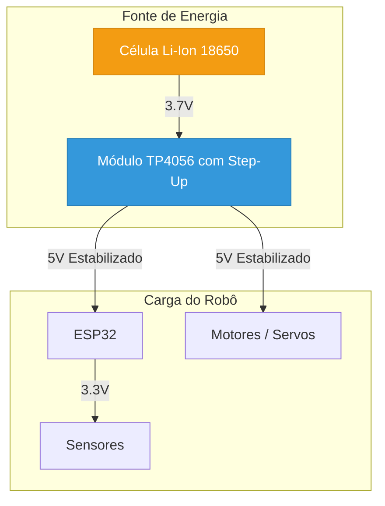

_# Módulo 2.5: Alimentação e Gestão de Energia

## A Força Vital do Robô

Um robô autônomo só é verdadeiramente autônomo se puder carregar sua própria fonte de energia. No Nível 1, usamos um power bank, que é uma solução simples e eficaz. No entanto, para robôs mais compactos e integrados, precisamos de um sistema de alimentação dedicado. Este módulo aborda os fundamentos da gestão de energia para robôs móveis.

## Tipos de Baterias

A escolha da bateria é uma das decisões mais críticas no design de um robô. Ela afeta o peso, a autonomia e a segurança do projeto.

| Tipo de Bateria | Vantagens | Desvantagens |
| :--- | :--- | :--- |
| **Alcalinas (AA, AAA)** | Baratas, fáceis de encontrar. | Não recarregáveis, baixa capacidade de corrente. |
| **NiMH (Níquel-Hidreto Metálico)** | Recarregáveis, mais seguras que Li-Ion. | Menor densidade de energia, efeito memória (em modelos antigos). |
| **Li-Ion (Íon de Lítio) / Li-Po (Polímero de Lítio)** | **Alta densidade de energia** (muita capacidade em pouco peso), alta capacidade de corrente. | **Requerem circuitos de proteção** (contra sobrecarga, descarga excessiva e curto-circuito), mais caras, sensíveis a danos físicos. |

Para robótica, as baterias de **Li-Ion** (como as células 18650) e **Li-Po** são as mais populares devido à sua excelente relação energia/peso. No entanto, elas exigem um cuidado extremo no manuseio e carregamento.

**AVISO DE SEGURANÇA:** Nunca use baterias de Lítio sem um **BMS (Battery Management System)** ou um circuito de proteção adequado. Uma sobrecarga ou um curto-circuito pode causar incêndios ou explosões.

## Reguladores de Tensão

Os componentes de um robô geralmente operam em tensões diferentes. Por exemplo:

-   **Motores**: Podem precisar de 6V, 7.4V ou até 12V.
-   **ESP32**: Opera com 3.3V, mas pode ser alimentado com 5V em seu pino VIN.
-   **Sensores**: Alguns operam em 5V, outros em 3.3V.

Uma bateria de Li-Ion fornece uma tensão que varia (ex: de 4.2V quando cheia a 3.0V quando vazia). Para fornecer as tensões estáveis que nossos componentes precisam, usamos **reguladores de tensão**.

### Reguladores Step-Down (Buck Converter)

Um conversor *step-down* **reduz** a tensão. Por exemplo, ele pode pegar os 7.4V de duas células de Li-Ion em série e convertê-los em 5V estáveis para alimentar o ESP32 e os servos.

### Reguladores Step-Up (Boost Converter)

Um conversor *step-up* **aumenta** a tensão. Por exemplo, ele pode pegar os 3.7V de uma única célula de Li-Ion e elevá-los para 5V.

O uso de conversores DC-DC (como os Buck e Boost) é muito mais eficiente do que usar reguladores lineares (como o LM7805), pois eles desperdiçam muito menos energia na forma de calor, o que é crucial para maximizar a autonomia da bateria.

## Projeto Prático: Sistema de Alimentação com Bateria 18650

Vamos projetar um sistema de alimentação básico para nosso robô usando uma célula de Li-Ion 18650 e um módulo que já inclui o carregador e o conversor step-up.

**Materiais Necessários:**
- 1x Célula de Li-Ion 18650
- 1x Suporte para bateria 18650
- 1x Módulo Carregador TP4056 com Proteção e Step-Up
    - *Este tipo de módulo é muito popular. Ele possui uma entrada micro-USB para carregar a bateria, um circuito de proteção e uma saída de 5V estabilizada.*
- Fios e conectores

**Montagem do Circuito:**

1.  **Encaixe a Bateria**: Coloque a célula 18650 no suporte, observando a polaridade correta.
2.  **Conecte a Bateria ao Módulo**: Solde os fios do suporte de bateria aos pads `B+` e `B-` do módulo TP4056.
3.  **Saída de 5V**: O módulo terá saídas marcadas como `OUT+` e `OUT-`. Esta será a sua fonte de 5V estabilizada para alimentar o robô (ESP32 e motores).
4.  **Carregamento**: Para carregar a bateria, basta conectar um cabo micro-USB à porta do módulo. Um LED no módulo indicará o status do carregamento (geralmente vermelho para carregando, azul/verde para completo).

**Diagrama do Sistema:**

**Resultado:**

Você agora tem um sistema de alimentação compacto e recarregável. A saída de 5V do módulo pode ser conectada diretamente à protoboard do seu robô, substituindo o power bank. Isso torna o robô totalmente independente e muito mais profissional.

No próximo módulo, vamos juntar todos os conceitos do Nível 2 para construir um robô autônomo completo, capaz de navegar em um ambiente usando sensores avançados e algoritmos de controle.
