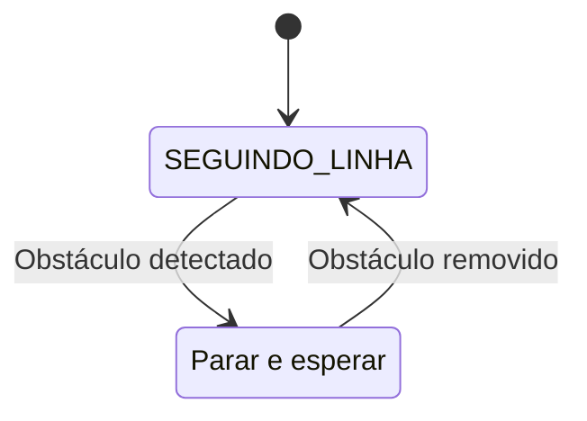

# Módulo 2.6: Projeto Final Nível 2 - Robô Autônomo Multi-Sensor

## O Desafio da Autonomia

Bem-vindo ao projeto final do Nível Intermediário! É hora de combinar o poder do ESP32, a precisão dos sensores avançados, a inteligência dos algoritmos de controle e um sistema de energia dedicado para construir um **robô autônomo multi-sensor**.

Nosso objetivo é construir um robô que possa navegar em um ambiente simples, realizando duas tarefas principais:

1.  **Seguir uma linha preta** no chão.
2.  **Parar automaticamente** se um obstáculo aparecer em seu caminho.

Este projeto representa um salto significativo em complexidade e capacidade em relação ao robô do Nível 1, transformando-o de um veículo teleoperado para um agente autônomo.


*Figura 1: Nosso objetivo é um robô que integra múltiplos sensores para navegar de forma inteligente.*

---

## 1. Upgrade do Hardware

Vamos partir do nosso Rover de Papel e adicionar os novos componentes.

**Materiais Adicionais:**
- 1x Módulo com 3 ou mais sensores de linha (TCRT5000)
- 1x Sensor Ultrassônico HC-SR04 (com divisor de tensão)
- 1x Sistema de alimentação com bateria (como o projetado no Módulo 2.5)
- Um chassi mais robusto (acrílico ou MDF é uma boa opção, mas o de papelão ainda funciona para prototipagem)

**Montagem:**

1.  **Chassi**: Monte o novo chassi, garantindo espaço para todos os componentes.
2.  **Motores e Rodas**: Fixe os servos de rotação contínua e as rodas, como no projeto anterior.
3.  **Sistema de Alimentação**: Instale a bateria e o módulo de gerenciamento de energia, garantindo que a saída de 5V esteja acessível.
4.  **Montagem dos Sensores**:
    -   **Sensores de Linha**: Monte o módulo de sensores de linha na frente do robô, o mais próximo possível do chão (cerca de 3-5 mm de altura é o ideal).
    -   **Sensor Ultrassônico**: Monte o HC-SR04 na frente do robô, apontado para frente, a uma altura que possa detectar obstáculos comuns.
5.  **Eletrônica**: Posicione o ESP32 e a protoboard no chassi e faça todas as conexões.

**Esquema de Conexões Sugerido:**

-   **Motores**: Esquerdo no **GPIO 18**, Direito no **GPIO 19**.
-   **Sensor Ultrassônico**: `Trig` no **GPIO 12**, `Echo` no **GPIO 13** (com divisor de tensão).
-   **Sensores de Linha** (exemplo para 3 sensores):
    -   Sensor Esquerdo: **GPIO 32**
    -   Sensor Central: **GPIO 33**
    -   Sensor Direito: **GPIO 34**

---

## 2. A Lógica do Programa: Uma Máquina de Estados

Nosso programa será estruturado como uma **máquina de estados**. O robô estará sempre em um de dois estados principais: `SEGUINDO_LINHA` ou `EVITANDO_OBSTACULO`.



-   O estado padrão é `SEGUINDO_LINHA`.
-   A cada ciclo do `loop()`, o robô primeiro verifica a distância com o sensor ultrassônico.
-   Se a distância for menor que um limiar (ex: 15 cm), ele transita para o estado `EVITANDO_OBSTACULO`, onde a ação principal é **parar**.
-   Se não houver obstáculo, ele executa a lógica do estado `SEGUINDO_LINHA`, usando os sensores de linha para ajustar a direção.

---

## 3. Código do Projeto

Este código integra a leitura de todos os sensores e implementa a máquina de estados descrita.

```cpp
#include <ESP32Servo.h>

// --- Configuração dos Pinos ---
const int pinoServoEsquerdo = 18;
const int pinoServoDireito = 19;

const int pinoTrig = 12;
const int pinoEcho = 13;

const int pinoSensorLinhaEsq = 32;
const int pinoSensorLinhaCen = 33;
const int pinoSensorLinhaDir = 34;

// --- Servos e Movimento ---
Servo servoEsquerdo;
Servo servoDireito;
int velocidadeBase = 150; // Velocidade de cruzeiro

// --- Sensores e Lógica ---
#define DISTANCIA_OBSTACULO 15 // cm

enum EstadoRobo { SEGUINDO_LINHA, EVITANDO_OBSTACULO };
EstadoRobo estadoAtual = SEGUINDO_LINHA;

void setup() {
  Serial.begin(115200);

  // Inicializa os motores
  servoEsquerdo.attach(pinoServoEsquerdo);
  servoDireito.attach(pinoServoDireito);

  // Inicializa os pinos dos sensores
  pinMode(pinoTrig, OUTPUT);
  pinMode(pinoEcho, INPUT);
  pinMode(pinoSensorLinhaEsq, INPUT);
  pinMode(pinoSensorLinhaCen, INPUT);
  pinMode(pinoSensorLinhaDir, INPUT);
}

// --- Funções de Movimento ---
void parar() { servoEsquerdo.writeMicroseconds(1500); servoDireito.writeMicroseconds(1500); }
void frente() { servoEsquerdo.writeMicroseconds(1500 + velocidadeBase); servoDireito.writeMicroseconds(1500 - velocidadeBase); }
void esquerda() { servoEsquerdo.writeMicroseconds(1500 - velocidadeBase); servoDireito.writeMicroseconds(1500 - velocidadeBase); }
void direita() { servoEsquerdo.writeMicroseconds(1500 + velocidadeBase); servoDireito.writeMicroseconds(1500 + velocidadeBase); }

// --- Funções de Leitura de Sensores ---
int lerDistancia() {
  digitalWrite(pinoTrig, LOW);
  delayMicroseconds(2);
  digitalWrite(pinoTrig, HIGH);
  delayMicroseconds(10);
  digitalWrite(pinoTrig, LOW);
  long duracao = pulseIn(pinoEcho, HIGH);
  return duracao * 0.0343 / 2;
}

void loop() {
  // 1. Verificação de Obstáculos (maior prioridade)
  int distancia = lerDistancia();
  if (distancia < DISTANCIA_OBSTACulo && distancia > 0) {
    estadoAtual = EVITANDO_OBSTACULO;
  } else {
    estadoAtual = SEGUINDO_LINHA;
  }

  // 2. Executa a lógica baseada no estado atual
  switch (estadoAtual) {
    case SEGUINDO_LINHA:
      // Lê os sensores de linha (LOW = viu linha preta)
      bool esq = digitalRead(pinoSensorLinhaEsq) == LOW;
      bool cen = digitalRead(pinoSensorLinhaCen) == LOW;
      bool dir = digitalRead(pinoSensorLinhaDir) == LOW;

      if (cen) {
        frente(); // Em cima da linha, vai para frente
      } else if (esq) {
        esquerda(); // Desviou para a direita, corrige para a esquerda
      } else if (dir) {
        direita(); // Desviou para a esquerda, corrige para a direita
      } else {
        // Perdeu a linha, para (ou pode girar para procurar)
        parar();
      }
      break;

    case EVITANDO_OBSTACULO:
      Serial.println("Obstáculo detectado! Parando.");
      parar();
      break;
  }
  
  delay(20); // Pequeno delay para estabilidade
}
```

---

## 4. Teste e Desafios

1.  **Crie uma Pista**: Desenhe uma pista simples em uma cartolina branca grande usando fita isolante preta. Comece com retas e curvas suaves.
2.  **Calibre os Motores**: Certifique-se de que os valores de `1500` em `parar()` realmente param seus motores. Ajuste se necessário.
3.  **Teste os Sensores**: Antes de colocar o robô na pista, verifique se os sensores de linha e o sensor ultrassônico estão fornecendo leituras corretas via Monitor Serial.
4.  **Execute o Robô**: Coloque o robô na pista e ligue-o. Ele deve começar a seguir a linha. Teste a função de evitar obstáculos colocando sua mão na frente dele.

**Desafios para Evoluir:**

-   **Controle PID**: Substitua a lógica simples de seguir linha por um controle PID (como discutido no Módulo 2.4) para um movimento muito mais suave e rápido.
-   **Intersecções**: Melhore o código para que o robô possa lidar com intersecções em "T" ou em cruz.
-   **Interface de Status**: Use o que aprendeu no Módulo 2.2 para criar um web server que mostre o estado atual do robô (seguindo linha, parado, etc.) e as leituras dos sensores em tempo real.

**Parabéns por concluir o Nível 2!** Você agora tem um robô autônomo e inteligente, e possui as habilidades necessárias para enfrentar os desafios do Nível 3, onde exploraremos o excitante mundo da Inteligência Artificial, Visão Computacional e Reconhecimento de Voz.
