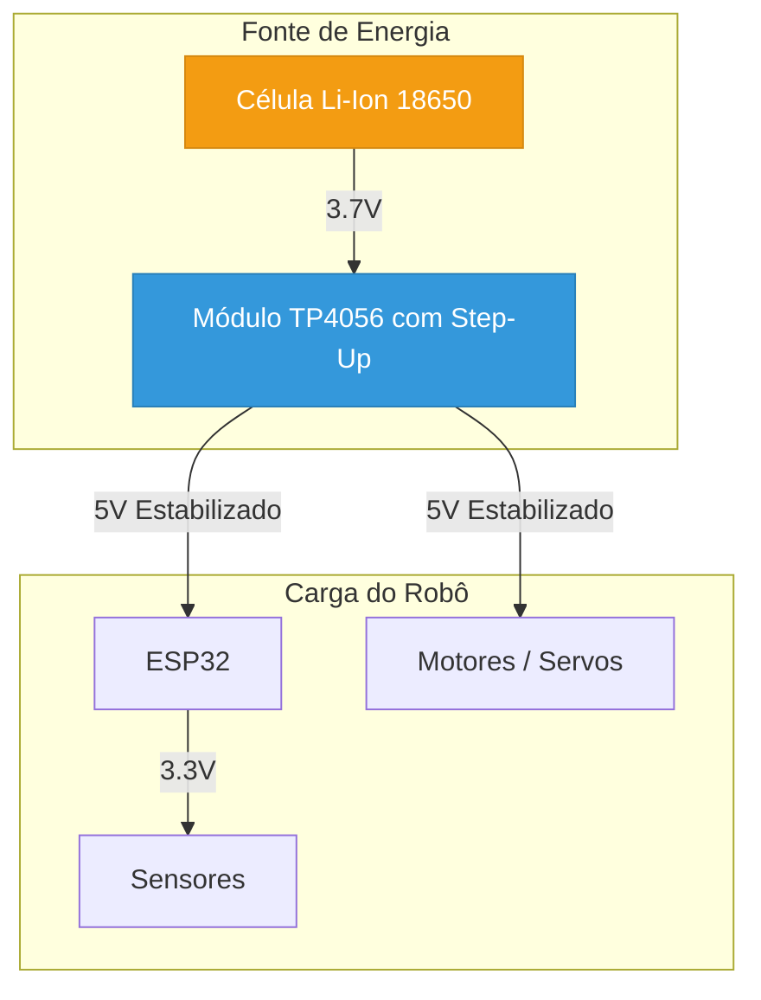
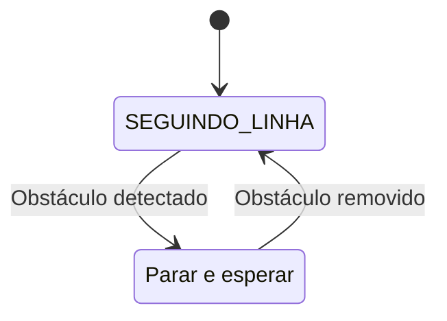

_# Módulo 2.1: Aprofundando no ESP32

## Bem-vindo ao Nível Intermediário!

No Nível 1, você construiu um robô funcional e aprendeu os fundamentos da programação e eletrônica. Agora, no Nível 2, vamos mergulhar em conceitos mais avançados para tornar nossos robôs mais inteligentes e autônomos. Começaremos explorando todo o potencial do **ESP32**, o cérebro poderoso que já estamos usando.

Enquanto o Arduino UNO é fantástico para começar, o ESP32 é uma plataforma muito mais robusta, projetada para a era da **Internet das Coisas (IoT)**. Suas principais vantagens são o processamento dual-core e, mais importante, a conectividade sem fio integrada.


*Figura 1: Diagrama de pinagem detalhado de um ESP32 DevKit, mostrando a vasta quantidade de periféricos disponíveis.*

---

## Arquitetura e Vantagens do ESP32

| Característica | Arduino UNO (ATmega328P) | ESP32 (Xtensa LX6) |
| :--- | :--- | :--- |
| **Processador** | Single-Core 8-bit @ 16 MHz | **Dual-Core 32-bit @ 240 MHz** |
| **Memória RAM** | 2 KB | **520 KB** |
| **Memória Flash** | 32 KB | **4 MB** (ou mais) |
| **Conectividade** | Nenhuma (requer shields) | **Wi-Fi 802.11 b/g/n e Bluetooth 4.2/BLE** |
| **Pinos GPIO** | 14 Digitais, 6 Analógicos | **Até 34**, com múltiplas funções (ADC, DAC, Touch, etc.) |
| **Tensão de Operação** | 5V | **3.3V** |

Essa superioridade em hardware permite que o ESP32 execute tarefas muito mais complexas, como:

-   Hospedar servidores web completos.
-   Processar dados de múltiplos sensores em tempo real.
-   Comunicar-se com outros dispositivos e serviços na nuvem.
-   Executar algoritmos de machine learning (no Nível 3).

### O Sistema Dual-Core

O ESP32 possui dois núcleos de processamento que podem executar tarefas de forma independente. Isso é extremamente útil em robótica. Podemos, por exemplo, dedicar um núcleo para tarefas críticas de tempo real (como o controle dos motores e a leitura de sensores), enquanto o outro núcleo cuida da comunicação Wi-Fi e da interface do usuário. Essa divisão evita que a conexão de rede interfira na estabilidade do robô.

---

## Pinos e Periféricos Especiais

Além dos pinos digitais e analógicos, o ESP32 oferece uma gama de periféricos avançados:

-   **ADC (Conversor Analógico-Digital)**: Múltiplos pinos para ler sensores analógicos com maior precisão.
-   **DAC (Conversor Digital-Analógico)**: Dois pinos que podem gerar um sinal de tensão analógico real, útil para áudio.
-   **Sensores de Toque**: Pinos que podem detectar o toque capacitivo, permitindo criar interfaces sem botões físicos.
-   **LEDC (PWM Avançado)**: O sistema de PWM do ESP32 é muito mais flexível que o do Arduino, permitindo configurar frequência e resolução para até 16 canais, ideal para controlar muitos servos ou LEDs com precisão.
-   **Comunicação**: Além do Serial (`UART`), o ESP32 suporta `I2C` e `SPI`, protocolos para se comunicar com centenas de sensores e outros chips usando poucos fios.

---

## Projeto Prático: Monitor de Status com Web Server

Vamos criar um projeto que demonstra o poder do ESP32. Construiremos um servidor web que não apenas controla um LED, mas também exibe o status de um pino (como um botão) e o tempo que o ESP32 está ligado (`uptime`).

**Materiais Necessários:**
- 1x ESP32 DevKit
- 1x LED
- 1x Resistor de 220Ω
- 1x Botão (Push-button)
- 1x Resistor de 10kΩ (pull-down)
- Protoboard e Fios Jumper

**Montagem do Circuito:**

1.  **LED**: Conecte o anodo (+) do LED ao **GPIO 26** através do resistor de 220Ω. Conecte o catodo (-) ao `GND`.
2.  **Botão**: Conecte um terminal do botão ao **GPIO 25**. No mesmo terminal, conecte o resistor de 10kΩ, e a outra ponta do resistor ao `GND`. Conecte o outro terminal do botão ao `3.3V` do ESP32.

**Código do Projeto:**

```cpp
#include <WiFi.h>

// Configurações de Rede
const char* ssid = "SEU_WIFI"; // <<< COLOQUE O NOME DA SUA REDE
const char* password = "SUA_SENHA"; // <<< COLOQUE A SENHA DA SUA REDE

WiFiServer server(80);

// Pinos dos componentes
const int pinoLed = 26;
const int pinoBotao = 25;

void setup() {
  Serial.begin(115200);
  pinMode(pinoLed, OUTPUT);
  pinMode(pinoBotao, INPUT);

  // Conecta ao Wi-Fi
  Serial.print("Conectando a ");
  Serial.println(ssid);
  WiFi.begin(ssid, password);
  while (WiFi.status() != WL_CONNECTED) {
    delay(500);
    Serial.print(".");
  }
  Serial.println("\nWiFi conectado!");
  Serial.print("Endereço IP: ");
  Serial.println(WiFi.localIP());

  server.begin();
}

void loop() {
  WiFiClient client = server.available();
  if (client) {
    String req = client.readStringUntil('\r');

    // Controle do LED
    if (req.indexOf("/led/on") != -1) {
      digitalWrite(pinoLed, HIGH);
    } else if (req.indexOf("/led/off") != -1) {
      digitalWrite(pinoLed, LOW);
    }

    // Monta a página HTML
    client.println("HTTP/1.1 200 OK");
    client.println("Content-Type: text/html");
    client.println("Connection: close");
    client.println();
    client.println("<!DOCTYPE html><html><head><title>ESP32 Web Server</title>");
    client.println("<meta http-equiv=\"refresh\" content=\"5\">"); // Atualiza a página a cada 5s
    client.println("</head><body><h1>Status do ESP32</h1>");
    client.print("<p>Uptime: ");
    client.print(millis() / 1000);
    client.println(" segundos</p>");
    client.print("<p>Status do Botão: ");
    client.print(digitalRead(pinoBotao) == HIGH ? "Pressionado" : "Solto");
    client.println("</p>");
    client.println("<p>Controle do LED:</p>");
    client.println("<a href=\"/led/on\"><button>Ligar</button></a>");
    client.println("<a href=\"/led/off\"><button>Desligar</button></a>");
    client.println("</body></html>");
  }
}
```

**Resultado Esperado:**

1.  **Atualize o SSID e a Senha**: Mude `"SEU_WIFI"` e `"SUA_SENHA"` para os dados da sua rede Wi-Fi.
2.  **Carregue o Código**: Envie o código para o ESP32.
3.  **Encontre o IP**: Abra o Monitor Serial. Ele mostrará o endereço de IP que o ESP32 recebeu do seu roteador.
4.  **Acesse o Servidor**: Digite esse endereço de IP no navegador de qualquer dispositivo (computador, celular) conectado à mesma rede Wi-Fi.

Você verá uma página que mostra há quanto tempo o ESP32 está ligado e o estado do botão. A página se atualizará automaticamente a cada 5 segundos. Os botões na página permitirão que você ligue e desligue o LED remotamente.

Este projeto demonstra como o ESP32 pode atuar como um dispositivo de IoT completo, servindo uma interface de usuário e interagindo com o hardware simultaneamente. No próximo módulo, vamos aprofundar na criação de interfaces web mais ricas e na comunicação sem fio.
_# Módulo 2.2: Comunicação Sem Fio e Interfaces Web

## Wi-Fi: O Coração da Conectividade

No projeto anterior, usamos o ESP32 no modo **Station (STA)**, onde ele se conecta a uma rede Wi-Fi existente, como um celular ou computador. No projeto do Nível 1 (Rover de Papel), usamos o modo **Access Point (AP)**, onde o ESP32 cria sua própria rede Wi-Fi.

Compreender a diferença é fundamental para a robótica conectada:

| Modo | Descrição | Vantagens | Desvantagens |
| :--- | :--- | :--- | :--- |
| **Station (STA)** | O ESP32 é um **cliente** em uma rede maior (seu roteador de casa). | Acesso à internet, comunicação com outros dispositivos na rede. | Depende de uma rede Wi-Fi existente. |
| **Access Point (AP)** | O ESP32 é o **roteador**, criando sua própria rede. | Autocontido, funciona em qualquer lugar sem infraestrutura externa. | Sem acesso à internet, apenas dispositivos conectados diretamente a ele podem se comunicar. |
| **AP + STA** | Modo híbrido onde o ESP32 cria sua rede e simultaneamente se conecta a outra. | O melhor dos dois mundos: oferece um ponto de acesso para configuração e ainda se conecta à internet. | Mais complexo de gerenciar. |

Para robôs móveis, o modo AP é excelente para controle direto em campo, enquanto o modo STA é ideal para robôs que precisam buscar informações da internet ou serem controlados de qualquer lugar do mundo.

---

## HTTP e a Web: Como Funciona a Comunicação

Quando você acessa uma página no seu navegador, seu dispositivo está fazendo uma **requisição HTTP** para um servidor. O servidor então envia de volta uma **resposta HTTP**, que contém o conteúdo da página (geralmente HTML, CSS e JavaScript).

-   **Requisição (Request)**: O cliente (navegador) pede um recurso. Ex: `GET /led/on`.
-   **Resposta (Response)**: O servidor (ESP32) envia o recurso ou uma confirmação. Ex: `HTTP/1.1 200 OK` seguido do código HTML.

Nosso ESP32 atua como um mini servidor web. Ele escuta por requisições e responde de acordo com a lógica que programamos.

### Criando Interfaces Web Melhores

No código anterior, o HTML e o CSS estavam misturados em uma única `String` no código C++, o que é difícil de manter. Uma abordagem muito mais limpa é armazenar o HTML em uma variável separada usando a notação `R"rawliteral(...)rawliteral"` do C++. Isso permite escrever HTML de forma muito mais natural.


*Figura 1: Um robô com ESP32-CAM sendo controlado por uma interface web sofisticada em um smartphone.*

---

## Projeto Prático: Dashboard de Controle Avançado

Vamos evoluir nosso web server para um dashboard mais completo. Ele terá botões que mudam de cor para refletir o estado do LED e usará um pouco de JavaScript para enviar comandos sem recarregar a página (uma técnica conhecida como **AJAX**), tornando a experiência muito mais fluida.

**Materiais:**
- Os mesmos do projeto anterior (Módulo 2.1).

**Montagem:**
- A mesma do projeto anterior.

**Código do Projeto:**

Este código é mais longo, mas a maior parte é a página HTML e o JavaScript. A lógica no ESP32 continua simples.

```cpp
#include <WiFi.h>

// ===== Configurações de Rede =====
const char* ssid = "SEU_WIFI";
const char* password = "SUA_SENHA";
WiFiServer server(80);

// ===== Pinos e Estado =====
const int pinoLed = 26;
bool estadoLed = false;

// ===== Página HTML com CSS e JavaScript =====
const char* HTML_PAGE = R"rawliteral(
<!DOCTYPE html>
<html lang="pt-BR">
<head>
<meta charset="utf-8" />
<meta name="viewport" content="width=device-width,initial-scale=1" />
<title>ESP32 Dashboard</title>
<style>
  body { font-family: system-ui, sans-serif; text-align:center; margin: 24px; background-color: #f0f0f0; }
  h1 { color: #333; }
  .card { background-color: white; padding: 20px; border-radius: 12px; box-shadow: 0 4px 8px rgba(0,0,0,0.1); max-width: 400px; margin: 20px auto; }
  button { font-size: 18px; padding: 12px 24px; border: none; border-radius: 8px; cursor: pointer; transition: background-color 0.3s; }
  .on { background-color: #2ecc71; color: white; }
  .off { background-color: #e74c3c; color: white; }
</style>
</head>
<body>
  <h1>Dashboard do Robô</h1>
  <div class="card">
    <h2>Controle do LED</h2>
    <p>O LED está atualmente: <b id="status">DESLIGADO</b></p>
    <button id="btnLigar" class="on" onclick="sendCommand('on')">LIGAR</button>
    <button id="btnDesligar" class="off" onclick="sendCommand('off')">DESLIGAR</button>
  </div>
<script>
function sendCommand(cmd) {
  fetch('/led/' + cmd)
    .then(response => response.text())
    .then(data => {
      document.getElementById('status').innerText = data;
    });
}
</script>
</body>
</html>
)rawliteral";

void setup() {
  pinMode(pinoLed, OUTPUT);
  digitalWrite(pinoLed, LOW);
  
  WiFi.begin(ssid, password);
  while (WiFi.status() != WL_CONNECTED) { delay(500); }
  server.begin();
}

void handleRequest(WiFiClient& client, String req) {
  String response_content_type = "text/html";
  String response_body = "";

  if (req.startsWith("GET /led/on")) {
    estadoLed = true;
    digitalWrite(pinoLed, HIGH);
    response_content_type = "text/plain";
    response_body = "LIGADO";
  } else if (req.startsWith("GET /led/off")) {
    estadoLed = false;
    digitalWrite(pinoLed, LOW);
    response_content_type = "text/plain";
    response_body = "DESLIGADO";
  } else {
    response_body = HTML_PAGE;
  }

  client.println("HTTP/1.1 200 OK");
  client.println("Content-Type: " + response_content_type + "; charset=utf-8");
  client.println("Connection: close\r\n");
  client.print(response_body);
}

void loop() {
  WiFiClient client = server.available();
  if (!client) return;
  String req = client.readStringUntil('\r');
  while (client.available()) client.read();
  handleRequest(client, req);
  delay(1);
}
```

**Como o Código Funciona:**

1.  **HTML/CSS**: A página agora tem um estilo mais agradável, com um "card" para organizar o conteúdo.
2.  **JavaScript (AJAX)**: A função `sendCommand(cmd)` usa a API `fetch()` do navegador. Quando um botão é clicado, o JavaScript envia a requisição (ex: `/led/on`) para o ESP32 em segundo plano. Ele não recarrega a página inteira.
3.  **Lógica do ESP32**: O servidor agora é mais inteligente. Se ele recebe um comando `/led/on` ou `/led/off`, ele muda o estado do LED e responde apenas com o novo status em texto puro (ex: "LIGADO"). Se ele recebe qualquer outra requisição, ele responde com a página HTML completa.
4.  **Atualização da Interface**: O JavaScript recebe a resposta de texto puro e atualiza apenas o `<span>` com o ID "status", mudando o texto na tela sem piscar.

**Resultado Esperado:**

Ao acessar o IP do seu ESP32, você verá um dashboard mais profissional. Clicar nos botões "LIGAR" e "DESLIGAR" mudará o estado do LED instantaneamente, e o texto de status na página será atualizado sem que a página inteira precise ser recarregada. Esta é a base para criar interfaces de controle de robôs muito mais responsivas e agradáveis de usar.

No próximo módulo, vamos adicionar mais "sentidos" ao nosso robô com sensores avançados.
_# Módulo 2.3: Sensores Avançados

## Dando Mais Sentidos ao Robô

No Nível 1, usamos o sensor ultrassônico para dar ao nosso robô uma percepção básica de distância. Agora, vamos equipá-lo com sentidos mais aguçados que permitem tarefas de navegação complexas, como seguir uma linha ou saber sua própria orientação no espaço.

### Sensor de Linha Infravermelho (TCRT5000)

O TCRT5000 é um sensor de refletância. Ele consiste em um LED infravermelho (emissor) e um fototransistor (receptor). O LED emite luz IR, que é refletida pela superfície abaixo do sensor e captada pelo fototransistor.

-   **Superfícies Claras (Branco)**: Refletem muita luz IR. O fototransistor recebe um sinal forte.
-   **Superfícies Escuras (Preto)**: Absorvem a maior parte da luz IR. O fototransistor recebe um sinal fraco.

Ao ler a intensidade do sinal refletido, o robô pode distinguir entre uma linha preta e um fundo branco, tornando-se a base para um **robô seguidor de linha**.


*Figura 1: Um módulo com o sensor TCRT5000. Ele já inclui o circuito necessário e um pino de saída digital e/ou analógico.*

### Unidade de Medição Inercial (IMU) - MPU-6050

A IMU é um dos sensores mais poderosos para robótica. O MPU-6050 é um chip que combina dois sensores em um:

1.  **Acelerômetro**: Mede a aceleração linear em três eixos (X, Y, Z). Pode ser usado para detectar inclinação e movimento.
2.  **Giroscópio**: Mede a velocidade angular (rotação) em três eixos (X, Y, Z). É essencial para saber o quão rápido o robô está virando.

Combinando os dados desses dois sensores (um processo chamado de **fusão de sensores**), podemos obter uma estimativa muito precisa da orientação do robô no espaço (seu *roll*, *pitch* e *yaw*). Isso é crucial para realizar curvas precisas (ex: virar exatamente 90 graus) ou para manter o robô equilibrado.


*Figura 2: Um módulo MPU-6050 conectado a um Arduino via protocolo I2C, que usa apenas dois fios de dados (SDA e SCL).*

---

## Projeto Prático: Navegador com IMU

Vamos construir um programa que lê os dados do MPU-6050 e os exibe no Monitor Serial. Este é o primeiro passo para usar a IMU em um sistema de navegação.

**Materiais Necessários:**
- 1x ESP32 DevKit
- 1x Módulo MPU-6050
- Protoboard e Fios Jumper

**Montagem do Circuito (Protocolo I2C):**

O MPU-6050 se comunica usando o protocolo I2C, que é muito conveniente pois usa apenas dois pinos de dados.

1.  **Alimentação**: Conecte o pino `VCC` do MPU-6050 ao pino `3.3V` do ESP32. Conecte o `GND` do MPU-6050 ao `GND` do ESP32.
2.  **Dados I2C**:
    -   Conecte o pino `SCL` (Serial Clock) do MPU-6050 ao pino **GPIO 22** do ESP32 (pino SCL padrão).
    -   Conecte o pino `SDA` (Serial Data) do MPU-6050 ao pino **GPIO 21** do ESP32 (pino SDA padrão).

**Código do Projeto:**

Primeiro, instale a biblioteca para o MPU-6050. Vá em `Ferramentas > Gerenciar Bibliotecas` e instale a biblioteca **"Adafruit MPU6050"** e suas dependências (como a **"Adafruit BusIO"** e a **"Adafruit Unified Sensor"**).

```cpp
#include <Adafruit_MPU6050.h>
#include <Adafruit_Sensor.h>
#include <Wire.h>

// Cria um objeto para o sensor MPU6050
Adafruit_MPU6050 mpu;

void setup() {
  Serial.begin(115200);

  // Tenta inicializar o sensor
  if (!mpu.begin()) {
    Serial.println(\"Falha ao encontrar o chip MPU6050. Verifique as conexões!\");
    while (1) {
      delay(10);
    }
  }
  Serial.println(\"MPU6050 Encontrado!\");

  // Configura as faixas de medição (opcional)
  mpu.setAccelerometerRange(MPU6050_RANGE_8_G);
  mpu.setGyroRange(MPU6050_RANGE_500_DPS);
  mpu.setFilterBandwidth(MPU6050_BAND_21_HZ);
}

void loop() {
  // Cria variáveis para armazenar os eventos (leituras) dos sensores
  sensors_event_t a, g, temp;
  mpu.getEvent(&a, &g, &temp);

  // Imprime os dados do Acelerômetro (em m/s^2)
  Serial.print(\"Aceleração X: \");
  Serial.print(a.acceleration.x);
  Serial.print(\", Y: \");
  Serial.print(a.acceleration.y);
  Serial.print(\", Z: \");
  Serial.print(a.acceleration.z);
  Serial.println(\" m/s^2\");

  // Imprime os dados do Giroscópio (em rad/s)
  Serial.print(\"Rotação X: \");
  Serial.print(g.gyro.x);
  Serial.print(\", Y: \");
  Serial.print(g.gyro.y);
  Serial.print(\", Z: \");
  Serial.print(g.gyro.z);
  Serial.println(\" rad/s\");

  Serial.println(\"---\" );

  delay(500); // Pausa de meio segundo entre as leituras
}
```

**Resultado Esperado:**

Abra o Monitor Serial. Você verá um fluxo contínuo de dados do acelerômetro e do giroscópio. Tente mover e girar o sensor MPU-6050. Observe como os valores nos eixos X, Y e Z mudam de acordo com o movimento.

-   **Acelerômetro**: Com o sensor parado e nivelado, o eixo Z deve mostrar um valor próximo a 9.8 m/s², que é a aceleração da gravidade. Ao inclinar o sensor, a gravidade será distribuída entre os eixos X e Y.
-   **Giroscópio**: Com o sensor parado, os valores devem ser próximos de zero. Ao girá-lo, você verá picos de velocidade angular no eixo correspondente.

Entender e interpretar esses dados é o primeiro passo para criar algoritmos de controle sofisticados, que é exatamente o que faremos no próximo módulo.
_# Módulo 2.4: Algoritmos de Controle

## Dando Inteligência ao Movimento

Até agora, nossos robôs ou eram controlados diretamente por nós (teleoperados) ou tinham uma lógica de decisão muito simples (se a distância for menor que X, faça Y). Para criar robôs verdadeiramente autônomos, precisamos de **algoritmos de controle**: um conjunto de regras e cálculos que permitem ao robô tomar decisões inteligentes com base nos dados dos sensores para atingir um objetivo.

Neste módulo, vamos explorar dois algoritmos fundamentais: a lógica para seguir uma linha e o famoso controle PID.

---

## Lógica de um Robô Seguidor de Linha

Um dos desafios clássicos da robótica é construir um robô que possa seguir uma linha preta em um fundo branco. A lógica por trás disso é um excelente exercício de controle.

Imagine que nosso robô tem **três sensores de linha** (TCRT5000) na frente: um à esquerda, um no centro e um à direita.


*Figura 1: Um robô autônomo precisa de algoritmos para interpretar os dados dos seus sensores e decidir como se mover.*

A lógica de decisão pode ser descrita como uma série de regras "SE-ENTÃO":

| Leitura dos Sensores (Esquerda, Centro, Direita) | Situação | Ação do Robô |
| :--- | :--- | :--- |
| Branco, **Preto**, Branco | O robô está perfeitamente sobre a linha. | **Mover para frente** em velocidade normal. |
| Branco, Branco, **Preto** | O robô está desviando para a esquerda. | **Virar para a direita** para corrigir. |
| **Preto**, Branco, Branco | O robô está desviando para a direita. | **Virar para a esquerda** para corrigir. |
| Branco, Branco, Branco | O robô perdeu a linha (ou chegou a uma interrupção). | **Parar** ou iniciar uma rotina de busca. |
| **Preto**, **Preto**, **Preto** | O robô encontrou uma intersecção ou a linha de chegada. | **Parar** ou tomar uma decisão mais complexa. |

Este é um exemplo de uma **máquina de estados finitos**, onde o robô está sempre em um de vários estados possíveis e transita entre eles com base nas leituras dos sensores.

---

## Controle PID: O Segredo da Precisão

A lógica "SE-ENTÃO" funciona, mas muitas vezes resulta em um movimento oscilante, onde o robô ziguezagueia sobre a linha. Para um movimento suave e preciso, usamos um **Controlador Proporcional-Integral-Derivativo (PID)**.

O PID é um algoritmo de controle de malha fechada amplamente utilizado na indústria e na robótica. Seu objetivo é minimizar o **erro** entre o estado atual de um sistema e o estado desejado (o *setpoint*).

No nosso robô seguidor de linha, o **erro** pode ser definido como a distância do sensor central até o centro da linha. O PID calcula uma **saída de correção** para os motores com base em três termos:


*Figura 2: Um fluxograma de programa de robô. O controle PID se encaixa no passo de "Processar Dados" e "Tomar Decisão".*

### 1. Termo Proporcional (P)

O termo **Proporcional** é a parte mais intuitiva. A correção é **proporcional ao erro atual**. 

-   Se o robô está muito longe da linha (erro grande), a correção é forte (vira bruscamente).
-   Se o robô está perto da linha (erro pequeno), a correção é suave.

**Correção_P = Kp * erro**

O `Kp` é uma constante de ganho que ajustamos. Um `Kp` muito alto causa oscilações; um `Kp` muito baixo torna o robô lento para reagir.

### 2. Termo Integral (I)

O termo **Integral** lida com o **erro acumulado ao longo do tempo**. Ele serve para corrigir pequenos erros persistentes que o termo P sozinho não consegue eliminar (erro de estado estacionário).

-   Se o robô fica consistentemente um pouco à direita da linha, o erro se acumula, e o termo I aumenta gradualmente a correção para a esquerda até que o erro seja zerado.

**Correção_I = Ki * (soma_dos_erros)**

O `Ki` é a constante integral. Um `Ki` muito alto pode levar a uma correção exagerada e instabilidade.

### 3. Termo Derivativo (D)

O termo **Derivativo** olha para a **taxa de variação do erro** (a "velocidade" com que o erro está mudando). Ele tem um efeito de amortecimento, prevendo o erro futuro e agindo para evitar que a correção seja excessiva (*overshoot*).

-   Se o robô está se aproximando da linha muito rápido, o termo D reduz a força da correção para que ele não passe direto pelo centro.

**Correção_D = Kd * (erro_atual - erro_anterior)**

O `Kd` é a constante derivativa. Ele ajuda a estabilizar o sistema e reduzir as oscilações.

### A Equação Final do PID

A correção total aplicada aos motores é a soma dos três termos:

**Correção_Final = (Kp * erro) + (Ki * soma_dos_erros) + (Kd * (erro_atual - erro_anterior))**

Esta `Correção_Final` é então usada para ajustar a velocidade dos motores esquerdo e direito, fazendo o robô seguir a linha de forma suave e eficiente.

---

## Projeto Prático: Simulação de Controle PID

Implementar um PID completo em hardware requer um ajuste cuidadoso (chamado de *tuning*) das constantes Kp, Ki e Kd. Antes de colocar no robô, vamos fazer um programa simples que simula a lógica do PID no Monitor Serial.

**Materiais:**
- Apenas um ESP32 DevKit.

**Código do Projeto:**

Este código simula um sistema (como nosso robô) que tenta alcançar um `setpoint` (ponto desejado) de `100`.

```cpp
// Variáveis do sistema simulado
double setpoint = 100.0; // O valor que queremos alcançar
double valorAtual = 0.0;   // O valor atual do sistema
double saidaMotor = 0.0;  // A "força" aplicada ao sistema

// Constantes do PID (Tuning)
double Kp = 0.5;
double Ki = 0.2;
double Kd = 0.1;

// Variáveis do PID
double erro;
double erroAnterior = 0;
double integral = 0;
double derivativo;

unsigned long tempoAnterior;

void setup() {
  Serial.begin(115200);
  tempoAnterior = millis();
}

void loop() {
  unsigned long tempoAtual = millis();
  double dt = (double)(tempoAtual - tempoAnterior) / 1000.0; // Delta T em segundos
  tempoAnterior = tempoAtual;

  // ===== Lógica do PID =====
  erro = setpoint - valorAtual;
  integral += erro * dt;
  derivativo = (erro - erroAnterior) / dt;
  erroAnterior = erro;

  // Calcula a saída do PID
  double saidaPID = (Kp * erro) + (Ki * integral) + (Kd * derivativo);

  // ===== Simulação do Sistema =====
  // A saída do PID afeta o valor atual do sistema (simulando o motor empurrando o robô)
  valorAtual += saidaPID * dt;

  // Imprime os resultados
  Serial.print("Setpoint: "); Serial.print(setpoint);
  Serial.print(" | Valor Atual: "); Serial.print(valorAtual);
  Serial.print(" | Erro: "); Serial.print(erro);
  Serial.print(" | Saída PID: "); Serial.println(saidaPID);

  // Para a simulação quando chegar perto do setpoint
  if (abs(erro) < 0.1) {
    Serial.println("\nSetpoint alcançado! Fim da simulação.");
    while(true) delay(1000);
  }

  delay(100);
}
```

**Resultado Esperado:**

Abra o Monitor Serial. Você verá o `Valor Atual` começar em 0 e gradualmente se aproximar do `Setpoint` de 100. Observe como a `Saída PID` é alta no início (quando o erro é grande) e diminui à medida que o `Valor Atual` se aproxima do `Setpoint`.

Experimente mudar os valores de `Kp`, `Ki` e `Kd`:
-   Aumente `Kp`: o sistema responderá mais rápido, mas pode passar do setpoint e oscilar.
-   Aumente `Ki`: o sistema eliminará erros pequenos mais rápido, mas pode se tornar instável.
-   Aumente `Kd`: o sistema ficará mais estável e com menos oscilações.

Entender essa dinâmica é a chave para aplicar o PID em projetos reais. No projeto final deste nível, usaremos essa lógica para criar um robô autônomo que navega com precisão.
_# Módulo 2.5: Alimentação e Gestão de Energia

## A Força Vital do Robô

Um robô autônomo só é verdadeiramente autônomo se puder carregar sua própria fonte de energia. No Nível 1, usamos um power bank, que é uma solução simples e eficaz. No entanto, para robôs mais compactos e integrados, precisamos de um sistema de alimentação dedicado. Este módulo aborda os fundamentos da gestão de energia para robôs móveis.

## Tipos de Baterias

A escolha da bateria é uma das decisões mais críticas no design de um robô. Ela afeta o peso, a autonomia e a segurança do projeto.

| Tipo de Bateria | Vantagens | Desvantagens |
| :--- | :--- | :--- |
| **Alcalinas (AA, AAA)** | Baratas, fáceis de encontrar. | Não recarregáveis, baixa capacidade de corrente. |
| **NiMH (Níquel-Hidreto Metálico)** | Recarregáveis, mais seguras que Li-Ion. | Menor densidade de energia, efeito memória (em modelos antigos). |
| **Li-Ion (Íon de Lítio) / Li-Po (Polímero de Lítio)** | **Alta densidade de energia** (muita capacidade em pouco peso), alta capacidade de corrente. | **Requerem circuitos de proteção** (contra sobrecarga, descarga excessiva e curto-circuito), mais caras, sensíveis a danos físicos. |

Para robótica, as baterias de **Li-Ion** (como as células 18650) e **Li-Po** são as mais populares devido à sua excelente relação energia/peso. No entanto, elas exigem um cuidado extremo no manuseio e carregamento.

**AVISO DE SEGURANÇA:** Nunca use baterias de Lítio sem um **BMS (Battery Management System)** ou um circuito de proteção adequado. Uma sobrecarga ou um curto-circuito pode causar incêndios ou explosões.

## Reguladores de Tensão

Os componentes de um robô geralmente operam em tensões diferentes. Por exemplo:

-   **Motores**: Podem precisar de 6V, 7.4V ou até 12V.
-   **ESP32**: Opera com 3.3V, mas pode ser alimentado com 5V em seu pino VIN.
-   **Sensores**: Alguns operam em 5V, outros em 3.3V.

Uma bateria de Li-Ion fornece uma tensão que varia (ex: de 4.2V quando cheia a 3.0V quando vazia). Para fornecer as tensões estáveis que nossos componentes precisam, usamos **reguladores de tensão**.

### Reguladores Step-Down (Buck Converter)

Um conversor *step-down* **reduz** a tensão. Por exemplo, ele pode pegar os 7.4V de duas células de Li-Ion em série e convertê-los em 5V estáveis para alimentar o ESP32 e os servos.

### Reguladores Step-Up (Boost Converter)

Um conversor *step-up* **aumenta** a tensão. Por exemplo, ele pode pegar os 3.7V de uma única célula de Li-Ion e elevá-los para 5V.

O uso de conversores DC-DC (como os Buck e Boost) é muito mais eficiente do que usar reguladores lineares (como o LM7805), pois eles desperdiçam muito menos energia na forma de calor, o que é crucial para maximizar a autonomia da bateria.

## Projeto Prático: Sistema de Alimentação com Bateria 18650

Vamos projetar um sistema de alimentação básico para nosso robô usando uma célula de Li-Ion 18650 e um módulo que já inclui o carregador e o conversor step-up.

**Materiais Necessários:**
- 1x Célula de Li-Ion 18650
- 1x Suporte para bateria 18650
- 1x Módulo Carregador TP4056 com Proteção e Step-Up
    - *Este tipo de módulo é muito popular. Ele possui uma entrada micro-USB para carregar a bateria, um circuito de proteção e uma saída de 5V estabilizada.*
- Fios e conectores

**Montagem do Circuito:**

1.  **Encaixe a Bateria**: Coloque a célula 18650 no suporte, observando a polaridade correta.
2.  **Conecte a Bateria ao Módulo**: Solde os fios do suporte de bateria aos pads `B+` e `B-` do módulo TP4056.
3.  **Saída de 5V**: O módulo terá saídas marcadas como `OUT+` e `OUT-`. Esta será a sua fonte de 5V estabilizada para alimentar o robô (ESP32 e motores).
4.  **Carregamento**: Para carregar a bateria, basta conectar um cabo micro-USB à porta do módulo. Um LED no módulo indicará o status do carregamento (geralmente vermelho para carregando, azul/verde para completo).

**Diagrama do Sistema:**



**Resultado:**

Você agora tem um sistema de alimentação compacto e recarregável. A saída de 5V do módulo pode ser conectada diretamente à protoboard do seu robô, substituindo o power bank. Isso torna o robô totalmente independente e muito mais profissional.

No próximo módulo, vamos juntar todos os conceitos do Nível 2 para construir um robô autônomo completo, capaz de navegar em um ambiente usando sensores avançados e algoritmos de controle.
# Módulo 2.6: Projeto Final Nível 2 - Robô Autônomo Multi-Sensor

## O Desafio da Autonomia

Bem-vindo ao projeto final do Nível Intermediário! É hora de combinar o poder do ESP32, a precisão dos sensores avançados, a inteligência dos algoritmos de controle e um sistema de energia dedicado para construir um **robô autônomo multi-sensor**.

Nosso objetivo é construir um robô que possa navegar em um ambiente simples, realizando duas tarefas principais:

1.  **Seguir uma linha preta** no chão.
2.  **Parar automaticamente** se um obstáculo aparecer em seu caminho.

Este projeto representa um salto significativo em complexidade e capacidade em relação ao robô do Nível 1, transformando-o de um veículo teleoperado para um agente autônomo.


*Figura 1: Nosso objetivo é um robô que integra múltiplos sensores para navegar de forma inteligente.*

---

## 1. Upgrade do Hardware

Vamos partir do nosso Rover de Papel e adicionar os novos componentes.

**Materiais Adicionais:**
- 1x Módulo com 3 ou mais sensores de linha (TCRT5000)
- 1x Sensor Ultrassônico HC-SR04 (com divisor de tensão)
- 1x Sistema de alimentação com bateria (como o projetado no Módulo 2.5)
- Um chassi mais robusto (acrílico ou MDF é uma boa opção, mas o de papelão ainda funciona para prototipagem)

**Montagem:**

1.  **Chassi**: Monte o novo chassi, garantindo espaço para todos os componentes.
2.  **Motores e Rodas**: Fixe os servos de rotação contínua e as rodas, como no projeto anterior.
3.  **Sistema de Alimentação**: Instale a bateria e o módulo de gerenciamento de energia, garantindo que a saída de 5V esteja acessível.
4.  **Montagem dos Sensores**:
    -   **Sensores de Linha**: Monte o módulo de sensores de linha na frente do robô, o mais próximo possível do chão (cerca de 3-5 mm de altura é o ideal).
    -   **Sensor Ultrassônico**: Monte o HC-SR04 na frente do robô, apontado para frente, a uma altura que possa detectar obstáculos comuns.
5.  **Eletrônica**: Posicione o ESP32 e a protoboard no chassi e faça todas as conexões.

**Esquema de Conexões Sugerido:**

-   **Motores**: Esquerdo no **GPIO 18**, Direito no **GPIO 19**.
-   **Sensor Ultrassônico**: `Trig` no **GPIO 12**, `Echo` no **GPIO 13** (com divisor de tensão).
-   **Sensores de Linha** (exemplo para 3 sensores):
    -   Sensor Esquerdo: **GPIO 32**
    -   Sensor Central: **GPIO 33**
    -   Sensor Direito: **GPIO 34**

---

## 2. A Lógica do Programa: Uma Máquina de Estados

Nosso programa será estruturado como uma **máquina de estados**. O robô estará sempre em um de dois estados principais: `SEGUINDO_LINHA` ou `EVITANDO_OBSTACULO`.



-   O estado padrão é `SEGUINDO_LINHA`.
-   A cada ciclo do `loop()`, o robô primeiro verifica a distância com o sensor ultrassônico.
-   Se a distância for menor que um limiar (ex: 15 cm), ele transita para o estado `EVITANDO_OBSTACULO`, onde a ação principal é **parar**.
-   Se não houver obstáculo, ele executa a lógica do estado `SEGUINDO_LINHA`, usando os sensores de linha para ajustar a direção.

---

## 3. Código do Projeto

Este código integra a leitura de todos os sensores e implementa a máquina de estados descrita.

```cpp
#include <ESP32Servo.h>

// --- Configuração dos Pinos ---
const int pinoServoEsquerdo = 18;
const int pinoServoDireito = 19;

const int pinoTrig = 12;
const int pinoEcho = 13;

const int pinoSensorLinhaEsq = 32;
const int pinoSensorLinhaCen = 33;
const int pinoSensorLinhaDir = 34;

// --- Servos e Movimento ---
Servo servoEsquerdo;
Servo servoDireito;
int velocidadeBase = 150; // Velocidade de cruzeiro

// --- Sensores e Lógica ---
#define DISTANCIA_OBSTACULO 15 // cm

enum EstadoRobo { SEGUINDO_LINHA, EVITANDO_OBSTACULO };
EstadoRobo estadoAtual = SEGUINDO_LINHA;

void setup() {
  Serial.begin(115200);

  // Inicializa os motores
  servoEsquerdo.attach(pinoServoEsquerdo);
  servoDireito.attach(pinoServoDireito);

  // Inicializa os pinos dos sensores
  pinMode(pinoTrig, OUTPUT);
  pinMode(pinoEcho, INPUT);
  pinMode(pinoSensorLinhaEsq, INPUT);
  pinMode(pinoSensorLinhaCen, INPUT);
  pinMode(pinoSensorLinhaDir, INPUT);
}

// --- Funções de Movimento ---
void parar() { servoEsquerdo.writeMicroseconds(1500); servoDireito.writeMicroseconds(1500); }
void frente() { servoEsquerdo.writeMicroseconds(1500 + velocidadeBase); servoDireito.writeMicroseconds(1500 - velocidadeBase); }
void esquerda() { servoEsquerdo.writeMicroseconds(1500 - velocidadeBase); servoDireito.writeMicroseconds(1500 - velocidadeBase); }
void direita() { servoEsquerdo.writeMicroseconds(1500 + velocidadeBase); servoDireito.writeMicroseconds(1500 + velocidadeBase); }

// --- Funções de Leitura de Sensores ---
int lerDistancia() {
  digitalWrite(pinoTrig, LOW);
  delayMicroseconds(2);
  digitalWrite(pinoTrig, HIGH);
  delayMicroseconds(10);
  digitalWrite(pinoTrig, LOW);
  long duracao = pulseIn(pinoEcho, HIGH);
  return duracao * 0.0343 / 2;
}

void loop() {
  // 1. Verificação de Obstáculos (maior prioridade)
  int distancia = lerDistancia();
  if (distancia < DISTANCIA_OBSTACulo && distancia > 0) {
    estadoAtual = EVITANDO_OBSTACULO;
  } else {
    estadoAtual = SEGUINDO_LINHA;
  }

  // 2. Executa a lógica baseada no estado atual
  switch (estadoAtual) {
    case SEGUINDO_LINHA:
      // Lê os sensores de linha (LOW = viu linha preta)
      bool esq = digitalRead(pinoSensorLinhaEsq) == LOW;
      bool cen = digitalRead(pinoSensorLinhaCen) == LOW;
      bool dir = digitalRead(pinoSensorLinhaDir) == LOW;

      if (cen) {
        frente(); // Em cima da linha, vai para frente
      } else if (esq) {
        esquerda(); // Desviou para a direita, corrige para a esquerda
      } else if (dir) {
        direita(); // Desviou para a esquerda, corrige para a direita
      } else {
        // Perdeu a linha, para (ou pode girar para procurar)
        parar();
      }
      break;

    case EVITANDO_OBSTACULO:
      Serial.println("Obstáculo detectado! Parando.");
      parar();
      break;
  }
  
  delay(20); // Pequeno delay para estabilidade
}
```

---

## 4. Teste e Desafios

1.  **Crie uma Pista**: Desenhe uma pista simples em uma cartolina branca grande usando fita isolante preta. Comece com retas e curvas suaves.
2.  **Calibre os Motores**: Certifique-se de que os valores de `1500` em `parar()` realmente param seus motores. Ajuste se necessário.
3.  **Teste os Sensores**: Antes de colocar o robô na pista, verifique se os sensores de linha e o sensor ultrassônico estão fornecendo leituras corretas via Monitor Serial.
4.  **Execute o Robô**: Coloque o robô na pista e ligue-o. Ele deve começar a seguir a linha. Teste a função de evitar obstáculos colocando sua mão na frente dele.

**Desafios para Evoluir:**

-   **Controle PID**: Substitua a lógica simples de seguir linha por um controle PID (como discutido no Módulo 2.4) para um movimento muito mais suave e rápido.
-   **Intersecções**: Melhore o código para que o robô possa lidar com intersecções em "T" ou em cruz.
-   **Interface de Status**: Use o que aprendeu no Módulo 2.2 para criar um web server que mostre o estado atual do robô (seguindo linha, parado, etc.) e as leituras dos sensores em tempo real.

**Parabéns por concluir o Nível 2!** Você agora tem um robô autônomo e inteligente, e possui as habilidades necessárias para enfrentar os desafios do Nível 3, onde exploraremos o excitante mundo da Inteligência Artificial, Visão Computacional e Reconhecimento de Voz.
